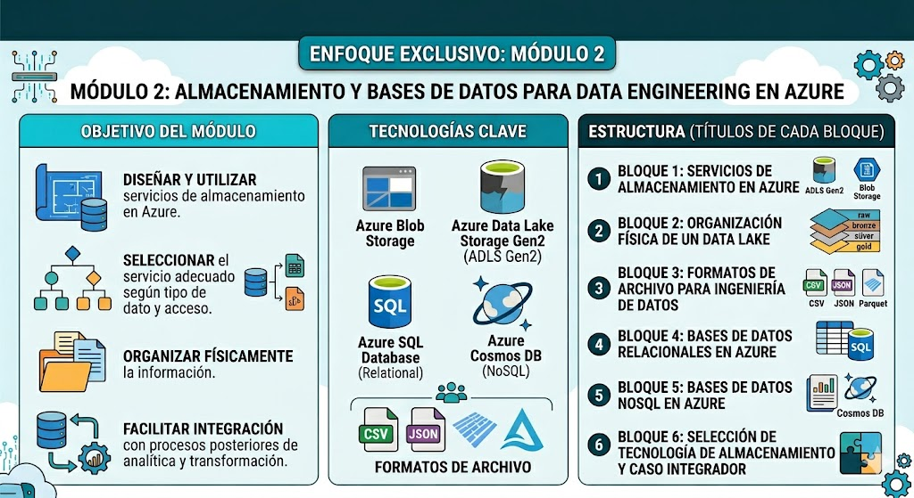

# 🧑🏽‍💻 Clase 02 - Introducción al Bloque 2

# Sesión 1. Programa del Bloque 2

# Sesión 2. Introducción a DP-900

- Guía de Estudio

[Guía de estudio del examen DP-900: Aspectos básicos de datos de Microsoft Azure](https://learn.microsoft.com/es-es/credentials/certifications/resources/study-guides/dp-900)

- Documentación para alimentar a NotebookLM e IAs:

<aside>

https://learn.microsoft.com/es-es/azure/azure-sql/?view=azuresql

https://learn.microsoft.com/es-es/sql/sql-server/?view=sql-server-ver16

https://learn.microsoft.com/es-es/azure/storage/blobs/

https://learn.microsoft.com/es-es/azure/storage/tables/

https://learn.microsoft.com/es-es/azure/cosmos-db/

https://learn.microsoft.com/es-es/azure/synapse-analytics/

https://learn.microsoft.com/es-es/azure/databricks/

https://learn.microsoft.com/es-es/azure/data-factory/

https://learn.microsoft.com/es-es/power-bi/

</aside>

- Rutas de contenidos para alimentar NotebookLM e IAs

[Curso DP-900T00-A: Introducción a los datos de Microsoft Azure - Training](https://learn.microsoft.com/es-es/training/courses/dp-900t00#course-syllabus)

## Actividades

### Actividad 1 - Asignación y preparación de preguntas de la DP-900 ✔️

### Actividad 2 - Instalar en local una maquina virtual de Ubuntu Server 24.04 LTS en Virtual Box ✔️

<aside>

Configuración recomendada:

- CPU: 2 cores
- RAM: 6 GB
- Disco: 40 GB
- Red: NAT
</aside>

### Actividad 3 - Basado en el contneido de la ruta de aprendizaje 1 :  **Introduction to Microsoft Azure Data Core data concepts.**

<aside>

- Módulo 1: Explore Data Concepts
    
    [Explore Core Data Concepts - Training](https://learn.microsoft.com/en-us/training/modules/explore-core-data-concepts/)
    
- Módulo 2: Explore Data Roles and Services
    
    [Explore Data Roles and Services - Training](https://learn.microsoft.com/en-us/training/modules/explore-roles-responsibilities-world-of-data/)
    
</aside>

Responde a las siguientes preguntas:

1. **Explique la diferencia fundamental entre los datos estructurados, semiestructurados y no estructurados, y proporcione un ejemplo de cada uno.**
2. **Contraste los formatos de archivo optimizados Parquet y Avro. ¿Cuáles son las características principales que los diferencian?**
3. **¿Cuál es el propósito de la normalización en una base de datos relacional y qué papel juegan las claves principales en este proceso?**
4. **Describa los cuatro tipos comunes de bases de datos no relacionales (NoSQL) y cómo almacenan la información.**
5.  **Defina qué es un sistema OLTP y explique por qué son críticas las propiedades ACID en su funcionamiento.**
6. **Diferencie entre los conceptos de Data Lake, Data Warehouse y Data Lakehouse en el contexto del análisis de datos.**
7. **Describa el flujo general de una arquitectura de procesamiento analítico utilizando los patrones ETL/ELT.**
8. **¿Qué es un modelo semántico (o modelo OLAP) y qué ventaja principal proporciona a los usuarios empresariales?**
9. **Explique el propósito y la organización de la "arquitectura medallón" dentro de un lakehouse.**
10. **Mencione las funciones principales de Microsoft Fabric y Azure Databricks dentro de las plataformas de análisis modernas.**
11. ¿Cuáles son las diferencias fundamentales entre las tareas de infraestructura que realiza un **Administrador de bases de datos** y la construcción de canalizaciones ETL que lleva a cabo un **Ingeniero de datos.**
12. ¿De qué manera procesa un **Analista de datos** la información sin procesar para diseñar modelos analíticos, y cómo le asisten las herramientas de inteligencia artificial en la creación de informes y visualizaciones ?
13. Describe cómo colabora un **Ingeniero de IA** con otros roles de datos para integrar modelos de lenguaje grande (LLM) y qué herramientas proporciona la plataforma **Microsoft Foundry** para diseñar e implementar estas soluciones
14. Explica la diferencia entre **PaaS** (Plataforma como servicio) y **SaaS** (Software como servicio) en el ecosistema de Azure, detallando qué nivel de responsabilidad sobre la infraestructura asume Microsoft en cada caso
15. ¿En qué escenarios arquitectónicos se elegiría utilizar **Azure Cosmos DB** sobre una base de datos tradicional, y qué interfaces de programación o formatos (como JSON, pares clave-valor o grafos) permite gestionar a escala global?
16. Detalla qué es **Microsoft Fabric** y explica cómo su capa de almacenamiento compartida, denominada **OneLake**, centraliza el trabajo de ingeniería, ciencia de datos y análisis en tiempo real en una única área de trabajo.
17. ¿Cuál es el propósito principal de **Azure Data Factory** dentro de la arquitectura de datos de una organización y cómo facilita el procesamiento de extracción, transformación y carga (ETL) ?
18. Compara los casos de uso específicos entre **Azure Stream Analytics**, utilizado para capturar flujos continuos, y **Azure Data Explorer**, optimizado para el análisis de registros de alto rendimiento y telemetría de IoT
19. ¿Qué función cumple **Microsoft Purview** en el mapa de datos de toda la empresa y por qué es una herramienta crucial para rastrear el linaje y asegurar la integridad de la información ?
20. ¿Por qué un equipo de datos elegiría **Azure Databricks** para sus análisis a gran escala, y de qué forma aprovechan los ingenieros y analistas su compatibilidad nativa con Apache Spark y cuadernos interactivos ?

<aside>
💡

Escoger uno de los siguientes [Azure Data Services](https://learn.microsoft.com/en-us/training/modules/explore-roles-responsibilities-world-of-data/3-data-services):

- Azure Data Factory
- Azure Databricks
- Azure Stream Analytics
- Azure Data Explorer
- Microsoft Purview (Gobernanza)

En una presentación Power Point debes investigar a detalle en que consiste el servicio escogido e incluye mínimo dos casos de uso.   

</aside>