# 🧑🏽‍💻 Clase 16 - Soluciones de almacenamiento en Azure

# 1. Soluciones de almacenamiento y bases de datos en Azure para DE

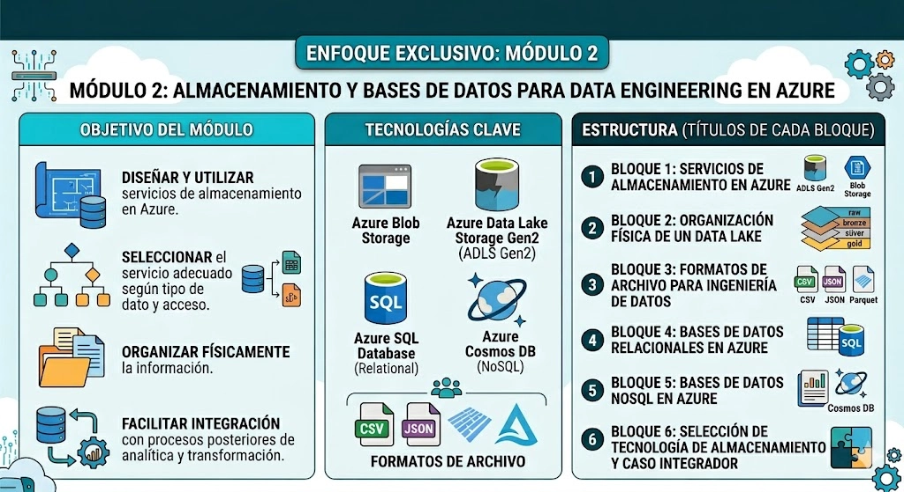

<aside>

Cuando trabajamos como Data Engineers, una de las primeras decisiones importantes no es  cómo hacer un dashboard, cómo entrenar un modelo de Machine Learning o cómo programar una transformación avanzada. Antes de todo eso, debemos responder una pregunta más básica: **¿Dónde van a vivir los datos?**

</aside>


> Al final de esta sesión se pretende entender en primera aproximación como desarrollar un pequeño pipeline como el que se ilustra:
> 


# 2. ¿Qué significa almacenar datos en Data Engineering?

<aside>

En el uso cotidiano, almacenar datos significa simplemente “guardar información”. Sin embargo, en Data Engineering el almacenamiento tiene una función mucho más importante.

</aside>


Por ejemplo, imaginemos una empresa de ventas online. Esta empresa puede tener:


<aside>

Todos estos datos no tienen la misma estructura ni el mismo uso. Por tanto, no deberían almacenarse necesariamente en el mismo lugar ni de la misma forma.

</aside>

---

# 3. Tipos de datos

Antes de elegir una tecnología, necesitamos entender qué tipo de datos tenemos.

## 3.1 Datos estructurados

<aside>

Son datos organizados en filas y columnas. Tienen un esquema claro.

</aside>

Ejemplo:

| cliente_id | nombre | ciudad | fecha_alta |
| --- | --- | --- | --- |
| 1 | Ana Pérez | Madrid | 2024-01-10 |
| 2 | Luis Gómez | Valencia | 2024-01-15 |


---

## 3.2 Datos semiestructurados

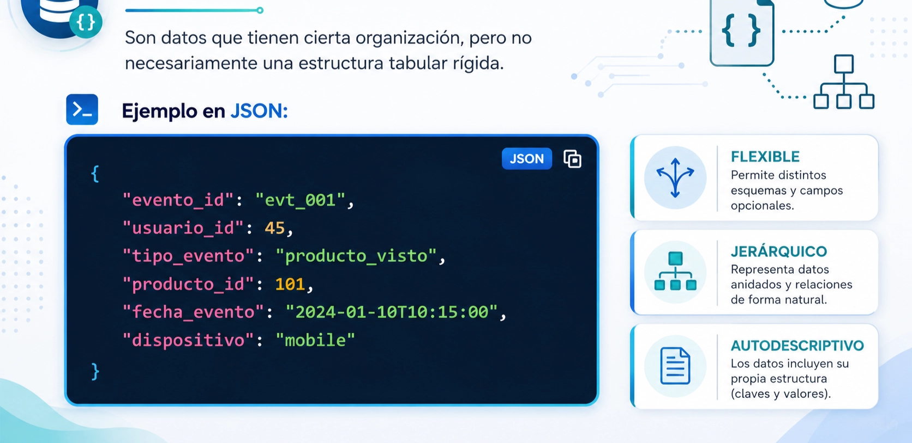


---

## 3.3 Datos no estructurados

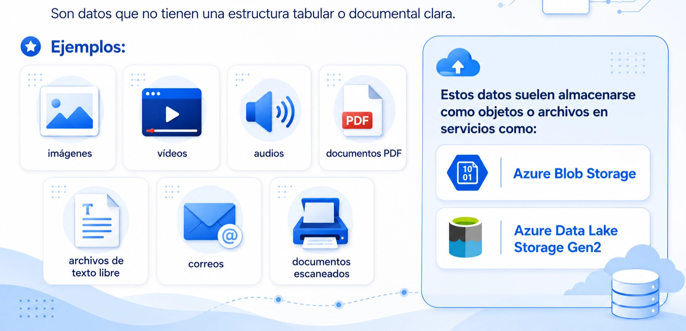

---

# 4. Servicios clave de almacenamiento en Azure

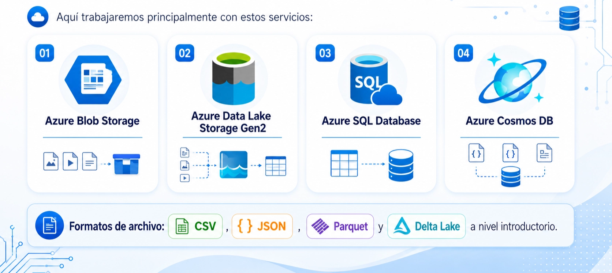

# 5. Azure Storage Account

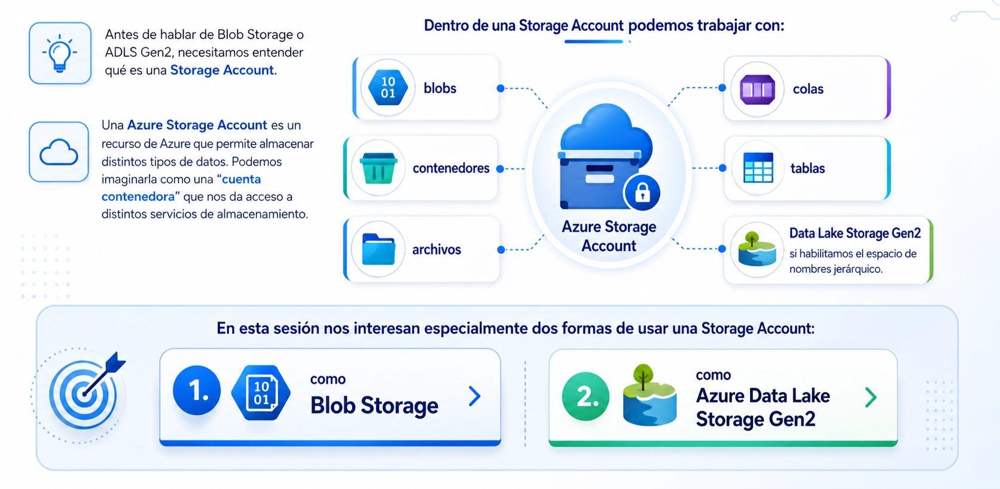

---

# 6. Azure Blob Storage

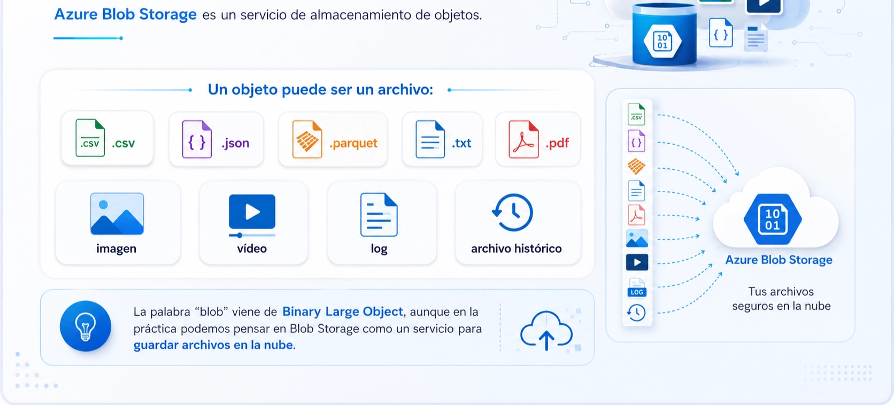

## 6.1 ¿Cuándo usar Blob Storage?

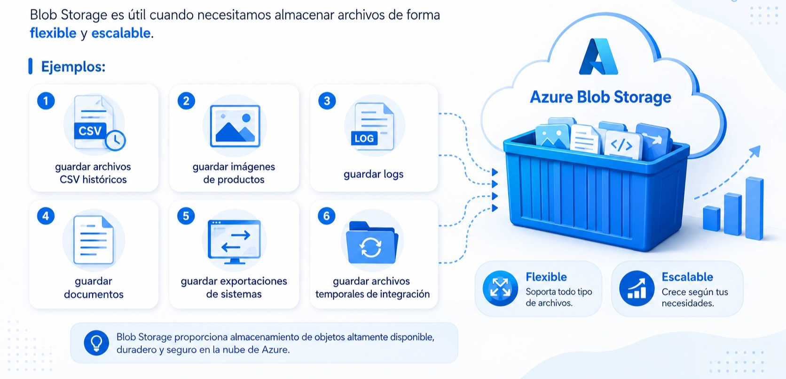

## 6.2 Ejemplo

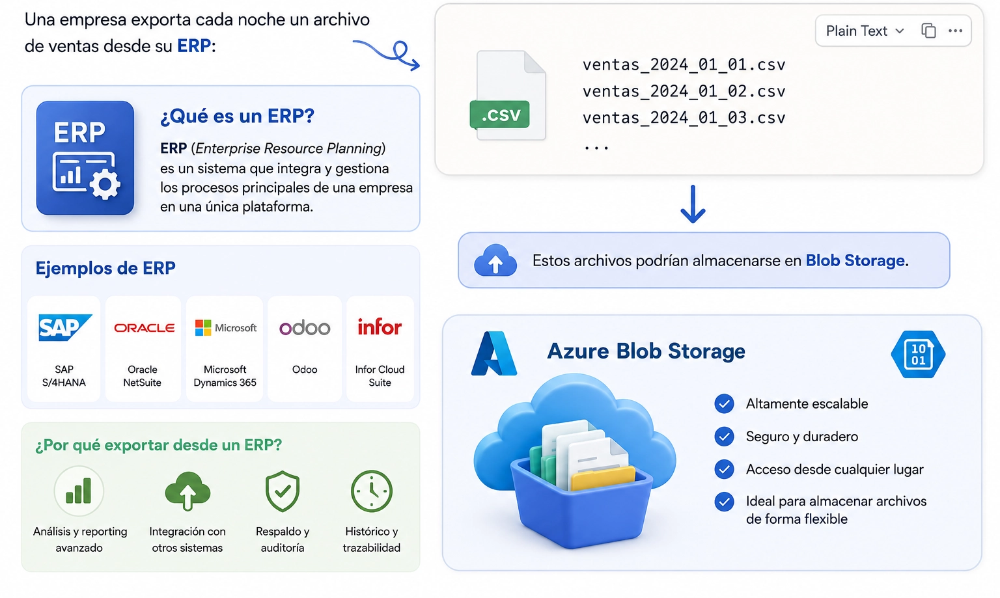

# 7. Azure Data Lake Storage Gen2

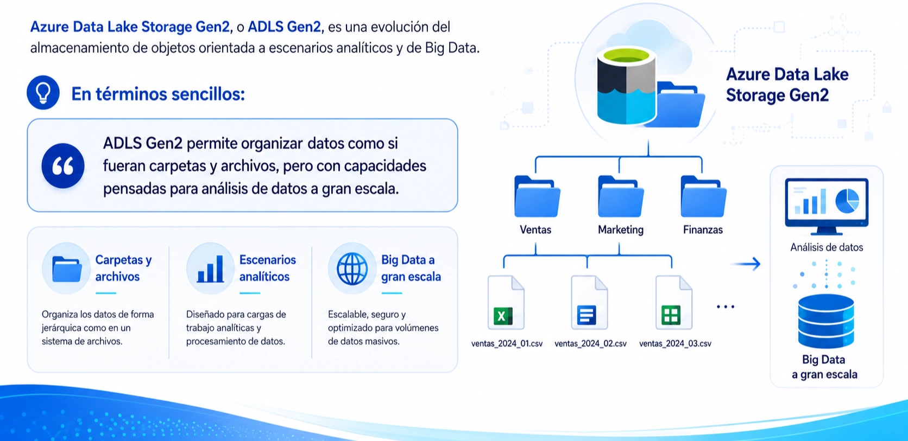

## 7.1 Diferencia básica entre Blob Storage y ADLS Gen2


---

# 8. ¿Qué es un Data Lake?


## 8.1 Ejemplo

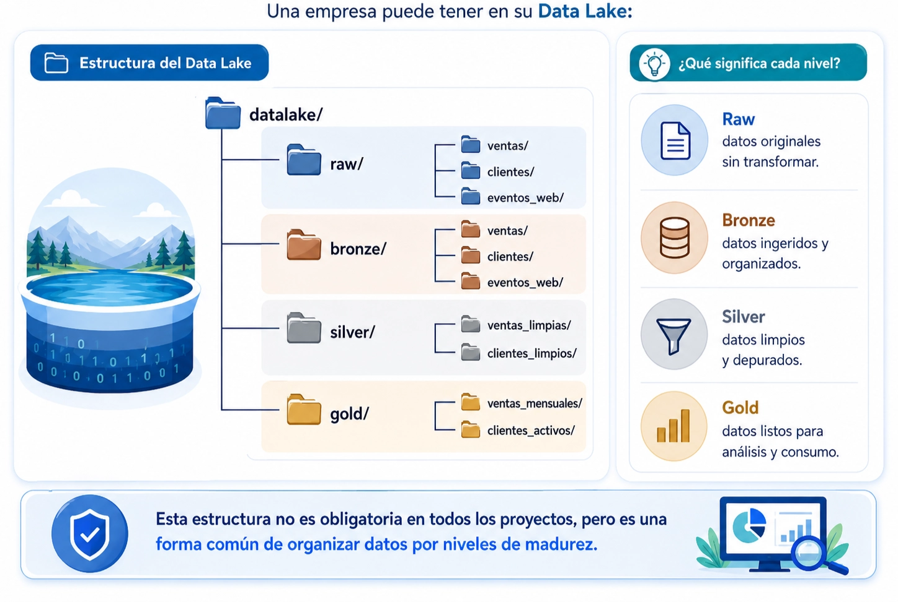

<aside>

#### Actividad 3.1 → Investiga lo siguiente:

Fabric tiene un servicio llamado **Onelake:
¿ Es un data lake ? ¿ Que features añade OneLake versus un Data Lake ?
¿ Está basado en ADLS Gen2 o no tienen nada que ver? 
Establece similitudes y diferencias.**

</aside>

---

# 9. Organización física de un Data Lake

## 9.1 Zona raw

<aside>

La zona `raw` contiene datos tal como llegan desde la fuente, o con muy poca modificación.

</aside>

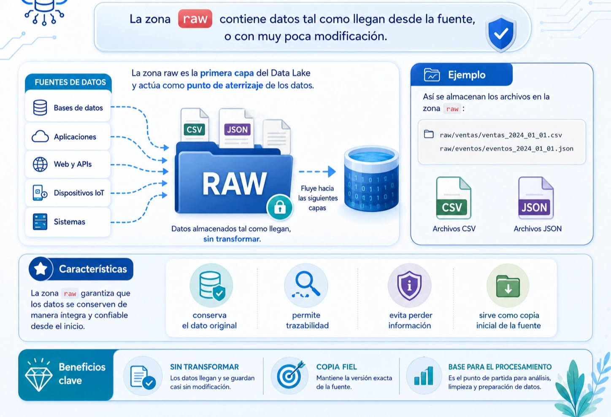

---

## 9.2 Zona bronze

<aside>

La zona `bronze` suele contener datos ya ingeridos y mínimamente estructurados.

</aside>


---


## 9.3 Zona silver


---

## 9.4 Zona gold


# 10. Convenciones de organización


---

# 11. Formatos de archivo

<aside>

No basta con decidir dónde guardar los datos. También debemos decidir **en qué formato** guardarlos.

</aside>

---

## 12.1 CSV


---

## 12.2 JSON


---

## 12.3 Parquet


---

## 12.4 Delta Lake


---

# 13. Particionado físico


---

# 14. Bases de datos relacionales en Azure

<aside>

Una base de datos relacional organiza datos en tablas relacionadas entre sí.

</aside>

> En este módulo usamos **Azure SQL Database** como servicio principal de base de datos relacional en Azure.
> 

## 14.1 ¿Qué es Azure SQL Database?


---

# 17. ¿Cuándo mover datos desde Azure SQL hacia un Data Lake?


---

# 18. Bases de datos NoSQL en Azure

<aside>

No todas las situaciones encajan bien con una base relacional. A veces los datos son más flexibles, variables o documentales.

</aside>

> En Azure, una opción importante es **Azure Cosmos DB**.
> 

## 18.1 ¿Qué es una base de datos NoSQL?


---

## 18.2 Azure Cosmos DB


---

---

# 19. Conceptos básicos de Cosmos DB


---


---

# 21. Cosmos DB frente a Azure SQL Database


---

# 22. Azure Data Factory (ADF)

<aside>

Azure Data Factory es una herramienta para orquestar flujos de datos entre distintos sistemas y transformarlos para análisis.

</aside>

## 🔧 ¿Qué permite hacer?


## 🏗️ Componentes principales


## 🔄 ETL vs ELT en ADF


<aside>

#### Actividad 3.2 → Equivalente de ADF en Fabric

Fabric tiene un componente que se llama **Data Factory**. Define y explica que es Data Factory   ¿ Es lo mismo que ADF? 
Establece similitudes y diferencias y redacta tus conclusiones.
¿ Podria desde Fabric conectarme a datos En Azure/AWS/GCP? De que formas se puede hacer esto y cual sería la utilidad?

</aside>

# ¿ Que cosas vamos a practicar en este modulo con ADF?

En las prácticas vamos a usar **Azure Data Factory** como mecanismo mínimo de copia:

```
Azure SQL Database → Azure Data Factory → ADLS Gen2
Cosmos DB → Azure Data Factory → ADLS Gen2
Blob Storage -> ADF -> ADLS Gen2
```

<aside>

Es importante entender el límite: en este módulo **no estudiaremos pipelines completos ni ETL avanzado** porque esos contenidos se reservan para módulos posteriores.

</aside>

En este módulo lo usaremos únicamente  para demostrar una idea básica:

> Los datos no solo se almacenan en una fuente; muchas veces deben copiarse hacia un lugar analítico donde puedan ser reutilizados.
> 
> 
> ADF nos permite visualizar el movimiento de datos desde una fuente hacia un destino.
> 


---

<aside>

#### Actividad 3.3 Servicios equivalentes en AWS y GCP

En una infografia estilo tabla comparativa coloca los equivalentes de AWS GCP y Fabric de estos servicios de Azure:

- Azure SQL Database
- Azure Data Factory
- Azure Data Lake Storage Gen 2

La tabla debe contener el logo/icono identificativo de cada servicio

Al final de la tabla comparativa escribe un resumen de cada servicio de AWS y GCP que has puesto en la tabla.

**Formato de entrega:** Word, pdf, powerpoint o markdown (o enlace del repo de Github) 

</aside>