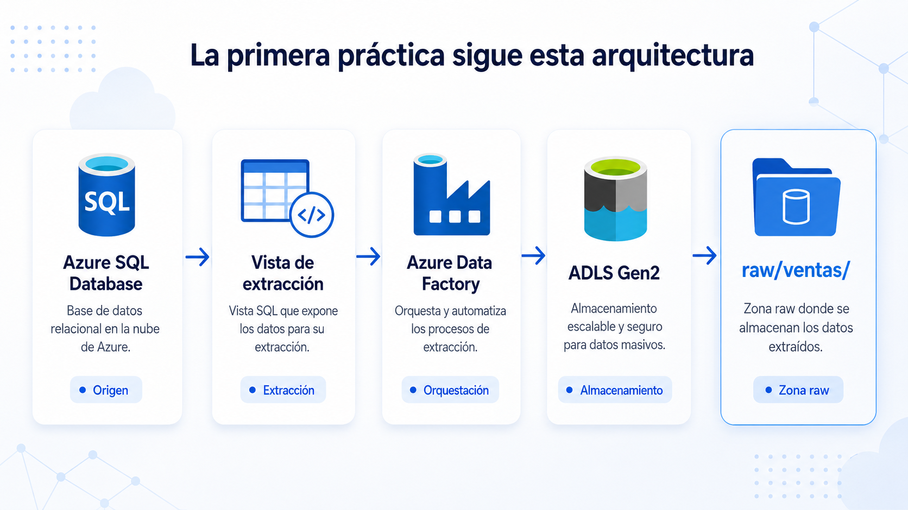

# 🧑🏽‍💻 Clase 17 - Ejercicio 1

---

## 23. Arquitectura práctica 1: Azure SQL Database hacia ADLS Gen2



## Fase 1. Crear Azure SQL Database

### Paso 1. Crear el grupo de recursos

1. Acceder a Azure Portal.
2. Buscar **Grupos de recursos**.
3. Seleccionar **Crear**.
4. Indicar:
    
    ```
    Nombre: rg-practica1
    Región: la región disponible
    ```
    
5. Seleccionar **Revisar y crear**.
6. Seleccionar **Crear**.

### Paso 2. Crear la base de datos

1. Buscar **SQL databases**.
2. Seleccionar **Crear**.
3. Selecciona Free offer
4. Configurar:
    
    ```
    Grupo de recursos: rg-practica1
    Nombre de base de datos: sqldb-ventas
    ```
    
5. En **Servidor**, seleccionar **Crear nuevo**.
6. Indicar:
    
    ```
    Nombre del servidor: server-practica1
    Ubicación: la misma región
    Método de autenticación: autenticación SQL
    Usuario administrador: practica
    Contraseña: Azure12345
    ```
    
    Pulsar en OK.
    
7. Para una práctica educativa como esta, seleccionar una configuración pequeña de desarrollo o pruebas.
8. No habilitar redundancias avanzadas innecesarias para el laboratorio.
9. Seleccionar **Revisar y crear**.
10. Seleccionar **Crear**.

### Paso 3. Configurar la conectividad

En el servidor lógico de Azure SQL:

1. Acceder a **Networking** o **Redes**.
2. Seleccionar acceso mediante **Public endpoint** para esta práctica.
3. Agregar la dirección IP actual del equipo.
4. Para permitir la conexión desde Azure Data Factory durante el laboratorio, habilitar temporalmente:
    
    ```
    Allow Azure services and resources to access this server
    ```
    
5. Guardar los cambios.

> Esta configuración simplifica el laboratorio, pero es demasiado amplia para un entorno productivo. En producción deberían utilizarse redes privadas, endpoints privados y autenticación administrada.
> 

## Fase 2. Crear el modelo relacional

## Modelo de datos

```
Clientes  1 ─────── N Ventas
Productos 1 ─────── N Ventas
Tiendas   1 ─────── N Ventas
```

La granularidad de `Ventas` será:

> Una fila representa un producto vendido dentro de una factura.
> 

Por esta razón, una factura puede aparecer en varias filas, diferenciadas mediante `LineaFactura`.

---

# 6. Script SQL completo

Se puede ejecutar desde:

- El editor de consultas de Azure Portal.
- SQL Server Management Studio.
- Azure Data Studio.
- Visual Studio Code con una extensión SQL.

El editor de consultas de Azure Portal permite conectarse a Azure SQL Database y ejecutar sentencias T-SQL directamente.

> **Advertencia:** el siguiente script elimina las tablas de la práctica si ya existen.
> 

```sql
/* ============================================================
   Ejercicio 1
   Azure SQL Database -> Vista -> ADF -> ADLS Gen2
   ============================================================ */

SET NOCOUNT ON;

/* ============================================================
   1. ELIMINACIÓN DE OBJETOS PREVIOS
   Permite volver a ejecutar toda la práctica desde cero.
   ============================================================ */

IF OBJECT_ID(N'etl.vw_ventas_extraccion', N'V') IS NOT NULL
    DROP VIEW etl.vw_ventas_extraccion;

IF OBJECT_ID(N'dbo.Ventas', N'U') IS NOT NULL
    DROP TABLE dbo.Ventas;

IF OBJECT_ID(N'dbo.Clientes', N'U') IS NOT NULL
    DROP TABLE dbo.Clientes;

IF OBJECT_ID(N'dbo.Productos', N'U') IS NOT NULL
    DROP TABLE dbo.Productos;

IF OBJECT_ID(N'dbo.Tiendas', N'U') IS NOT NULL
    DROP TABLE dbo.Tiendas;

/* ============================================================
   2. CREACIÓN DEL ESQUEMA DE EXTRACCIÓN
   ============================================================ */

IF NOT EXISTS (
    SELECT 1
    FROM sys.schemas
    WHERE name = N'etl'
)
BEGIN
    EXEC(N'CREATE SCHEMA etl AUTHORIZATION dbo;');
END;

/* ============================================================
   3. TABLA DE CLIENTES
   ============================================================ */

CREATE TABLE dbo.Clientes
(
    ClienteId       INT IDENTITY(1,1) NOT NULL,
    Nombre          NVARCHAR(80) NOT NULL,
    Apellidos       NVARCHAR(120) NOT NULL,
    Email           NVARCHAR(255) NOT NULL,
    Ciudad          NVARCHAR(80) NOT NULL,
    Provincia       NVARCHAR(80) NOT NULL,
    Pais            CHAR(2) NOT NULL
        CONSTRAINT DF_Clientes_Pais DEFAULT ('ES'),
    FechaAlta       DATE NOT NULL
        CONSTRAINT DF_Clientes_FechaAlta
        DEFAULT (CONVERT(DATE, SYSUTCDATETIME())),
    Activo          BIT NOT NULL
        CONSTRAINT DF_Clientes_Activo DEFAULT (1),
    FechaCreacion   DATETIME2(0) NOT NULL
        CONSTRAINT DF_Clientes_FechaCreacion
        DEFAULT (SYSUTCDATETIME()),

    CONSTRAINT PK_Clientes
        PRIMARY KEY (ClienteId),

    CONSTRAINT UQ_Clientes_Email
        UNIQUE (Email)
);

/* ============================================================
   4. TABLA DE PRODUCTOS
   ============================================================ */

CREATE TABLE dbo.Productos
(
    ProductoId      INT IDENTITY(1,1) NOT NULL,
    SKU             NVARCHAR(30) NOT NULL,
    NombreProducto  NVARCHAR(150) NOT NULL,
    Categoria       NVARCHAR(80) NOT NULL,
    PrecioLista     DECIMAL(12,2) NOT NULL,
    Activo          BIT NOT NULL
        CONSTRAINT DF_Productos_Activo DEFAULT (1),
    FechaCreacion   DATETIME2(0) NOT NULL
        CONSTRAINT DF_Productos_FechaCreacion
        DEFAULT (SYSUTCDATETIME()),

    CONSTRAINT PK_Productos
        PRIMARY KEY (ProductoId),

    CONSTRAINT UQ_Productos_SKU
        UNIQUE (SKU),

    CONSTRAINT CK_Productos_PrecioLista
        CHECK (PrecioLista >= 0)
);

/* ============================================================
   5. TABLA DE TIENDAS
   ============================================================ */

CREATE TABLE dbo.Tiendas
(
    TiendaId        INT IDENTITY(1,1) NOT NULL,
    CodigoTienda    NVARCHAR(20) NOT NULL,
    NombreTienda    NVARCHAR(120) NOT NULL,
    Ciudad          NVARCHAR(80) NOT NULL,
    Provincia       NVARCHAR(80) NOT NULL,
    Canal           NVARCHAR(20) NOT NULL,
    Activa          BIT NOT NULL
        CONSTRAINT DF_Tiendas_Activa DEFAULT (1),
    FechaCreacion   DATETIME2(0) NOT NULL
        CONSTRAINT DF_Tiendas_FechaCreacion
        DEFAULT (SYSUTCDATETIME()),

    CONSTRAINT PK_Tiendas
        PRIMARY KEY (TiendaId),

    CONSTRAINT UQ_Tiendas_Codigo
        UNIQUE (CodigoTienda),

    CONSTRAINT CK_Tiendas_Canal
        CHECK (Canal IN (N'Física', N'Online'))
);

/* ============================================================
   6. TABLA DE VENTAS
   Una fila representa una línea de factura.
   ============================================================ */

CREATE TABLE dbo.Ventas
(
    VentaId             BIGINT IDENTITY(1,1) NOT NULL,
    NumeroFactura       NVARCHAR(30) NOT NULL,
    LineaFactura        SMALLINT NOT NULL,
    FechaVenta          DATETIME2(0) NOT NULL,

    ClienteId           INT NOT NULL,
    ProductoId          INT NOT NULL,
    TiendaId            INT NOT NULL,

    Cantidad            SMALLINT NOT NULL,
    PrecioUnitario      DECIMAL(12,2) NOT NULL,
    DescuentoPct        DECIMAL(5,2) NOT NULL
        CONSTRAINT DF_Ventas_Descuento DEFAULT (0),

    ImporteBruto AS
    (
        CONVERT(
            DECIMAL(14,2),
            Cantidad * PrecioUnitario
        )
    ) PERSISTED,

    ImporteDescuento AS
    (
        CONVERT(
            DECIMAL(14,2),
            Cantidad * PrecioUnitario * (DescuentoPct / 100.0)
        )
    ) PERSISTED,

    ImporteNeto AS
    (
        CONVERT(
            DECIMAL(14,2),
            Cantidad * PrecioUnitario
            * (1 - DescuentoPct / 100.0)
        )
    ) PERSISTED,

    MetodoPago         NVARCHAR(30) NOT NULL,
    EstadoVenta        NVARCHAR(20) NOT NULL
        CONSTRAINT DF_Ventas_Estado DEFAULT (N'Completada'),

    FechaCreacion      DATETIME2(0) NOT NULL
        CONSTRAINT DF_Ventas_FechaCreacion
        DEFAULT (SYSUTCDATETIME()),

    FechaModificacion  DATETIME2(0) NOT NULL
        CONSTRAINT DF_Ventas_FechaModificacion
        DEFAULT (SYSUTCDATETIME()),

    CONSTRAINT PK_Ventas
        PRIMARY KEY (VentaId),

    CONSTRAINT UQ_Ventas_FacturaLinea
        UNIQUE (NumeroFactura, LineaFactura),

    CONSTRAINT FK_Ventas_Clientes
        FOREIGN KEY (ClienteId)
        REFERENCES dbo.Clientes (ClienteId),

    CONSTRAINT FK_Ventas_Productos
        FOREIGN KEY (ProductoId)
        REFERENCES dbo.Productos (ProductoId),

    CONSTRAINT FK_Ventas_Tiendas
        FOREIGN KEY (TiendaId)
        REFERENCES dbo.Tiendas (TiendaId),

    CONSTRAINT CK_Ventas_LineaFactura
        CHECK (LineaFactura > 0),

    CONSTRAINT CK_Ventas_Cantidad
        CHECK (Cantidad > 0),

    CONSTRAINT CK_Ventas_PrecioUnitario
        CHECK (PrecioUnitario >= 0),

    CONSTRAINT CK_Ventas_Descuento
        CHECK (DescuentoPct BETWEEN 0 AND 100),

    CONSTRAINT CK_Ventas_MetodoPago
        CHECK (
            MetodoPago IN (
                N'Tarjeta',
                N'Efectivo',
                N'Transferencia',
                N'PayPal'
            )
        ),

    CONSTRAINT CK_Ventas_Estado
        CHECK (
            EstadoVenta IN (
                N'Completada',
                N'Cancelada',
                N'Devuelta'
            )
        )
);

/* ============================================================
   7. ÍNDICES DE APOYO
   ============================================================ */

CREATE INDEX IX_Ventas_FechaVenta
    ON dbo.Ventas (FechaVenta);

CREATE INDEX IX_Ventas_ClienteId
    ON dbo.Ventas (ClienteId);

CREATE INDEX IX_Ventas_ProductoId
    ON dbo.Ventas (ProductoId);

CREATE INDEX IX_Ventas_TiendaId
    ON dbo.Ventas (TiendaId);

CREATE INDEX IX_Ventas_FechaModificacion
    ON dbo.Ventas (FechaModificacion);

/* ============================================================
   8. DATOS DE CLIENTES
   ============================================================ */

INSERT INTO dbo.Clientes
(
    Nombre,
    Apellidos,
    Email,
    Ciudad,
    Provincia,
    Pais,
    FechaAlta
)
VALUES
(N'Ana',    N'López Martín',      N'ana.lopez@example.com',       N'Madrid',     N'Madrid',     'ES', '2025-10-10'),
(N'Carlos', N'García Pérez',      N'carlos.garcia@example.com',   N'Barcelona',  N'Barcelona',  'ES', '2025-10-15'),
(N'Lucía',  N'Martínez Ruiz',     N'lucia.martinez@example.com',  N'Valencia',   N'Valencia',   'ES', '2025-11-03'),
(N'Diego',  N'Sánchez Moreno',    N'diego.sanchez@example.com',   N'Sevilla',    N'Sevilla',    'ES', '2025-11-11'),
(N'Marta',  N'Ruiz Fernández',    N'marta.ruiz@example.com',      N'Bilbao',     N'Bizkaia',    'ES', '2025-12-01'),
(N'Javier', N'Torres Gómez',      N'javier.torres@example.com',   N'Zaragoza',   N'Zaragoza',   'ES', '2025-12-14'),
(N'Elena',  N'Navarro Gil',       N'elena.navarro@example.com',   N'Alicante',   N'Alicante',   'ES', '2026-01-05'),
(N'Pablo',  N'Romero Díaz',       N'pablo.romero@example.com',    N'Málaga',     N'Málaga',     'ES', '2026-01-17'),
(N'Sofía',  N'Díaz Ortega',       N'sofia.diaz@example.com',      N'Valladolid', N'Valladolid', 'ES', '2026-02-08'),
(N'Miguel', N'Castillo Molina',   N'miguel.castillo@example.com', N'Murcia',     N'Murcia',     'ES', '2026-02-20');

/* ============================================================
   9. DATOS DE PRODUCTOS
   ============================================================ */

INSERT INTO dbo.Productos
(
    SKU,
    NombreProducto,
    Categoria,
    PrecioLista
)
VALUES
(N'P001', N'Portátil Pro 15',           N'Informática',  1049.90),
(N'P002', N'Monitor 27 pulgadas',        N'Informática',   239.90),
(N'P003', N'Teclado mecánico',           N'Accesorios',     49.90),
(N'P004', N'Ratón inalámbrico',          N'Accesorios',     24.90),
(N'P005', N'Auriculares Bluetooth',      N'Audio',          79.90),
(N'P006', N'Webcam Full HD',             N'Accesorios',     69.90),
(N'P007', N'Silla ergonómica',           N'Mobiliario',    189.00),
(N'P008', N'Mesa de oficina',            N'Mobiliario',    249.00),
(N'P009', N'Disco SSD 1 TB',             N'Almacenamiento', 89.90),
(N'P010', N'Router Wi-Fi 6',             N'Redes',         119.90),
(N'P011', N'Tablet 10 pulgadas',         N'Movilidad',     399.00),
(N'P012', N'Impresora multifunción',     N'Impresión',     179.90);

/* ============================================================
   10. DATOS DE TIENDAS
   ============================================================ */

INSERT INTO dbo.Tiendas
(
    CodigoTienda,
    NombreTienda,
    Ciudad,
    Provincia,
    Canal
)
VALUES
(N'T001', N'Madrid Centro',       N'Madrid',    N'Madrid',    N'Física'),
(N'T002', N'Barcelona Diagonal',  N'Barcelona', N'Barcelona', N'Física'),
(N'T003', N'Valencia Centro',     N'Valencia',  N'Valencia',  N'Física'),
(N'T004', N'Tienda Online',       N'Madrid',    N'Madrid',    N'Online');

/* ============================================================
   11. DATOS DE VENTAS
   30 líneas de venta distribuidas entre abril y junio de 2026.
   ============================================================ */

INSERT INTO dbo.Ventas
(
    NumeroFactura,
    LineaFactura,
    FechaVenta,
    ClienteId,
    ProductoId,
    TiendaId,
    Cantidad,
    PrecioUnitario,
    DescuentoPct,
    MetodoPago,
    EstadoVenta
)
VALUES
(N'F-2026-0001', 1, '2026-04-01T10:15:00',  1,  1, 1, 1,  999.90,  5.00, N'Tarjeta',       N'Completada'),
(N'F-2026-0001', 2, '2026-04-01T10:15:00',  1,  3, 1, 1,   49.90,  0.00, N'Tarjeta',       N'Completada'),

(N'F-2026-0002', 1, '2026-04-04T12:30:00',  2,  2, 2, 2,  229.90, 10.00, N'Tarjeta',       N'Completada'),

(N'F-2026-0003', 1, '2026-04-08T18:20:00',  3,  4, 4, 2,   24.90,  0.00, N'PayPal',        N'Completada'),
(N'F-2026-0003', 2, '2026-04-08T18:20:00',  3,  5, 4, 1,   79.90,  0.00, N'PayPal',        N'Completada'),

(N'F-2026-0004', 1, '2026-04-12T11:45:00',  4,  7, 3, 1,  189.00,  5.00, N'Tarjeta',       N'Completada'),

(N'F-2026-0005', 1, '2026-04-17T09:10:00',  5, 11, 4, 1,  399.00,  0.00, N'Transferencia', N'Completada'),
(N'F-2026-0005', 2, '2026-04-17T09:10:00',  5,  6, 4, 1,   69.90,  0.00, N'Transferencia', N'Completada'),

(N'F-2026-0006', 1, '2026-04-22T17:05:00',  6,  9, 1, 2,   89.90, 10.00, N'Efectivo',      N'Completada'),

(N'F-2026-0007', 1, '2026-04-27T13:40:00',  7, 10, 2, 1,  119.90,  0.00, N'Tarjeta',       N'Completada'),
(N'F-2026-0007', 2, '2026-04-27T13:40:00',  7,  3, 2, 2,   49.90,  0.00, N'Tarjeta',       N'Completada'),

(N'F-2026-0008', 1, '2026-05-02T16:25:00',  8,  8, 3, 1,  249.00,  5.00, N'Tarjeta',       N'Completada'),

(N'F-2026-0009', 1, '2026-05-06T20:15:00',  9, 12, 4, 1,  179.90, 15.00, N'PayPal',        N'Completada'),

(N'F-2026-0010', 1, '2026-05-10T10:00:00', 10,  2, 1, 1,  229.90,  0.00, N'Efectivo',      N'Completada'),
(N'F-2026-0010', 2, '2026-05-10T10:00:00', 10,  4, 1, 1,   24.90,  0.00, N'Efectivo',      N'Completada'),

(N'F-2026-0011', 1, '2026-05-15T12:50:00',  1,  5, 2, 2,   79.90, 10.00, N'Tarjeta',       N'Completada'),

(N'F-2026-0012', 1, '2026-05-19T19:30:00',  2,  6, 4, 1,   69.90,  0.00, N'PayPal',        N'Completada'),
(N'F-2026-0012', 2, '2026-05-19T19:30:00',  2,  9, 4, 1,   89.90,  0.00, N'PayPal',        N'Completada'),

(N'F-2026-0013', 1, '2026-05-24T11:20:00',  3, 11, 3, 1,  399.00,  5.00, N'Tarjeta',       N'Completada'),

(N'F-2026-0014', 1, '2026-05-29T15:10:00',  4,  1, 1, 1, 1049.90, 10.00, N'Tarjeta',       N'Completada'),
(N'F-2026-0014', 2, '2026-05-29T15:10:00',  4, 10, 1, 1,  119.90,  0.00, N'Tarjeta',       N'Completada'),

(N'F-2026-0015', 1, '2026-06-03T13:35:00',  5,  7, 2, 2,  189.00,  5.00, N'Transferencia', N'Completada'),

(N'F-2026-0016', 1, '2026-06-07T18:10:00',  6, 12, 4, 1,  179.90,  0.00, N'PayPal',        N'Completada'),
(N'F-2026-0016', 2, '2026-06-07T18:10:00',  6,  3, 4, 1,   49.90,  0.00, N'PayPal',        N'Completada'),

(N'F-2026-0017', 1, '2026-06-11T10:45:00',  7,  8, 3, 1,  249.00, 10.00, N'Tarjeta',       N'Completada'),

(N'F-2026-0018', 1, '2026-06-14T12:20:00',  8,  2, 2, 2,  239.90,  5.00, N'Tarjeta',       N'Completada'),
(N'F-2026-0018', 2, '2026-06-14T12:20:00',  8,  4, 2, 2,   24.90,  0.00, N'Tarjeta',       N'Completada'),

(N'F-2026-0019', 1, '2026-06-18T09:40:00',  9,  9, 1, 3,   89.90, 15.00, N'Efectivo',      N'Completada'),

(N'F-2026-0020', 1, '2026-06-20T21:05:00', 10,  5, 4, 1,   79.90,  0.00, N'PayPal',        N'Completada'),
(N'F-2026-0020', 2, '2026-06-20T21:05:00', 10,  6, 4, 1,   69.90,  0.00, N'PayPal',        N'Completada');

/* ============================================================
   12. VISTA DE EXTRACCIÓN
   No agrega información y no aplica reglas analíticas.
   Solo une y proyecta los datos necesarios.
   ============================================================ */

EXEC(N'
CREATE OR ALTER VIEW etl.vw_ventas_extraccion
AS
SELECT
    v.VentaId,
    v.NumeroFactura,
    v.LineaFactura,
    v.FechaVenta,

    v.ClienteId,
    CONCAT(c.Nombre, N'' '', c.Apellidos) AS NombreCliente,
    c.Email AS EmailCliente,
    c.Ciudad AS CiudadCliente,
    c.Provincia AS ProvinciaCliente,
    c.Pais AS PaisCliente,

    v.ProductoId,
    p.SKU,
    p.NombreProducto,
    p.Categoria,

    v.TiendaId,
    t.CodigoTienda,
    t.NombreTienda,
    t.Canal,
    t.Ciudad AS CiudadTienda,
    t.Provincia AS ProvinciaTienda,

    v.Cantidad,
    v.PrecioUnitario,
    v.DescuentoPct,
    v.ImporteBruto,
    v.ImporteDescuento,
    v.ImporteNeto,

    v.MetodoPago,
    v.EstadoVenta,
    v.FechaCreacion,
    v.FechaModificacion

FROM dbo.Ventas AS v

INNER JOIN dbo.Clientes AS c
    ON v.ClienteId = c.ClienteId

INNER JOIN dbo.Productos AS p
    ON v.ProductoId = p.ProductoId

INNER JOIN dbo.Tiendas AS t
    ON v.TiendaId = t.TiendaId;
');

/* ============================================================
   13. VALIDACIONES
   ============================================================ */

SELECT N'Clientes' AS Entidad, COUNT(*) AS NumeroRegistros
FROM dbo.Clientes

UNION ALL

SELECT N'Productos', COUNT(*)
FROM dbo.Productos

UNION ALL

SELECT N'Tiendas', COUNT(*)
FROM dbo.Tiendas

UNION ALL

SELECT N'Ventas', COUNT(*)
FROM dbo.Ventas;

SELECT TOP (20)
    *
FROM etl.vw_ventas_extraccion
ORDER BY VentaId;
```

### Resultado que debe devolver la validación

```
Clientes     10
Productos    12
Tiendas       4
Ventas       30
```

La vista también debe devolver exactamente 30 filas:

```
SELECT COUNT(*) AS FilasVista
FROM etl.vw_ventas_extraccion;
```

Resultado:

```
FilasVista
----------
30
```

---

### Comprobar las relaciones y los importes

#### Ventas por categoría

```sql
SELECT
    Categoria,
    SUM(ImporteNeto) AS VentasNetas
FROM etl.vw_ventas_extraccion
GROUP BY Categoria
ORDER BY VentasNetasDESC;
```

#### Ventas por tienda

```sql
SELECT
    NombreTienda,
    Canal,
COUNT(DISTINCT NumeroFactura) AS NumeroFacturas,
    SUM(ImporteNeto) AS VentasNetas
FROM etl.vw_ventas_extraccion
GROUP BY
    NombreTienda,
    Canal
ORDER BY VentasNetas DESC;
```

#### Ventas por cliente

```sql
SELECT
    ClienteId,
    NombreCliente,
    COUNT(DISTINCT NumeroFactura) AS NumeroFacturas,
    SUM(ImporteNeto) AS VentasNetas
FROM etl.vw_ventas_extraccion
GROUP BY
    ClienteId,
    NombreCliente
ORDER BY VentasNetas DESC;
```

Estas consultas son únicamente de validación. Azure Data Factory copiará las filas de la vista sin agregar los datos.

## Fase 3. Crear Azure Data Lake Storage Gen2

ADLS Gen2 se implementa mediante una cuenta de almacenamiento con el espacio de nombres jerárquico habilitado. Esta característica permite trabajar con contenedores, directorios y archivos como una estructura de Data Lake.

### Paso 1. Crear la cuenta de almacenamiento

1. Buscar **Storage accounts**.
2. Seleccionar **Crear**.
3. Configurar:
    
    ```
    Grupo de recursos: rg-ifcd0078-practica1
    Nombre: stifcd0078<alias>
    Región: la misma que los demás servicios
    Rendimiento: Standard
    Redundancia: LRS
    ```
    
4. Acceder a la pestaña **Advanced** o **Opciones avanzadas**.
5. Habilitar:
    
    ```
    Hierarchical namespace
    Espacio de nombres jerárquico
    ```
    
6. Mantener activada la transferencia segura mediante HTTPS.
7. Seleccionar **Revisar y crear**.
8. Seleccionar **Crear**.

---

## Paso 2. Crear el contenedor

1. Abrir la cuenta de almacenamiento.
2. Acceder a **Storage browser**.
3. Seleccionar **Blob containers**.
4. Crear el contenedor:
    
    ```
    datalake
    ```
    
5. Mantener el nivel de acceso como privado.

### Paso 3. Crear la estructura inicial

Dentro del contenedor `datalake`, crear:

```
raw/
raw/ventas/
```

ADF podrá crear automáticamente las subcarpetas de fecha cuando ejecute el pipeline.

---

# Fase 4. Crear Azure Data Factory

Azure Data Factory utiliza la actividad Copy para mover datos entre almacenes cloud y locales. La actividad admite Azure SQL Database como origen y ADLS Gen2 como destino, incluyendo archivos CSV y Parquet.

## Paso 1. Crear Data Factory

1. Buscar **Data factories**.
2. Seleccionar **Crear**.
3. Configurar:
    
    ```
    Grupo de recursos: rg-ifcd0078-practica1
    Nombre: adf-ifcd0078-<alias>
    Región: la misma región
    Versión: V2
    ```
    
4. No es obligatorio configurar Git para esta práctica.
5. Seleccionar **Revisar y crear**.
6. Seleccionar **Crear**.
7. Abrir el recurso.
8. Seleccionar **Launch Studio**.

---

# Fase 5. Autorizar a Data Factory sobre ADLS Gen2

Data Factory dispone de una identidad administrada. Esta identidad puede recibir permisos sobre otros recursos de Azure sin que sea necesario almacenar claves dentro del pipeline.

## Asignar el rol

1. Abrir la cuenta de almacenamiento.
2. Acceder a **Access Control (IAM)**.
3. Seleccionar **Add role assignment**.
4. Elegir:
    
    ```
    Storage Blob Data Contributor
    ```
    

Este rol permite leer, escribir y eliminar blobs y archivos del almacenamiento.

1. En tipo de miembro, seleccionar:
    
    ```
    Managed identity
    ```
    
2. Buscar el recurso de tipo **Data Factory**.
3. Seleccionar:
    
    ```
    adf-ifcd0078-<alias>
    ```
    
4. Completar la asignación.

Los permisos pueden tardar unos minutos en propagarse.

---

## Fase 6. Crear el Linked Service de Azure SQL Database

En Data Factory Studio:

1. Abrir **Manage**.
2. Seleccionar **Linked services**.
3. Seleccionar **New**.
4. Buscar:
    
    ```
    Azure SQL Database
    ```
    
5. Configurar:
    
    ```
    Nombre: ls_azure_sql_ventas
    Servidor: sql-ifcd0078-<alias>.database.windows.net
    Base de datos: sqldb-ventas
    Tipo de autenticación: SQL Authentication
    Usuario: sqladminifcd
    Contraseña: la contraseña del servidor
    ```
    
6. Seleccionar **Test connection**.
7. Guardar.

La contraseña queda almacenada cifrada dentro del servicio, pero para una solución empresarial debería usarse una identidad administrada o Azure Key Vault.

Si la prueba falla:

- Revisar el firewall de Azure SQL.
- Confirmar la dirección del servidor.
- Confirmar el nombre de la base de datos.
- Confirmar las credenciales.
- Confirmar que se permite temporalmente el acceso desde servicios de Azure.

---

# Fase 7. Crear el Linked Service de ADLS Gen2

1. En **Manage → Linked services**, seleccionar **New**.
2. Buscar:
    
    ```
    Azure Data Lake Storage Gen2
    ```
    
3. Configurar:
    
    ```
    Nombre: ls_adls_gen2
    Método de autenticación: Managed Identity
    Cuenta de almacenamiento: stifcd0078<alias>
    ```
    
    La URL del servicio tendrá una estructura similar a:
    
    ```
    https://stifcd0078<alias>.dfs.core.windows.net
    ```
    
4. Seleccionar **Test connection**.
5. Guardar.

El conector de ADLS Gen2 puede utilizarse como destino de una actividad Copy de ADF.

---

## Fase 8. Crear el dataset de origen

### Dataset de Azure SQL

1. Abrir la sección **Author**.
2. Seleccionar **Datasets**.
3. Crear un nuevo dataset.
4. Elegir:
    
    ```
    Azure SQL Database
    ```
    
5. Nombre:
    
    ```
    ds_sql_vw_ventas_extraccion
    ```
    
6. Linked service:
    
    ```
    ls_azure_sql_ventas
    ```
    
7. Como tabla, se puede seleccionar:
    
    ```
    etl.vw_ventas_extraccion
    ```
    
    Si la vista no aparece en la lista, se puede dejar la tabla sin seleccionar y utilizar una consulta dentro de la actividad Copy.
    
8. Validar mediante **Preview data**.

---

# Fase 9. Crear el dataset de destino

## Dataset CSV de ADLS Gen2

1. Crear un dataset nuevo.
2. Elegir:
    
    ```
    Azure Data Lake Storage Gen2
    ```
    
3. Formato:
    
    ```
    DelimitedText
    ```
    
4. Nombre:
    
    ```
    ds_adls_raw_ventas_csv
    ```
    
5. Linked service:
    
    ```
    ls_adls_gen2
    ```
    
6. Contenedor:
    
    ```
    datalake
    ```
    

---

## Crear parámetros en el dataset

Crear dos parámetros:

```
pDirectorio
pArchivo
```

En la configuración de conexión del dataset:

### Directory

```
@dataset().pDirectorio
```

### File

```
@dataset().pArchivo
```

Configurar el formato:

```
Delimiter: ,
First row as header: activado
Encoding: UTF-8
Quote character: "
Compression: None
```

---

### Fase 10. Crear el pipeline

1. En **Author**, seleccionar **Pipelines**.
2. Crear un pipeline nuevo.
3. Nombre:
    
    ```
    pl_sql_ventas_to_adls_raw
    ```
    
4. Arrastrar una actividad:
    
    ```
    Copy data
    ```
    
5. Nombre de la actividad:
    
    ```
    cp_vw_ventas_to_raw
    ```
    

## Configurar el origen de la actividad Copy

En la pestaña **Source**:

1. Seleccionar el dataset:
    
    ```
    ds_sql_vw_ventas_extraccion
    ```
    
2. Elegir la opción **Query**.
3. Introducir:
    
    ```sql
    SELECT
        *,
        SYSUTCDATETIME() AS FechaExtraccionUtc
    FROM etl.vw_ventas_extraccion;
    ```
    

Esto añade la fecha de ejecución de la extracción a cada fila.

No se aplican:

- Agregaciones.
- Reglas de negocio.
- Limpieza de nulos.
- Eliminación de registros.
- Cálculos analíticos adicionales.

---

# 18. Configurar el destino

En la pestaña **Sink**:

1. Seleccionar:
    
    ```
    ds_adls_raw_ventas_csv
    ```
    
2. Informar los parámetros del dataset.

## Parámetro `pDirectorio`

Seleccionar **Add dynamic content** y utilizar:

```
@concat(
    'raw/ventas/fecha_carga=',
    formatDateTime(utcNow(),'yyyy-MM-dd')
)
```

## Parámetro `pArchivo`

Utilizar:

```
@concat(
    'ventas_',
    formatDateTime(utcNow(),'yyyyMMdd_HHmmss'),
    '.csv'
)
```

El resultado será similar a:

```
raw/ventas/fecha_carga=2026-06-25/ventas_20260625_103000.csv
```

---

# 19. Configurar el mapeo

En la pestaña **Mapping**:

1. Seleccionar **Import schemas**.
2. Verificar que se han cargado todas las columnas.
3. Confirmar que aparecen, entre otras:
    
    ```
    VentaId
    NumeroFactura
    LineaFactura
    FechaVenta
    ClienteId
    NombreCliente
    ProductoId
    NombreProducto
    Categoria
    TiendaId
    NombreTienda
    Cantidad
    PrecioUnitario
    DescuentoPct
    ImporteBruto
    ImporteDescuento
    ImporteNeto
    FechaExtraccionUtc
    ```
    

En un archivo CSV los datos quedarán serializados como texto, pero ADF utilizará los tipos de origen para efectuar la copia.

---

# 20. Validar y ejecutar el pipeline

## Validación

1. Seleccionar **Validate all**.
2. Corregir cualquier error.
3. Seleccionar **Debug**.
4. Esperar a que finalice la ejecución.

El resultado esperado es:

```
Status: Succeeded
Rows read: 30
Rows copied: 30
```

ADF muestra métricas como:

- Filas leídas.
- Filas escritas.
- Volumen copiado.
- Duración.
- Rendimiento.
- Errores producidos.

---

### Publicar

Después de una ejecución correcta:

1. Seleccionar **Publish all**.
2. Confirmar la publicación.

Una ejecución realizada mediante `Debug` permite probar el pipeline, pero los cambios deben publicarse para quedar guardados como versión activa.

---

## 21. Verificar el archivo en ADLS Gen2

1. Abrir la cuenta de almacenamiento.
2. Acceder a **Storage browser**.
3. Abrir el contenedor:
    
    ```
    datalake
    ```
    
4. Navegar hasta:
    
    ```
    raw/
    └── ventas/
        └── fecha_carga=AAAA-MM-DD/
    ```
    
5. Comprobar que existe un archivo:
    
    ```
    ventas_AAAAMMDD_HHMMSS.csv
    ```
    
6. Descargarlo o visualizarlo.
7. Comprobar que:
- Tiene encabezados.
- Contiene 30 registros de datos.
- Los identificadores coinciden con Azure SQL.
- Los importes aparecen correctamente.
- Incluye `FechaExtraccionUtc`.

---

## Validación entre origen y destino

## Recuento en Azure SQL

```sql
SELECT COUNT(*) AS FilasOrigen
FROM etl.vw_ventas_extraccion;
```

Resultado esperado:

```
30
```

## Validación en ADF

En la salida de la actividad Copy:

```
Rows read: 30
Rows copied: 30
```

## Validación en el archivo

El CSV debe contener:

```
1 fila de encabezados
30 filas de datos
```

---

## Crear un trigger programado

Después de validar el pipeline se puede programar una carga diaria.

1. Abrir el pipeline.
2. Seleccionar **Add trigger**.
3. Seleccionar **New/Edit**.
4. Crear un trigger de tipo **Schedule**.
5. Ejemplo:
    
    ```
    Nombre: trg_diario_ventas
    Frecuencia: cada 1 día
    Hora: 02:00
    Zona horaria: la indicada para el curso
    ```
    
6. Activar el trigger.
7. Seleccionar **Publish all**.

Gracias al nombre dinámico, cada ejecución genera un archivo diferente.

```
raw/ventas/
├── fecha_carga=2026-06-25/
│   └── ventas_20260625_020000.csv
└── fecha_carga=2026-06-26/
    └── ventas_20260626_020000.csv
```

---

## Monitorización

En Data Factory Studio:

1. Abrir **Monitor**.
2. Seleccionar **Pipeline runs**.
    
    ```
    pl_sql_ventas_to_adls_raw
    ```
    
3. Localizar:
4. Revisar el estado.
5. Abrir el detalle de la actividad Copy.

Estados habituales:

```
Succeeded
Failed
In progress
Cancelled
```

Ante un fallo, revisar:

- Mensaje de error.
- Conexión al servidor SQL.
- Firewall.
- Credenciales.
- Permisos sobre ADLS.
- Ruta del contenedor.
- Nombre de la vista.
- Tipos y mapeo de columnas.

---

---

## Consideración importante sobre la zona raw

En una arquitectura empresarial estricta, la zona `raw` suele conservar una copia lo más fiel posible de las tablas de origen:

```
raw/clientes/
raw/productos/
raw/tiendas/
raw/ventas/
```

En esta práctica se utiliza una vista desnormalizada porque el objetivo es trabajar un flujo sencillo:

```
Azure SQL → vista de extracción → ADF → raw/ventas/
```

La vista:

- No agrega ventas.
- No elimina filas.
- No aplica KPIs.
- No transforma los datos en un modelo dimensional.
- Solo resuelve las relaciones y selecciona columnas.

Por tanto, debe entenderse como una **simplificación pedagógica de copia mínima**. En un caso posterior se podrían copiar las cuatro tablas de forma independiente y realizar las uniones en una capa `silver`.

---

## Extensión para carga incremental

La tabla incluye la columna:

```
FechaModificacion
```

Esto permitirá desarrollar posteriormente una carga incremental:

```sql
SELECT
    *,
    SYSUTCDATETIME() AS FechaExtraccionUtc
FROM etl.vw_ventas_extraccion
WHERE FechaModificacion > @UltimaFechaCarga
  AND FechaModificacion <= @FechaCargaActual;
```

Para esta primera práctica se recomienda una **carga completa**, porque:

- Solo existen 30 filas.
- Facilita la comprensión del flujo.
- Evita introducir tablas de control y watermarks.
- Permite validar fácilmente origen y destino.

## Arquitectura final implementada

