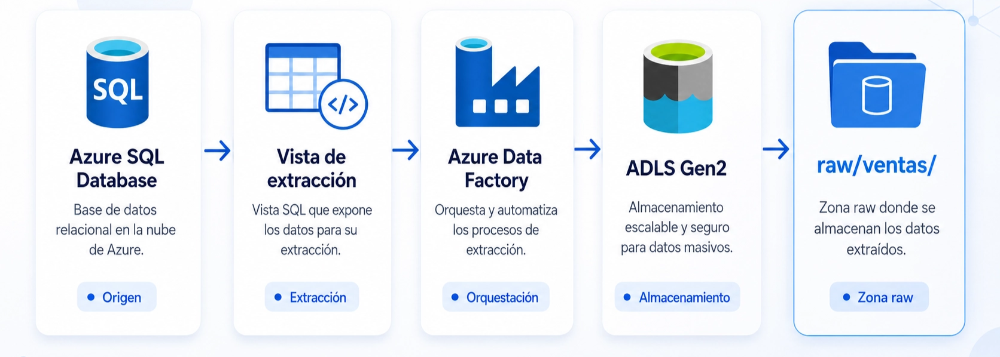

# 🧑🏽‍💻 Clase 18 - Ejercicio 1 (Ingesta EL)

---

## Ejercicio 1: Azure SQL Database hacia ADLS Gen2


## Fase 1. Crear Azure SQL Database

### Paso 1. Crear el grupo de recursos

1. Acceder a Azure Portal.
2. Buscar **Grupos de recursos**.
3. Seleccionar **Crear**.
4. Indicar:
    
    ```
    Nombre: rg-practica1
    Región: la región disponible
    ```
    
5. Seleccionar **Revisar y crear**.
6. Seleccionar **Crear**.

### Paso 2. Crear la base de datos

1. Buscar **SQL database**
    
    
    
2. Seleccionar **Crear**.
3. Selecciona Free offer
    
    
    
4. Configurar:
    
    ```
    Grupo de recursos: rg-practica1
    Nombre de base de datos: sqldb-ventas
    ```
    
5. En **Servidor**, seleccionar **Crear nuevo**.
    
    
    
6. Indicar:
    
    ```
    Nombre del servidor: server-practica1
    Ubicación: la misma región
    Método de autenticación: autenticación SQL
    Usuario administrador: practica
    Contraseña: Azure12345
    ```
    
    
    
    
    
    Pulsar en OK.
    
7. Para una práctica educativa como esta, seleccionar una configuración pequeña de desarrollo o pruebas.
8. No habilitar redundancias avanzadas (o configuración necesaria) innecesarias para el laboratorio.
9. Seleccionar **Revisar y crear**.
    
    
    
10. Seleccionar **Crear/Create**.
    
    
    
11. Tras un par de minutos,  deberias ver esto:
    
    
    
12. Despliega Deployment details y deberias ver esto:
    
    
    

### Paso 3. Configurar la conectividad

En el servidor lógico de Azure SQL:

<aside>
💡

En la barra de búsqueda superior, escribe **SQL servers** o **Servidores SQL**. Abre el servidor que creaste para la práctica, por ejemplo: `server-practica1`

</aside>


1. Acceder a Security/**Networking** o **Redes**.
2. Seleccionar acceso mediante **Public access** → **Public network access y** debes dejar seleccionada `Selected networks`
    
    
    
    <aside>
    💡
    
    Eso significa que el servidor acepta conexiones mediante su endpoint público, pero únicamente desde las redes o direcciones IP autorizadas.
    
    </aside>
    
    En **Firewall rules**, pulsa: Add your client IPv4 address…
    
    
    
3. Agregar la dirección IP actual del equipo.
4. Para permitir la conexión desde Azure Data Factory durante el laboratorio, habilitar temporalmente:
    
    ```
    Allow Azure services and resources to access this server
    ```
    
5. Guardar los cambios, pulsar en Save.
    
    
    

> Esta configuración simplifica el laboratorio. En producción deberían utilizarse redes privadas, endpoints privados y autenticación administrada.
> 

## Fase 2. Crear el modelo relacional

## Modelo de datos

```
Clientes  1 ─────── N Ventas
Productos 1 ─────── N Ventas
Tiendas   1 ─────── N Ventas
```

La granularidad de `Ventas` será:

> Una fila representa un producto vendido dentro de una factura.
> 

Por esta razón, una factura puede aparecer en varias filas, diferenciadas mediante `LineaFactura`.

---

# 6. Script SQL completo

Se puede ejecutar desde:

- El editor de consultas de Azure Portal.
- SQL Server Management Studio.
- Azure Data Studio.
- Visual Studio Code con una extensión SQL.

El editor de consultas de Azure Portal permite conectarse a Azure SQL Database y ejecutar sentencias T-SQL directamente.

- Abrir la base de datos, pulsa en `sqldb-ventas (server-practica1/sqldb-ventas)`
    
    
    
- En el menú lateral busca: **Query editor (preview)** o **Editor de consultas (versión preliminar).**
    
    
    
    > Puedes escribir `Query editor` en el buscador del menú lateral si no aparece a primera vista. Este editor permite ejecutar sentencias T-SQL directamente desde el navegador.
    > 
- Selecciona **SQL authentication** e introduce:
    
    ```
    Login: practica
    Password: la contraseña que configuraste al crear el servidor
    ```
    
    
    
- Pulsa en Connect.
- Pulsa en New Query
    
    
    
- Ahora, dentro del **Query Editor**, haz primero una prueba rápida:
    
    ```sql
    SELECT
        DB_NAME() AS BaseDeDatos,
        ORIGINAL_LOGIN() AS UsuarioConectado;
    ```
    
- Pulsa **Run** y verifica que aparezca:
    
    ```sql
    BaseDeDatos: sqldb-ventas
    UsuarioConectado: practica
    ```
    
    
    
- Borra la consulta de prueba.
- Copia todo el contenido que tienes abajo
    
    > **Advertencia:** el siguiente script elimina las tablas de la práctica si ya existen.
    > 
    
    ```sql
    /* ============================================================
       Ejercicio 1
       Azure SQL Database -> Vista -> ADF -> ADLS Gen2
       ============================================================ */
    
    SET NOCOUNT ON;
    
    /* ============================================================
       1. ELIMINACIÓN DE OBJETOS PREVIOS
       Permite volver a ejecutar toda la práctica desde cero.
       ============================================================ */
    
    IF OBJECT_ID(N'etl.vw_ventas_extraccion', N'V') IS NOT NULL
        DROP VIEW etl.vw_ventas_extraccion;
    
    IF OBJECT_ID(N'dbo.Ventas', N'U') IS NOT NULL
        DROP TABLE dbo.Ventas;
    
    IF OBJECT_ID(N'dbo.Clientes', N'U') IS NOT NULL
        DROP TABLE dbo.Clientes;
    
    IF OBJECT_ID(N'dbo.Productos', N'U') IS NOT NULL
        DROP TABLE dbo.Productos;
    
    IF OBJECT_ID(N'dbo.Tiendas', N'U') IS NOT NULL
        DROP TABLE dbo.Tiendas;
    
    /* ============================================================
       2. CREACIÓN DEL ESQUEMA DE EXTRACCIÓN
       ============================================================ */
    
    IF NOT EXISTS (
        SELECT 1
        FROM sys.schemas
        WHERE name = N'etl'
    )
    BEGIN
        EXEC(N'CREATE SCHEMA etl AUTHORIZATION dbo;');
    END;
    
    /* ============================================================
       3. TABLA DE CLIENTES
       ============================================================ */
    
    CREATE TABLE dbo.Clientes
    (
        ClienteId       INT IDENTITY(1,1) NOT NULL,
        Nombre          NVARCHAR(80) NOT NULL,
        Apellidos       NVARCHAR(120) NOT NULL,
        Email           NVARCHAR(255) NOT NULL,
        Ciudad          NVARCHAR(80) NOT NULL,
        Provincia       NVARCHAR(80) NOT NULL,
        Pais            CHAR(2) NOT NULL
            CONSTRAINT DF_Clientes_Pais DEFAULT ('ES'),
        FechaAlta       DATE NOT NULL
            CONSTRAINT DF_Clientes_FechaAlta
            DEFAULT (CONVERT(DATE, SYSUTCDATETIME())),
        Activo          BIT NOT NULL
            CONSTRAINT DF_Clientes_Activo DEFAULT (1),
        FechaCreacion   DATETIME2(0) NOT NULL
            CONSTRAINT DF_Clientes_FechaCreacion
            DEFAULT (SYSUTCDATETIME()),
    
        CONSTRAINT PK_Clientes
            PRIMARY KEY (ClienteId),
    
        CONSTRAINT UQ_Clientes_Email
            UNIQUE (Email)
    );
    
    /* ============================================================
       4. TABLA DE PRODUCTOS
       ============================================================ */
    
    CREATE TABLE dbo.Productos
    (
        ProductoId      INT IDENTITY(1,1) NOT NULL,
        SKU             NVARCHAR(30) NOT NULL,
        NombreProducto  NVARCHAR(150) NOT NULL,
        Categoria       NVARCHAR(80) NOT NULL,
        PrecioLista     DECIMAL(12,2) NOT NULL,
        Activo          BIT NOT NULL
            CONSTRAINT DF_Productos_Activo DEFAULT (1),
        FechaCreacion   DATETIME2(0) NOT NULL
            CONSTRAINT DF_Productos_FechaCreacion
            DEFAULT (SYSUTCDATETIME()),
    
        CONSTRAINT PK_Productos
            PRIMARY KEY (ProductoId),
    
        CONSTRAINT UQ_Productos_SKU
            UNIQUE (SKU),
    
        CONSTRAINT CK_Productos_PrecioLista
            CHECK (PrecioLista >= 0)
    );
    
    /* ============================================================
       5. TABLA DE TIENDAS
       ============================================================ */
    
    CREATE TABLE dbo.Tiendas
    (
        TiendaId        INT IDENTITY(1,1) NOT NULL,
        CodigoTienda    NVARCHAR(20) NOT NULL,
        NombreTienda    NVARCHAR(120) NOT NULL,
        Ciudad          NVARCHAR(80) NOT NULL,
        Provincia       NVARCHAR(80) NOT NULL,
        Canal           NVARCHAR(20) NOT NULL,
        Activa          BIT NOT NULL
            CONSTRAINT DF_Tiendas_Activa DEFAULT (1),
        FechaCreacion   DATETIME2(0) NOT NULL
            CONSTRAINT DF_Tiendas_FechaCreacion
            DEFAULT (SYSUTCDATETIME()),
    
        CONSTRAINT PK_Tiendas
            PRIMARY KEY (TiendaId),
    
        CONSTRAINT UQ_Tiendas_Codigo
            UNIQUE (CodigoTienda),
    
        CONSTRAINT CK_Tiendas_Canal
            CHECK (Canal IN (N'Física', N'Online'))
    );
    
    /* ============================================================
       6. TABLA DE VENTAS
       Una fila representa una línea de factura.
       ============================================================ */
    
    CREATE TABLE dbo.Ventas
    (
        VentaId             BIGINT IDENTITY(1,1) NOT NULL,
        NumeroFactura       NVARCHAR(30) NOT NULL,
        LineaFactura        SMALLINT NOT NULL,
        FechaVenta          DATETIME2(0) NOT NULL,
    
        ClienteId           INT NOT NULL,
        ProductoId          INT NOT NULL,
        TiendaId            INT NOT NULL,
    
        Cantidad            SMALLINT NOT NULL,
        PrecioUnitario      DECIMAL(12,2) NOT NULL,
        DescuentoPct        DECIMAL(5,2) NOT NULL
            CONSTRAINT DF_Ventas_Descuento DEFAULT (0),
    
        ImporteBruto AS
        (
            CONVERT(
                DECIMAL(14,2),
                Cantidad * PrecioUnitario
            )
        ) PERSISTED,
    
        ImporteDescuento AS
        (
            CONVERT(
                DECIMAL(14,2),
                Cantidad * PrecioUnitario * (DescuentoPct / 100.0)
            )
        ) PERSISTED,
    
        ImporteNeto AS
        (
            CONVERT(
                DECIMAL(14,2),
                Cantidad * PrecioUnitario
                * (1 - DescuentoPct / 100.0)
            )
        ) PERSISTED,
    
        MetodoPago         NVARCHAR(30) NOT NULL,
        EstadoVenta        NVARCHAR(20) NOT NULL
            CONSTRAINT DF_Ventas_Estado DEFAULT (N'Completada'),
    
        FechaCreacion      DATETIME2(0) NOT NULL
            CONSTRAINT DF_Ventas_FechaCreacion
            DEFAULT (SYSUTCDATETIME()),
    
        FechaModificacion  DATETIME2(0) NOT NULL
            CONSTRAINT DF_Ventas_FechaModificacion
            DEFAULT (SYSUTCDATETIME()),
    
        CONSTRAINT PK_Ventas
            PRIMARY KEY (VentaId),
    
        CONSTRAINT UQ_Ventas_FacturaLinea
            UNIQUE (NumeroFactura, LineaFactura),
    
        CONSTRAINT FK_Ventas_Clientes
            FOREIGN KEY (ClienteId)
            REFERENCES dbo.Clientes (ClienteId),
    
        CONSTRAINT FK_Ventas_Productos
            FOREIGN KEY (ProductoId)
            REFERENCES dbo.Productos (ProductoId),
    
        CONSTRAINT FK_Ventas_Tiendas
            FOREIGN KEY (TiendaId)
            REFERENCES dbo.Tiendas (TiendaId),
    
        CONSTRAINT CK_Ventas_LineaFactura
            CHECK (LineaFactura > 0),
    
        CONSTRAINT CK_Ventas_Cantidad
            CHECK (Cantidad > 0),
    
        CONSTRAINT CK_Ventas_PrecioUnitario
            CHECK (PrecioUnitario >= 0),
    
        CONSTRAINT CK_Ventas_Descuento
            CHECK (DescuentoPct BETWEEN 0 AND 100),
    
        CONSTRAINT CK_Ventas_MetodoPago
            CHECK (
                MetodoPago IN (
                    N'Tarjeta',
                    N'Efectivo',
                    N'Transferencia',
                    N'PayPal'
                )
            ),
    
        CONSTRAINT CK_Ventas_Estado
            CHECK (
                EstadoVenta IN (
                    N'Completada',
                    N'Cancelada',
                    N'Devuelta'
                )
            )
    );
    
    /* ============================================================
       7. ÍNDICES DE APOYO
       ============================================================ */
    
    CREATE INDEX IX_Ventas_FechaVenta
        ON dbo.Ventas (FechaVenta);
    
    CREATE INDEX IX_Ventas_ClienteId
        ON dbo.Ventas (ClienteId);
    
    CREATE INDEX IX_Ventas_ProductoId
        ON dbo.Ventas (ProductoId);
    
    CREATE INDEX IX_Ventas_TiendaId
        ON dbo.Ventas (TiendaId);
    
    CREATE INDEX IX_Ventas_FechaModificacion
        ON dbo.Ventas (FechaModificacion);
    
    /* ============================================================
       8. DATOS DE CLIENTES
       ============================================================ */
    
    INSERT INTO dbo.Clientes
    (
        Nombre,
        Apellidos,
        Email,
        Ciudad,
        Provincia,
        Pais,
        FechaAlta
    )
    VALUES
    (N'Ana',    N'López Martín',      N'ana.lopez@example.com',       N'Madrid',     N'Madrid',     'ES', '2025-10-10'),
    (N'Carlos', N'García Pérez',      N'carlos.garcia@example.com',   N'Barcelona',  N'Barcelona',  'ES', '2025-10-15'),
    (N'Lucía',  N'Martínez Ruiz',     N'lucia.martinez@example.com',  N'Valencia',   N'Valencia',   'ES', '2025-11-03'),
    (N'Diego',  N'Sánchez Moreno',    N'diego.sanchez@example.com',   N'Sevilla',    N'Sevilla',    'ES', '2025-11-11'),
    (N'Marta',  N'Ruiz Fernández',    N'marta.ruiz@example.com',      N'Bilbao',     N'Bizkaia',    'ES', '2025-12-01'),
    (N'Javier', N'Torres Gómez',      N'javier.torres@example.com',   N'Zaragoza',   N'Zaragoza',   'ES', '2025-12-14'),
    (N'Elena',  N'Navarro Gil',       N'elena.navarro@example.com',   N'Alicante',   N'Alicante',   'ES', '2026-01-05'),
    (N'Pablo',  N'Romero Díaz',       N'pablo.romero@example.com',    N'Málaga',     N'Málaga',     'ES', '2026-01-17'),
    (N'Sofía',  N'Díaz Ortega',       N'sofia.diaz@example.com',      N'Valladolid', N'Valladolid', 'ES', '2026-02-08'),
    (N'Miguel', N'Castillo Molina',   N'miguel.castillo@example.com', N'Murcia',     N'Murcia',     'ES', '2026-02-20');
    
    /* ============================================================
       9. DATOS DE PRODUCTOS
       ============================================================ */
    
    INSERT INTO dbo.Productos
    (
        SKU,
        NombreProducto,
        Categoria,
        PrecioLista
    )
    VALUES
    (N'P001', N'Portátil Pro 15',           N'Informática',  1049.90),
    (N'P002', N'Monitor 27 pulgadas',        N'Informática',   239.90),
    (N'P003', N'Teclado mecánico',           N'Accesorios',     49.90),
    (N'P004', N'Ratón inalámbrico',          N'Accesorios',     24.90),
    (N'P005', N'Auriculares Bluetooth',      N'Audio',          79.90),
    (N'P006', N'Webcam Full HD',             N'Accesorios',     69.90),
    (N'P007', N'Silla ergonómica',           N'Mobiliario',    189.00),
    (N'P008', N'Mesa de oficina',            N'Mobiliario',    249.00),
    (N'P009', N'Disco SSD 1 TB',             N'Almacenamiento', 89.90),
    (N'P010', N'Router Wi-Fi 6',             N'Redes',         119.90),
    (N'P011', N'Tablet 10 pulgadas',         N'Movilidad',     399.00),
    (N'P012', N'Impresora multifunción',     N'Impresión',     179.90);
    
    /* ============================================================
       10. DATOS DE TIENDAS
       ============================================================ */
    
    INSERT INTO dbo.Tiendas
    (
        CodigoTienda,
        NombreTienda,
        Ciudad,
        Provincia,
        Canal
    )
    VALUES
    (N'T001', N'Madrid Centro',       N'Madrid',    N'Madrid',    N'Física'),
    (N'T002', N'Barcelona Diagonal',  N'Barcelona', N'Barcelona', N'Física'),
    (N'T003', N'Valencia Centro',     N'Valencia',  N'Valencia',  N'Física'),
    (N'T004', N'Tienda Online',       N'Madrid',    N'Madrid',    N'Online');
    
    /* ============================================================
       11. DATOS DE VENTAS
       30 líneas de venta distribuidas entre abril y junio de 2026.
       ============================================================ */
    
    INSERT INTO dbo.Ventas
    (
        NumeroFactura,
        LineaFactura,
        FechaVenta,
        ClienteId,
        ProductoId,
        TiendaId,
        Cantidad,
        PrecioUnitario,
        DescuentoPct,
        MetodoPago,
        EstadoVenta
    )
    VALUES
    (N'F-2026-0001', 1, '2026-04-01T10:15:00',  1,  1, 1, 1,  999.90,  5.00, N'Tarjeta',       N'Completada'),
    (N'F-2026-0001', 2, '2026-04-01T10:15:00',  1,  3, 1, 1,   49.90,  0.00, N'Tarjeta',       N'Completada'),
    
    (N'F-2026-0002', 1, '2026-04-04T12:30:00',  2,  2, 2, 2,  229.90, 10.00, N'Tarjeta',       N'Completada'),
    
    (N'F-2026-0003', 1, '2026-04-08T18:20:00',  3,  4, 4, 2,   24.90,  0.00, N'PayPal',        N'Completada'),
    (N'F-2026-0003', 2, '2026-04-08T18:20:00',  3,  5, 4, 1,   79.90,  0.00, N'PayPal',        N'Completada'),
    
    (N'F-2026-0004', 1, '2026-04-12T11:45:00',  4,  7, 3, 1,  189.00,  5.00, N'Tarjeta',       N'Completada'),
    
    (N'F-2026-0005', 1, '2026-04-17T09:10:00',  5, 11, 4, 1,  399.00,  0.00, N'Transferencia', N'Completada'),
    (N'F-2026-0005', 2, '2026-04-17T09:10:00',  5,  6, 4, 1,   69.90,  0.00, N'Transferencia', N'Completada'),
    
    (N'F-2026-0006', 1, '2026-04-22T17:05:00',  6,  9, 1, 2,   89.90, 10.00, N'Efectivo',      N'Completada'),
    
    (N'F-2026-0007', 1, '2026-04-27T13:40:00',  7, 10, 2, 1,  119.90,  0.00, N'Tarjeta',       N'Completada'),
    (N'F-2026-0007', 2, '2026-04-27T13:40:00',  7,  3, 2, 2,   49.90,  0.00, N'Tarjeta',       N'Completada'),
    
    (N'F-2026-0008', 1, '2026-05-02T16:25:00',  8,  8, 3, 1,  249.00,  5.00, N'Tarjeta',       N'Completada'),
    
    (N'F-2026-0009', 1, '2026-05-06T20:15:00',  9, 12, 4, 1,  179.90, 15.00, N'PayPal',        N'Completada'),
    
    (N'F-2026-0010', 1, '2026-05-10T10:00:00', 10,  2, 1, 1,  229.90,  0.00, N'Efectivo',      N'Completada'),
    (N'F-2026-0010', 2, '2026-05-10T10:00:00', 10,  4, 1, 1,   24.90,  0.00, N'Efectivo',      N'Completada'),
    
    (N'F-2026-0011', 1, '2026-05-15T12:50:00',  1,  5, 2, 2,   79.90, 10.00, N'Tarjeta',       N'Completada'),
    
    (N'F-2026-0012', 1, '2026-05-19T19:30:00',  2,  6, 4, 1,   69.90,  0.00, N'PayPal',        N'Completada'),
    (N'F-2026-0012', 2, '2026-05-19T19:30:00',  2,  9, 4, 1,   89.90,  0.00, N'PayPal',        N'Completada'),
    
    (N'F-2026-0013', 1, '2026-05-24T11:20:00',  3, 11, 3, 1,  399.00,  5.00, N'Tarjeta',       N'Completada'),
    
    (N'F-2026-0014', 1, '2026-05-29T15:10:00',  4,  1, 1, 1, 1049.90, 10.00, N'Tarjeta',       N'Completada'),
    (N'F-2026-0014', 2, '2026-05-29T15:10:00',  4, 10, 1, 1,  119.90,  0.00, N'Tarjeta',       N'Completada'),
    
    (N'F-2026-0015', 1, '2026-06-03T13:35:00',  5,  7, 2, 2,  189.00,  5.00, N'Transferencia', N'Completada'),
    
    (N'F-2026-0016', 1, '2026-06-07T18:10:00',  6, 12, 4, 1,  179.90,  0.00, N'PayPal',        N'Completada'),
    (N'F-2026-0016', 2, '2026-06-07T18:10:00',  6,  3, 4, 1,   49.90,  0.00, N'PayPal',        N'Completada'),
    
    (N'F-2026-0017', 1, '2026-06-11T10:45:00',  7,  8, 3, 1,  249.00, 10.00, N'Tarjeta',       N'Completada'),
    
    (N'F-2026-0018', 1, '2026-06-14T12:20:00',  8,  2, 2, 2,  239.90,  5.00, N'Tarjeta',       N'Completada'),
    (N'F-2026-0018', 2, '2026-06-14T12:20:00',  8,  4, 2, 2,   24.90,  0.00, N'Tarjeta',       N'Completada'),
    
    (N'F-2026-0019', 1, '2026-06-18T09:40:00',  9,  9, 1, 3,   89.90, 15.00, N'Efectivo',      N'Completada'),
    
    (N'F-2026-0020', 1, '2026-06-20T21:05:00', 10,  5, 4, 1,   79.90,  0.00, N'PayPal',        N'Completada'),
    (N'F-2026-0020', 2, '2026-06-20T21:05:00', 10,  6, 4, 1,   69.90,  0.00, N'PayPal',        N'Completada');
    
    /* ============================================================
       12. VISTA DE EXTRACCIÓN
       No agrega información y no aplica reglas analíticas.
       Solo une y proyecta los datos necesarios.
       ============================================================ */
    
    EXEC(N'
    CREATE OR ALTER VIEW etl.vw_ventas_extraccion
    AS
    SELECT
        v.VentaId,
        v.NumeroFactura,
        v.LineaFactura,
        v.FechaVenta,
    
        v.ClienteId,
        CONCAT(c.Nombre, N'' '', c.Apellidos) AS NombreCliente,
        c.Email AS EmailCliente,
        c.Ciudad AS CiudadCliente,
        c.Provincia AS ProvinciaCliente,
        c.Pais AS PaisCliente,
    
        v.ProductoId,
        p.SKU,
        p.NombreProducto,
        p.Categoria,
    
        v.TiendaId,
        t.CodigoTienda,
        t.NombreTienda,
        t.Canal,
        t.Ciudad AS CiudadTienda,
        t.Provincia AS ProvinciaTienda,
    
        v.Cantidad,
        v.PrecioUnitario,
        v.DescuentoPct,
        v.ImporteBruto,
        v.ImporteDescuento,
        v.ImporteNeto,
    
        v.MetodoPago,
        v.EstadoVenta,
        v.FechaCreacion,
        v.FechaModificacion
    
    FROM dbo.Ventas AS v
    
    INNER JOIN dbo.Clientes AS c
        ON v.ClienteId = c.ClienteId
    
    INNER JOIN dbo.Productos AS p
        ON v.ProductoId = p.ProductoId
    
    INNER JOIN dbo.Tiendas AS t
        ON v.TiendaId = t.TiendaId;
    ');
    
    /* ============================================================
       13. VALIDACIONES
       ============================================================ */
    
    SELECT N'Clientes' AS Entidad, COUNT(*) AS NumeroRegistros
    FROM dbo.Clientes
    
    UNION ALL
    
    SELECT N'Productos', COUNT(*)
    FROM dbo.Productos
    
    UNION ALL
    
    SELECT N'Tiendas', COUNT(*)
    FROM dbo.Tiendas
    
    UNION ALL
    
    SELECT N'Ventas', COUNT(*)
    FROM dbo.Ventas;
    
    SELECT TOP (20)
        *
    FROM etl.vw_ventas_extraccion
    ORDER BY VentaId;
    ```
    
- Pégalo en el editor, y luego pulsa en Run:
    
    
    
    
    
- El script creará:
    - `dbo.Clientes`
    - `dbo.Productos`
    - `dbo.Tiendas`
    - `dbo.Ventas`
    - el esquema `etl`
    - la vista `etl.vw_ventas_extraccion`
    - índices y datos de ejemplo.
        
        
        
- Ejecuta también estas comprobaciones:
    
    ```sql
    SELECT COUNT(*) AS Clientes FROM dbo.Clientes;
    ```
    
    
    
    ```sql
    SELECT COUNT(*) AS Productos FROM dbo.Productos;
    ```
    
    
    
    ```sql
    SELECT COUNT(*) AS Tiendas FROM dbo.Tiendas;
    ```
    
    
    
    ```sql
    SELECT COUNT(*) AS Ventas FROM dbo.Ventas;
    ```
    
    
    
    ```sql
    SELECT TOP (10) *
    FROM etl.vw_ventas_extraccion;
    ```
    
    
    

### Resultado que debe devolver la validación

```
Clientes     10
Productos    12
Tiendas       4
Ventas       30
```

La vista también debe devolver exactamente 30 filas:

```sql
SELECT COUNT(*) AS FilasVista
FROM etl.vw_ventas_extraccion;
```


---

### Comprobar las relaciones y los importes

#### Ventas por categoría

```sql
SELECT
    Categoria,
    SUM(ImporteNeto) AS VentasNetas
FROM etl.vw_ventas_extraccion
GROUP BY Categoria
ORDER BY VentasNetas DESC;
```


#### Ventas por tienda

```sql
SELECT
    NombreTienda,
    Canal,
COUNT(DISTINCT NumeroFactura) AS NumeroFacturas,
    SUM(ImporteNeto) AS VentasNetas
FROM etl.vw_ventas_extraccion
GROUP BY
    NombreTienda,
    Canal
ORDER BY VentasNetas DESC;
```


#### Ventas por cliente

```sql
SELECT
    ClienteId,
    NombreCliente,
    COUNT(DISTINCT NumeroFactura) AS NumeroFacturas,
    SUM(ImporteNeto) AS VentasNetas
FROM etl.vw_ventas_extraccion
GROUP BY
    ClienteId,
    NombreCliente
ORDER BY VentasNetas DESC;
```


> Estas consultas son únicamente de validación. Azure Data Factory copiará las filas de la vista sin agregar los datos.
> 

## Fase 3. Crear Azure Data Lake Storage Gen2

ADLS Gen2 se implementa mediante una cuenta de almacenamiento con el espacio de nombres jerárquico habilitado. Esta característica permite trabajar con contenedores, directorios y archivos como una estructura de Data Lake.

### Paso 1. Crear la cuenta de almacenamiento

1. Buscar **Storage accounts**.
    
    
    
2. Seleccionar **Crear**.
    
    
    
3. Configurar:
    
    ```
    Grupo de recursos: rg-practica1
    Nombre: storageaccountpractica1
    Región: la misma que los demás servicios
    Primary service: Azure Blob Storage or Azure Data Lake Storage Gen 2
    Rendimiento(Performance): Standard
    Redundancia: LRS-Locally redundant storage
    ```
    
    
    
4. No pulses todavía **Review + create**. Entra en la pestaña **Advanced** y busca la sección: **`Azure Blob Storage`**y activa:
    
    ```
    Enable hierarchical namespace
    ```
    
5. En estas opciones
    - **Enable SFTP:** desactivado
    - **Allow cross-tenant replication:** desactivado
    - **Access tier:** `Hot`
    - **Enable network file system v3:** desactivado
    - Resto de opciones: valores predeterminados
        
        
        
    - 
6. Después pulsa **Review + create**.
    
    > La opción de espacio de nombres jerárquico es esencial porque permitirá trabajar con una estructura real de directorios como:
    > 
    > 
    > ```
    > raw/
    > └── ventas/
    >     └── fecha_carga=2026-06-26/
    >         └── ventas_20260626_172000.csv
    > ```
    > 
    
    
    
7. Pulsar en **Create**.
    
    
    
    Pulsa en `Go to resource` para seguir el siguiente paso
    

---

## Paso 2. Crear el contenedor

1. Abrir la cuenta de almacenamiento (lo que viene despues pulsar en Go to resource).
2. Acceder a **Storage browser**.
    
    
    
3. Seleccionar **Blob containers**.
    
    
    
4. Pulsa **Add container** o **+ Container**.
    
    
    
5. Configura:
    
    ```
    Name: datalake
    Anonymous access level: Private (no anonymous access)
    ```
    
    
    
6. Pulsar en Create.
    
    
    

### Paso 3. Crear la estructura inicial

- Dentro del contenedor `datalake`
    
    
    
- Pulsa **Add directory** o **New directory**.
    
    
    
- Crea el directorio:
    
    ```
    raw
    ```
    
    
    
- Entra en raw y crea `ventas`
    
    
    
- La estructura quedará:
    
    ```
    datalake/
    └── raw/
        └── ventas/
    ```
    
    
    

> ADF podrá crear automáticamente las subcarpetas de fecha cuando ejecute el pipeline.
> 

---

# Fase 4. Crear Azure Data Factory

> Azure Data Factory utiliza la actividad Copy para mover datos entre almacenes cloud y locales. La actividad admite Azure SQL Database como origen y ADLS Gen2 como destino, incluyendo archivos CSV y Parquet.
> 

## Paso 1. Crear Data Factory

1. Buscar **Data factories**.
    
    
    
2. Seleccionar **Create**.
    
    
    
3. Configurar:
    
    ```
    Grupo de recursos: rg-practica1
    Nombre: adf-practica1
    Región: la misma región
    Versión: V2
    ```
    
    
    
4. No es obligatorio configurar Git para esta práctica.
5. Pulsar en **Review + create** 
    
    
    
6. Pulsar en **Create**.
    
    
    
7. Abrir el recurso. Pulsa en **Go to resource**
    
    
    
8. Pulsa en adf-practica1
    
    
    
9. Seleccionar **Launch Studio**.
    
    
    
    
    

---

# Fase 5. Autorizar a Data Factory sobre ADLS Gen2

Data Factory dispone de una identidad administrada. Esta identidad puede recibir permisos sobre otros recursos de Azure sin que sea necesario almacenar claves dentro del pipeline.

## Asignar el rol

> Deja la pestaña de adf abierta y, en otra pestaña del navegador, vuelve a Azure Portal.
> 
1. Abre `storageaccountpractica1`.
    
    
    
2. En el menú lateral, entra en **Access control (IAM)**.
    
    
    
3. Pulsa **Add → Add role assignment**.
    
    
    
4. Busca y selecciona:
    
    ```
    Storage Blob Data Contributor
    ```
    
    
    
5. Pulsa en Next:
    
    
    
6. En **Assign access to**, selecciona: `Managed identity`
    
    
    
7. Pulsa **Select members**.
    
    
    
8. Configura:
    
    ```
    Subscription: Azure for Students
    Managed identity: Data factory
    Select: adf-practica1
    ```
    
    
    
    > Debes pulsar en adf-practica1 para que se mueva a Selected members
    > 
    
    
    
9. Pulsa **Select**.
10. Termina con **Review + assign** y nuevamente **Review + assign**.
    
    
    
    
    
    
    
    > Este rol permite a la identidad de Data Factory leer, crear, modificar y eliminar archivos o blobs dentro del almacenamiento.
    > 
    
    <aside>
    💡
    
    **Después espera uno o dos minutos para que el permiso se propague**. 
    
    A continuación volveremos a la pantalla de Data Factory Studio y crearemos el primer **Linked Service** para Azure SQL Database
    
    </aside>
    

---

## Fase 6. Crear el Linked Service de Azure SQL Database

Vuelve a la pestaña de Data Factory Studio:


1. Abrir **Manage**.
    
    
    
2. Seleccionar **Linked services**.
    
    
    
3. Seleccionar **New**.
    
    
    
4. Buscar:
    
    ```
    Azure SQL Database
    ```
    
    
    
5. Pulsar en Azure SQL Database, luego en Continue:
    
    
    
6. Configurar:
    
    ```
    Nombre: ls_azure_sql_ventas
    Version: 2.0
    Account selection method: From Azure subscription
    Server name: server-practica1
    Database name: sqldb-ventas
    Authentication type: SQL Authentication
    User name: practica
    Contraseña: la contraseña del servidor
    Encrypt: Mandatory
    Trust server certificate: desactivado
    Always encrypted: desactivado
    Host name in certificate: vacío
    ```
    
    
    
    
    
7. Ahora pulsa **Test connection** antes de crear el Linked Service. Si aparece: `Connection successful`pulsa **Create**.
    
    
    


> La contraseña queda almacenada cifrada dentro del servicio, pero para una solución empresarial debería usarse una identidad administrada o Azure Key Vault.
> 

Si la prueba falla:

- Revisar el firewall de Azure SQL.
- Confirmar la dirección del servidor.
- Confirmar el nombre de la base de datos.
- Confirmar las credenciales.
- Confirmar que se permite temporalmente el acceso desde servicios de Azure.
- Verificar que la base de datos está online

---

# Fase 7. Crear el Linked Service de ADLS Gen2

1. En Azure Data Factory Studio: Ve a **Manage → Linked services**, seleccionar **New**.
    
    
    
    
    
2. Busca y selecciona: `Azure Data Lake Storage Gen2`
    
    
    
3. Pulsar en Continue
4. Configurar:
    
    ```
    Nombre: ls_adls_gen2
    Connect via integration runtime: AutoResolveIntegrationRuntime
    Authentication type: System Assigned Managed Identity
    Account Selection method: From Azure subscription
    Azure subcription: Azure for Students
    Storage account name: storageaccountpractica1
    
    ```
    
    La URL del servicio tendrá una estructura similar a:
    
    ```
    https://storageaccountpractica1.dfs.core.windows.net
    ```
    
5. En test connection seleccionar: **To linked service**
6. Pulsar en Test connection y si aparece `Connection succesfull` pulsa en `Create`
    
    
    
    
    
7. Pulsar en Validate all y luego Publish all.
    
    
    
8. Espera al mensaje **Successfully published**. Si no tienes errores te debería salir:
    
    
    
    > Tener en cuenta que **Publish all publica todos los cambios pendientes a la vez**, no solamente el elemento que tienes seleccionado. Después de publicarlo, la insignia amarilla debería desaparecer. Los Linked Services publicados podrán ser utilizados posteriormente por los datasets y pipelines.
    > 

<aside>
💡

El conector de ADLS Gen2 puede utilizarse como destino de una actividad Copy de ADF.

</aside>

---

## Fase 8. Crear el dataset de origen

> Este dataset representará la vista SQL: `etl.vw_ventas_extraccion` . El **Linked Service** contiene la conexión con Azure SQL; el **dataset** indica qué objeto concreto leer dentro de esa conexión.
> 
1.  En Azure Data Factory Abrir la sección **Author**.
    
    
    
2. En el panel **Factory Resources pulsa en +**
    
    
    
3. Selecciona Dataset 
    
    
    
4. En el buscador escribe `Azure SQL Database` 
    
    
    
5. Selecciona Continue.
6. En Set properties introduce:
    
    ```
    Name: ds_sql_vw_ventas_extraccion
    En Linked service selecciona: ls_azure_sql_ventas 
    En Table name selecciona: etl.vw_ventas_extraccion
    En import schema selecciona: From connection/store
    ```
    
    
    
7. Pulsar en OK.
8. Antes de publicar es aconsejable pulsar en Preview data 
y verifica que aparecen las filas de `etl.vw_ventas_extraccion`.
    
    
    
    
    
9. En la pestaña **Schema**, confirma que se han importado las columnas.
    
    
    
10. Pulsa **Validate all**. y luego **Publish all.** 
    
    
    
    
    
11. Pulsar en Publish y esperar que salga: `Publishin complete`
    
    
    

---

# Fase 9. Crear el dataset de destino

<aside>
💡

Este dataset representará el archivo CSV que Azure Data Factory escribirá dentro de ADLS Gen2. La ruta y el nombre del archivo serán dinámicos.

</aside>

### Dataset CSV de ADLS Gen2

1. Ir a Azure Data Studio,  En Author crear un dataset nuevo pulsando en + 
    
    
    
2. Elegir `Azure Data Lake Storage Gen2`  y luego pulsar en Continue.
    
    
    
3. En **Select Format** elige `DelimitedText`  y luego Continue
    
    
    
4. En Set properties: 
    
    ```
    1. Name: ds_adls_raw_ventas_csv
    2. Linked Service: ls_adls_gen2
    3. En File path: 
    - File system: datalake
    - Directory:  dejar vacio
    - File name: dejar vacio
    Tambien puedes pulsar el icono de la carpeta
    para seleccionar el contenedor datalake
    4. Dejar activado: First Row as header
    5. En Import Schema selecciona: None
    El archivo todavía no existe, así que ADF 
    no puede importar su esquema desde el almacenamiento.
    ```
    
    > Una vez rellenadas las propiedades, pulsa en ok.
    > 
    
    
    
    
    
5. A continuación, dentro del dataset, en Parameters, crea:
    
    ```
    pDirectorio   String
    pArchivo      String
    ```
    
    
    
    
    
    
    
6. En **Connection**, configura:
    
    ```
    Directory: @dataset().pDirectorio
    File:      @dataset().pArchivo
    ```
    
    
    
    El pipeline proporcionará después valores dinámicos como:
    
    ```
    raw/ventas/fecha_carga=2026-06-29
    ventas_20260629_153000.csv
    ```
    
    > Revisa que **First row as header** esté activado.
    > 
7. Ejecuta **Validate all** y finalmente **Publish all**.
    
    
    
    > Esta parametrización permite que cada ejecución genere una carpeta y un archivo distintos.
    > 

---

### Fase 10. Crear el pipeline

1. En **Author**, seleccionar **Pipelines**.
    
    
    
2. Pulsar en `…` y luego New pipeline
    
    
    
3. En el panel derecho, cambia el nombre a:
    
    ```
    pl_sql_ventas_to_adls_raw
    ```
    
    
    
4. Añadir la actividad Copy. En el panel **Activities busca `Copy data`:**
    
    
    
5. Arrástra “Copy data” al lienzo. Selecciona la actividad y, en la pestaña **General**, cambia su nombre a: `cp_vw_ventas_to_raw`
    
    
    
    
    
6. Configurar el origen. Con la actividad seleccionada, abre la pestaña **Source**.
    
    
    
7. Selecciona: `Source dataset: ds_sql_vw_ventas_extraccion`
    
    
    
8. En **Use query** o **Query type**, selecciona: `Query`
    
    
    
9. Introduce esta consulta:
    
    ```sql
    SELECT
        *,
        SYSUTCDATETIME() AS FechaExtraccionUtc
    FROM etl.vw_ventas_extraccion;
    ```
    
    > Esto copiará las 30 filas de la vista y añadirá a cada una la fecha y hora UTC de extracción. No se agregan ni eliminan registros.
    > 
    > 
    > Esto añade la fecha de ejecución de la extracción a cada fila.
    > 
    > No se aplican:
    > 
    > - Agregaciones.
    > - Reglas de negocio.
    > - Limpieza de nulos.
    > - Eliminación de registros.
    > - Cálculos analíticos adicionales.
    
    
    
10. **Configurar el destino**. Abre la pestaña **Sink** y selecciona:
    
    ```sql
    Sink dataset: ds_adls_raw_ventas_csv
    ```
    
    
    
    Aparecerán los parámetros del dataset. 
    
11. `pDirectorio`Pulsa **Add dynamic content** y escribe:
    
    ```sql
    @concat(
        'raw/ventas/fecha_carga=',
        formatDateTime(utcNow(),'yyyy-MM-dd')
    )
    ```
    
    
    
    
    
12. `pArchivo`.Pulsa **Add dynamic content** y escribe:
    
    ```sql
    @concat(
        'ventas_',
        formatDateTime(utcNow(),'yyyyMMdd_HHmmss'),
        '.csv'
    )
    ```
    
    La ruta resultante será similar a:
    
    ```
    datalake/
    └── raw/
        └── ventas/
            └── fecha_carga=2026-06-29/
                └── ventas_20260629_153000.csv
    ```
    
    
    
13. Configurar el mapeo. En la pestaña **Mapping**:
    
    
    
14. Pulsa **Import schemas y comprueba que aparecen las columnas de origen y destino.**
    
    
    
    
    
15. Verifica especialmente que se incluya:
    
    ```
    FechaExtraccionUtc
    ```
    
    
    
    > También deben aparecer columnas como `VentaId`, `NumeroFactura`, `FechaVenta`, `NombreCliente`, `NombreProducto`, `Cantidad`, `ImporteNeto`, etc.
    > 
16. Probar el pipeline. Pulsa en Vallidate:
    
    
    
17. Si no hay errores, pulsa **Debug**.
    
    
    
18. Espera a que termine la actividad. El resultado esperado es: Status Succeeded
    
    
    
19. Después de comprobar que funciona: `Vallidate all → Publish all`

---

---

## Fase 11. Verificar el archivo en ADLS Gen2

1. Abrir la cuenta de almacenamiento.
    
    
    
2. Acceder a **Storage browser**.
    
    
    
3. Abrir el contenedor: `datalake`
    
    
    
4. Navegar hasta:
    
    ```
    raw/
    └── ventas/
        └── fecha_carga=AAAA-MM-DD/
    ```
    
    y comprueba que existe un archivo: `ventas_AAAAMMDD_HHMMSS.csv`
    
    
    
5. Descargarlo o visualizarlo (Pulsar en View/Edit).
6. Comprobar que:
- Tiene encabezados.
- Contiene 30 registros de datos.
- Los identificadores coinciden con Azure SQL.
- Los importes aparecen correctamente.
- Incluye `FechaExtraccionUtc`.
    
    
    
    
    
    
    
    O si lo quieres descargar en csv y vsualizarlo en excel o vscode:
    
    
    
    
    
    
    

---

## Validación entre origen y destino

## Recuento en Azure SQL

```sql
SELECT COUNT(*) AS FilasOrigen
FROM etl.vw_ventas_extraccion;
```

Resultado esperado:

```
30
```

## Validación en ADF

En la salida de la actividad Copy:

```
Rows read: 30
Rows copied: 30
```


## Validación en el archivo

El CSV debe contener:

```
1 fila de encabezados
30 filas de datos
```


---

## Crear un trigger programado

Después de validar el pipeline se puede programar una carga diaria. Para ello debes ir a `Data Factory Studio`

1. Abrir el pipeline.
2. Seleccionar **Add trigger**.
    
    
    
3. Seleccionar **New/Edit**.
    
    
    
4. Crear un trigger de tipo **Schedule**.
5. Ejemplo:
    
    ```
    Nombre: trg_diario_ventas
    Frecuencia: cada 1 día
    Hora: 02:00
    Zona horaria: la indicada para el curso
    ```
    
    
    
6. Pulsar en OK
    
    
    
7. Pulsa OK otra vez.
8. Pulsa **Publish all → Publish**.
    
    
    
9. Después puedes comprobarlo en: Manage → Triggers.
    
    
    
    
    

Gracias al nombre dinámico, cada ejecución genera un archivo diferente.

```
raw/ventas/
├── fecha_carga=2026-06-25/
│   └── ventas_20260625_020000.csv
└── fecha_carga=2026-06-26/
    └── ventas_20260626_020000.csv
```

También podrás revisar sus ejecuciones en: `Monitor -> Trigger runs`

---

## Monitorización de ejecuciones automáticas

Cuando el trigger programado se active, Azure Data Factory iniciará automáticamente una ejecución del pipeline:

```
pl_sql_ventas_to_adls_raw
```

Para comprobar el resultado de la ejecución:

1. Abrir **Data Factory Studio**.
2. Acceder a **Monitor**.
3. Seleccionar **Pipeline runs**.
4. Abrir la pestaña **Triggered**.

> La pestaña **Debug** muestra únicamente las ejecuciones de prueba iniciadas desde el editor mediante el botón **Debug**.
> 
> 
> Las ejecuciones iniciadas por un trigger programado, por **Trigger now** o por otro mecanismo de activación aparecen en **Triggered**.
> 
1. Pulsar **Refresh** si la ejecución todavía no aparece.
2. Localizar el pipeline:
    
    ```
    pl_sql_ventas_to_adls_raw
    ```
    
3. Revisar la columna **Status**.
    
    Los estados habituales son:
    
    ```
    Succeeded
    Failed
    In progress
    Cancelled
    ```
    

### Interpretación de los estados

- **Succeeded:** el pipeline terminó correctamente.
- **Failed:** una actividad del pipeline produjo un error.
- **In progress:** la ejecución todavía está en curso.
- **Cancelled:** la ejecución fue cancelada antes de finalizar.

### Revisar el detalle de la actividad Copy

Para consultar los detalles:

1. Seleccionar el nombre de la ejecución del pipeline o el icono de detalle.
2. Abrir la actividad:
    
    ```
    cp_vw_ventas_to_raw
    ```
    
3. Revisar las métricas de ejecución, como:
    
    ```
    Rows read
    Rows copied
    Data read
    Data written
    Duration
    Throughput
    ```
    

En una ejecución correcta, el número de filas leídas y copiadas debería coincidir.

Por ejemplo:

```
Rows read: 30
Rows copied: 30
Status: Succeeded
```

Esto confirma que los registros de la vista SQL se han extraído y escrito correctamente en ADLS Gen2.

### Comprobar la ejecución del trigger

También se puede acceder a:

```
Monitor → Trigger runs
```

En esta sección se muestra:

- el nombre del trigger;
- la fecha y hora de activación;
- el estado de la ejecución;
- el pipeline iniciado;
- el resultado de la activación.

El trigger esperado es:

```
trg_diario_ventas
```

Para que el trigger se ejecute automáticamente, debe cumplirse lo siguiente:

- el trigger debe estar publicado;
- su estado debe ser **Started**;
- la fecha y hora programadas deben haberse alcanzado;
- el pipeline asociado también debe estar publicado.

### Validar el archivo generado

Después de una ejecución correcta, abrir la cuenta de almacenamiento y comprobar la ruta:

```
datalake/
└── raw/
    └── ventas/
        └── fecha_carga=AAAA-MM-DD/
            └── ventas_AAAAMMDD_HHMMSS.csv
```

Debe existir un nuevo archivo CSV correspondiente a la ejecución del trigger.

### Diagnóstico de errores

Si el pipeline aparece con estado **Failed**, abrir el detalle de la actividad Copy y revisar el mensaje completo de error.

Las causas más habituales son:

- Azure SQL Database pausada o no disponible;
- credenciales SQL incorrectas;
- firewall del servidor SQL;
- Linked Service de Azure SQL mal configurado;
- permisos insuficientes sobre ADLS Gen2;
- identidad administrada sin el rol `Storage Blob Data Contributor`;
- nombre incorrecto del contenedor;
- ruta de destino mal construida;
- nombre incorrecto de la vista SQL;
- parámetros `pDirectorio` o `pArchivo` incorrectos;
- incompatibilidad en tipos o mapeo de columnas.

Después de corregir el problema, puede ejecutarse el pipeline manualmente mediante:

```
Add trigger → Trigger now
```

De esta forma se valida la corrección sin tener que esperar a la siguiente ejecución programada.

---

## Consideración importante sobre la zona raw

En una arquitectura empresarial estricta, la zona `raw` suele conservar una copia lo más fiel posible de las tablas de origen:

```
raw/clientes/
raw/productos/
raw/tiendas/
raw/ventas/
```

En esta práctica se utiliza una vista desnormalizada porque el objetivo es trabajar un flujo sencillo:



La vista:

- No agrega ventas.
- No elimina filas.
- No aplica KPIs.
- No transforma los datos en un modelo dimensional.
- Solo resuelve las relaciones y selecciona columnas.

Por tanto, debe entenderse esta practica **como un primer paso hacia una ETL completa que se tratará mas adelante**. En un caso posterior se podrían copiar las cuatro tablas de forma independiente y realizar las uniones en una capa `silver`.

---

## Extensión para carga incremental

La tabla incluye la columna: `FechaModificacion`

Esto permitirá desarrollar posteriormente una carga incremental:

```sql
SELECT
    *,
    SYSUTCDATETIME() AS FechaExtraccionUtc
FROM etl.vw_ventas_extraccion
WHERE FechaModificacion > @UltimaFechaCarga
  AND FechaModificacion <= @FechaCargaActual;
```

Para esta primera práctica se recomienda una **carga completa**, porque:

- Solo existen 30 filas.
- Facilita la comprensión del flujo.
- Evita introducir tablas de control y watermarks.
- Permite validar fácilmente origen y destino.

## Arquitectura final implementada

