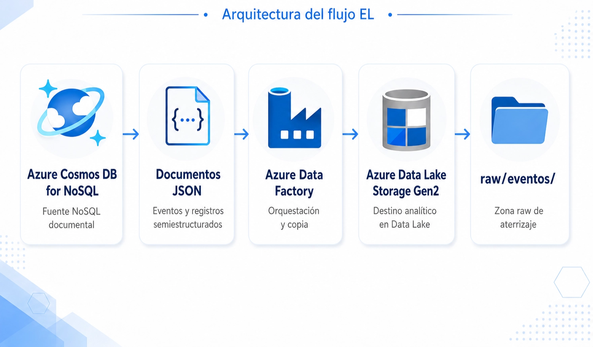
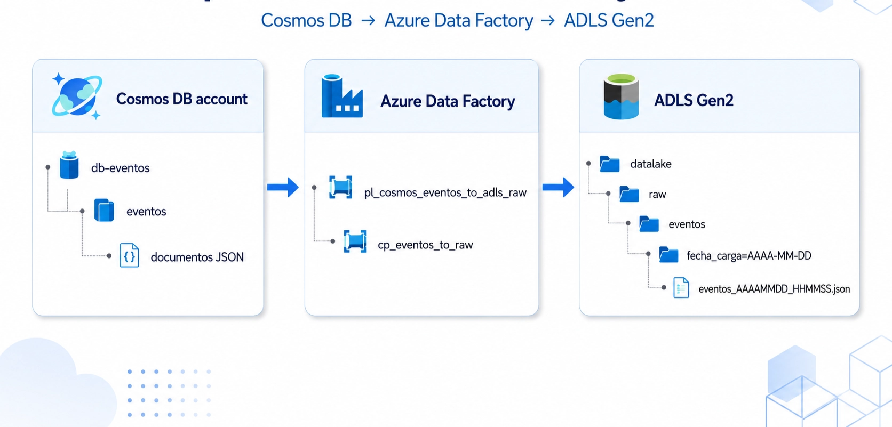
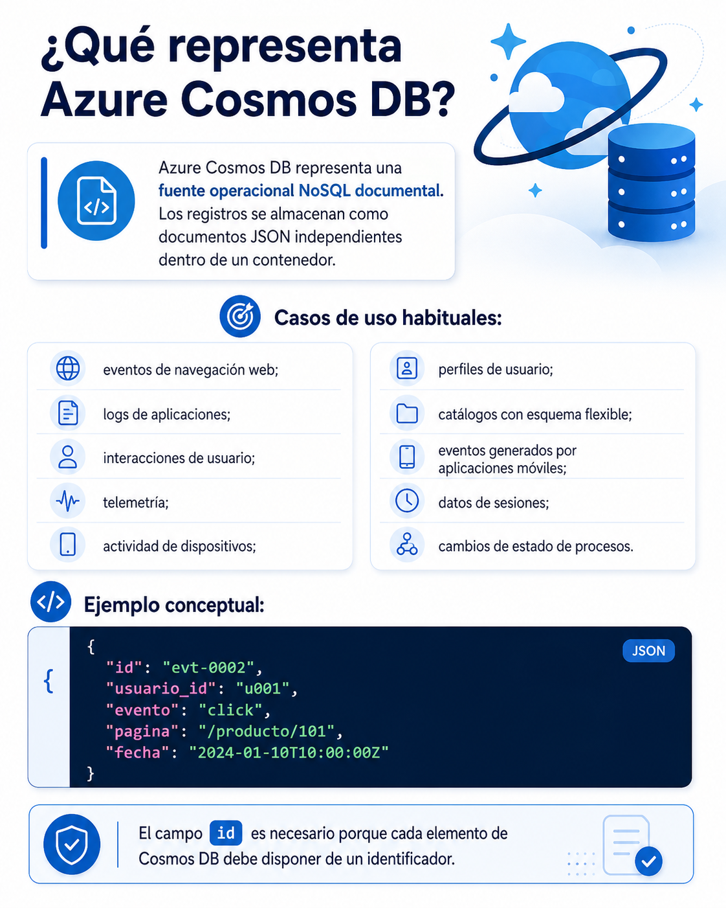
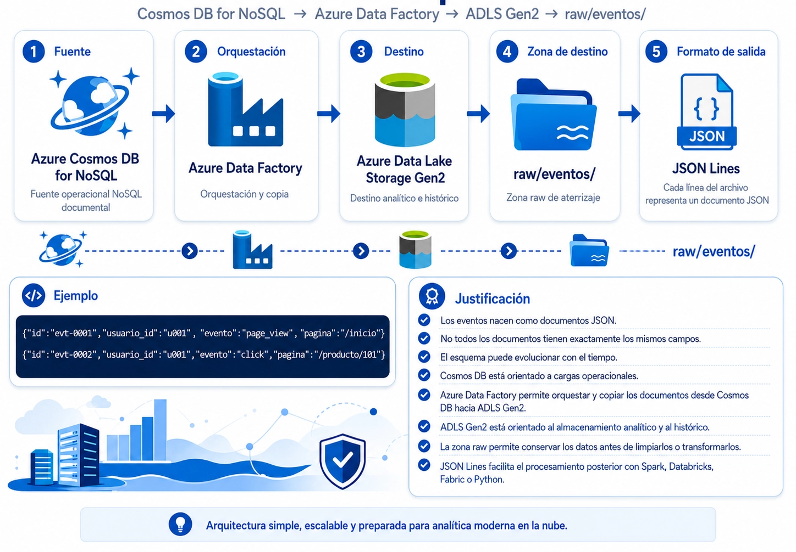

# 🧑🏽‍💻 Clase 20 - Ingesta EL desde Cosmos DB

---

# **Ejercicio 2: Azure Cosmos DB for NoSQL hacia Azure Data Lake Storage Gen2**

Este ejercicio sigue esta arquitectura:



La implementación final será:



---

# **¿Qué representa Azure Cosmos DB?**



# **Decisión de arquitectura**



# **Fase 1. Crear Azure Cosmos DB for NoSQL**

## **Paso 1. Crear el grupo de recursos**

1. Acceder a Azure Portal.
2. Buscar:
    
    ```
    Resource groups
    ```
    
3. Seleccionar **Create**.
4. Configurar:
    
    ```
    Nombre: rg-practica2
    Región: una región permitida por la suscripción
    ```
    
5. Seleccionar **Review + create**.
6. Seleccionar **Create**.


---

## **Paso 2. Crear la cuenta de Azure Cosmos DB**

1. En la barra de búsqueda del portal, escribir: `Azure Cosmos DB`
2. Seleccionar el servicio **Azure Cosmos DB**.
    
    
    
3. Seleccionar **Create**.
    
    
    
4. En la pantalla de selección de API, elegir: `Azure Cosmos DB for NoSQL`
    
    
    
5. Seleccionar **Create** dentro de la opción NoSQL recomendada.

> No debe seleccionarse la API de MongoDB, Cassandra, Gremlin ni Table. El conector que se utilizará en Data Factory será **Azure Cosmos DB for NoSQL**.
> 

---

## **Paso 3. Configurar la cuenta**

Configurar:

```
Workload type: Learning
Subscription: Azure for Students
Resource group: rg-practica2
Account name: cosmos-practica2
Location: la misma región utilizada para la práctica
Availability Zones: Disable
Capacity mode: Provisioned throughput
Apply Free Tier Discount: Apply
Limit total account throughput: Activado
```


Pulsar en: Next: `Global Distribution`

Dejar ambas opciones desactivadas.


> **Multi-region Writes** está pensado para aplicaciones globales que necesitan escribir localmente desde varias regiones y mantener alta disponibilidad frente a fallos regionales; no es necesario para este laboratorio.
> 

Continúa con **Next: Networking**.

### Para simplificar el ejercicio:

```
Connectivity methot: All networks
Conection Security Setting: TLS 1.2
```


> En producción se recomienda utilizar identidad administrada, redes privadas, endpoints privados y el principio de mínimo privilegio.
> 

Pulsar en Next: **Backup Policy**


Pulsar en: Security


Pulsar en Review + create y luego Create


---

# **Fase 2. Crear el modelo documental**

## **2.1 Modelo lógico**

El modelo de la práctica es:

```
Cuenta Cosmos DB
└── Base de datos: db-eventos
    └── Contenedor: eventos
        └── Documentos JSON
```

No existen tablas, claves foráneas ni joins relacionales. La unidad básica es un documento.

## **2.2 Granularidad**

La granularidad será:

> Una fila lógica o documento representa un evento producido por un usuario en un instante determinado.
> 

Ejemplos:

- una visualización de página;
- un clic;
- una búsqueda;
- añadir un producto al carrito;
- una compra;
- un error de aplicación;
- abrir un chat;
- iniciar sesión.

Una misma persona puede generar muchos documentos.

```
Usuario 1 ─────── N Eventos
```

---

## **2.3 Diseño de la clave de partición**

La clave de partición será: `/usuario_id`.Esto significa que Cosmos DB agrupa lógicamente los eventos según el valor de `usuario_id`.

Ejemplos:

```
u001
u002
u003
```

La elección es razonable para el laboratorio porque:

- todos los documentos tienen `usuario_id`;
- existen varios usuarios;
- permite consultar la actividad de un usuario;
- distribuye los documentos entre diferentes valores de partición.

> En un entorno real, la clave de partición debe evaluarse según:
> 
> - volumen esperado;
> - cardinalidad;
> - distribución de escritura;
> - consultas frecuentes;
> - tamaño máximo por partición lógica;
> - estabilidad del valor;
> - necesidad de transacciones por partición.

> La clave de partición no debe elegirse solo porque un campo “parece importante”. Debe responder al patrón de acceso y distribución de la carga.
> 

---

## **2.4 Esquema flexible**

Todos los documentos comparten algunos campos:

| **Campo** | **Descripción** |
| --- | --- |
| `id` | Identificador único del documento |
| `usuario_id` | Usuario que genera el evento |
| `evento` | Tipo de evento |
| `pagina` | Página o recurso asociado |
| `fecha` | Momento del evento en formato ISO 8601 |
| `dispositivo` | Tipo de dispositivo |
| `navegador` | Navegador utilizado |
| `canal` | Canal de adquisición o acceso |

Otros campos aparecen solo cuando son necesarios:

- `producto_id`;
- `cantidad`;
- `pedido_id`;
- `importe`;
- `moneda`;
- `campania`;
- `termino`;
- `resultados`;
- `error`;
- `contexto`;
- `duracion_ms`;
- `resultado`;
- `motivo`;
- `red_social`.

Esta variación permite observar una característica importante de un modelo documental:

> No todos los documentos tienen que poseer exactamente las mismas propiedades.
> 

---

## **Paso 1. Crear la base de datos y el contenedor**

1. Abrir Cosmos DB.
2. Seleccionar **Data Explorer**.
    
    
    
3. Seleccionar **New Container**.
    
    
    
4. Configurar:
    
    
    | Campo | Valor |
    | --- | --- |
    | **Id. de base de datos** | Crear nuevo → `db-eventos` |
    | **Container id** | `eventos` |
    | **Clave de partición** | `/usuario_id` |
    | **Container throughput** | **Manual** |
    | **RU/s** | `400` |
    | **Claves únicas** | No añadir |
    | **Almacén analítico** | **Desactivado** |
    
    <aside>
    💡
    
    Los **400 RU/s** son el mínimo admitido para un contenedor con rendimiento manual y son suficientes para este laboratorio. Como activaste Free Tier, los primeros **1000 RU/s** y **25 GB** de la cuenta están incluidos, siempre que no superes esos límites.
    
    En la clave de partición escribe exactamente:
    
    ```
    /usuario_id
    ```
    
    Incluye la barra inicial. No pulses **Agregar clave de partición jerárquica**. Todos los documentos de la práctica contendrán `usuario_id`, por ejemplo:
    
    ```json
    {
      "id":"evt-0001",
      "usuario_id":"u001",
      "evento":"page_view"
    }
    ```
    
    Cosmos DB utiliza la clave de partición para distribuir los documentos y el consumo de rendimiento entre particiones lógicas.
    
    Deja **Almacén analítico: Desactivado**, porque el ejercicio extraerá los documentos mediante **Azure Data Factory** hacia ADLS Gen2. El almacén analítico se utiliza para integraciones analíticas específicas y no es necesario para esta copia.
    
    No modifiques:
    
    ```
    Claves únicas
    Directiva de búsqueda de texto completo
    Avanzado
    ```
    
    </aside>
    
    Pulsa en Aceptar.
    
    
    
    
    
    
    
    
    

---

## **Paso 2. Preparar los documentos de ejemplo**

Crear un archivo local llamado:

```
eventos_web.json
```

Copiar en él el siguiente contenido:

```json
[
  {
    "id": "evt-0001",
    "usuario_id": "u001",
    "evento": "page_view",
    "pagina": "/inicio",
    "fecha": "2024-01-10T09:58:12Z",
    "dispositivo": "desktop",
    "navegador": "Edge",
    "canal": "organico"
  },
  {
    "id": "evt-0002",
    "usuario_id": "u001",
    "evento": "click",
    "pagina": "/producto/101",
    "fecha": "2024-01-10T10:00:00Z",
    "dispositivo": "desktop",
    "navegador": "Edge",
    "canal": "organico",
    "producto_id": "101",
    "elemento": "boton_ver_detalle"
  },
  {
    "id": "evt-0003",
    "usuario_id": "u001",
    "evento": "add_to_cart",
    "pagina": "/producto/101",
    "fecha": "2024-01-10T10:01:25Z",
    "dispositivo": "desktop",
    "navegador": "Edge",
    "canal": "organico",
    "producto_id": "101",
    "cantidad": 1
  },
  {
    "id": "evt-0004",
    "usuario_id": "u001",
    "evento": "purchase",
    "pagina": "/checkout/confirmacion",
    "fecha": "2024-01-10T10:05:42Z",
    "dispositivo": "desktop",
    "navegador": "Edge",
    "canal": "organico",
    "pedido_id": "p-9001",
    "importe": 79.9,
    "moneda": "EUR"
  },
  {
    "id": "evt-0005",
    "usuario_id": "u002",
    "evento": "page_view",
    "pagina": "/inicio",
    "fecha": "2024-01-10T10:12:03Z",
    "dispositivo": "mobile",
    "navegador": "Chrome",
    "canal": "campania",
    "campania": "invierno_2024"
  },
  {
    "id": "evt-0006",
    "usuario_id": "u002",
    "evento": "search",
    "pagina": "/buscar",
    "fecha": "2024-01-10T10:13:15Z",
    "dispositivo": "mobile",
    "navegador": "Chrome",
    "canal": "campania",
    "termino": "zapatillas",
    "resultados": 24
  },
  {
    "id": "evt-0007",
    "usuario_id": "u002",
    "evento": "click",
    "pagina": "/producto/205",
    "fecha": "2024-01-10T10:14:10Z",
    "dispositivo": "mobile",
    "navegador": "Chrome",
    "canal": "campania",
    "producto_id": "205",
    "elemento": "imagen_producto"
  },
  {
    "id": "evt-0008",
    "usuario_id": "u002",
    "evento": "add_to_cart",
    "pagina": "/producto/205",
    "fecha": "2024-01-10T10:15:37Z",
    "dispositivo": "mobile",
    "navegador": "Chrome",
    "canal": "campania",
    "producto_id": "205",
    "cantidad": 2
  },
  {
    "id": "evt-0009",
    "usuario_id": "u003",
    "evento": "login",
    "pagina": "/login",
    "fecha": "2024-01-10T11:02:19Z",
    "dispositivo": "tablet",
    "navegador": "Safari",
    "canal": "directo",
    "resultado": "correcto"
  },
  {
    "id": "evt-0010",
    "usuario_id": "u003",
    "evento": "page_view",
    "pagina": "/mi-cuenta",
    "fecha": "2024-01-10T11:03:01Z",
    "dispositivo": "tablet",
    "navegador": "Safari",
    "canal": "directo",
    "duracion_ms": 18450
  },
  {
    "id": "evt-0011",
    "usuario_id": "u003",
    "evento": "logout",
    "pagina": "/mi-cuenta",
    "fecha": "2024-01-10T11:08:44Z",
    "dispositivo": "tablet",
    "navegador": "Safari",
    "canal": "directo"
  },
  {
    "id": "evt-0012",
    "usuario_id": "u004",
    "evento": "page_view",
    "pagina": "/categoria/electronica",
    "fecha": "2024-01-10T12:20:08Z",
    "dispositivo": "desktop",
    "navegador": "Firefox",
    "canal": "referencia",
    "referente": "blog-tecnologia.example"
  },
  {
    "id": "evt-0013",
    "usuario_id": "u004",
    "evento": "click",
    "pagina": "/producto/310",
    "fecha": "2024-01-10T12:21:17Z",
    "dispositivo": "desktop",
    "navegador": "Firefox",
    "canal": "referencia",
    "producto_id": "310",
    "elemento": "ficha_tecnica"
  },
  {
    "id": "evt-0014",
    "usuario_id": "u004",
    "evento": "error",
    "pagina": "/producto/310",
    "fecha": "2024-01-10T12:21:19Z",
    "dispositivo": "desktop",
    "navegador": "Firefox",
    "canal": "referencia",
    "error": {
      "codigo": "JS-500",
      "mensaje": "No se pudo cargar la recomendacion"
    }
  },
  {
    "id": "evt-0015",
    "usuario_id": "u005",
    "evento": "page_view",
    "pagina": "/ofertas",
    "fecha": "2024-01-11T08:15:55Z",
    "dispositivo": "mobile",
    "navegador": "Chrome",
    "canal": "email",
    "campania": "newsletter_enero"
  },
  {
    "id": "evt-0016",
    "usuario_id": "u005",
    "evento": "click",
    "pagina": "/producto/115",
    "fecha": "2024-01-11T08:16:20Z",
    "dispositivo": "mobile",
    "navegador": "Chrome",
    "canal": "email",
    "producto_id": "115",
    "elemento": "banner_oferta"
  },
  {
    "id": "evt-0017",
    "usuario_id": "u005",
    "evento": "wishlist_add",
    "pagina": "/producto/115",
    "fecha": "2024-01-11T08:17:02Z",
    "dispositivo": "mobile",
    "navegador": "Chrome",
    "canal": "email",
    "producto_id": "115"
  },
  {
    "id": "evt-0018",
    "usuario_id": "u006",
    "evento": "page_view",
    "pagina": "/inicio",
    "fecha": "2024-01-11T09:30:11Z",
    "dispositivo": "desktop",
    "navegador": "Edge",
    "canal": "organico",
    "contexto": {
      "idioma": "es-ES",
      "pais": "ES"
    }
  },
  {
    "id": "evt-0019",
    "usuario_id": "u006",
    "evento": "search",
    "pagina": "/buscar",
    "fecha": "2024-01-11T09:31:03Z",
    "dispositivo": "desktop",
    "navegador": "Edge",
    "canal": "organico",
    "termino": "mochila",
    "resultados": 12
  },
  {
    "id": "evt-0020",
    "usuario_id": "u006",
    "evento": "click",
    "pagina": "/producto/420",
    "fecha": "2024-01-11T09:31:58Z",
    "dispositivo": "desktop",
    "navegador": "Edge",
    "canal": "organico",
    "producto_id": "420",
    "elemento": "resultado_busqueda"
  },
  {
    "id": "evt-0021",
    "usuario_id": "u007",
    "evento": "page_view",
    "pagina": "/ayuda/envios",
    "fecha": "2024-01-11T15:40:07Z",
    "dispositivo": "mobile",
    "navegador": "Safari",
    "canal": "directo"
  },
  {
    "id": "evt-0022",
    "usuario_id": "u007",
    "evento": "chat_open",
    "pagina": "/ayuda/envios",
    "fecha": "2024-01-11T15:41:33Z",
    "dispositivo": "mobile",
    "navegador": "Safari",
    "canal": "directo",
    "agente_virtual": "support-bot-v2"
  },
  {
    "id": "evt-0023",
    "usuario_id": "u007",
    "evento": "chat_close",
    "pagina": "/ayuda/envios",
    "fecha": "2024-01-11T15:44:28Z",
    "dispositivo": "mobile",
    "navegador": "Safari",
    "canal": "directo",
    "resuelto": true,
    "duracion_ms": 175000
  },
  {
    "id": "evt-0024",
    "usuario_id": "u008",
    "evento": "page_view",
    "pagina": "/producto/501",
    "fecha": "2024-01-12T07:50:09Z",
    "dispositivo": "desktop",
    "navegador": "Chrome",
    "canal": "campania",
    "campania": "retargeting_enero",
    "producto_id": "501"
  },
  {
    "id": "evt-0025",
    "usuario_id": "u008",
    "evento": "add_to_cart",
    "pagina": "/producto/501",
    "fecha": "2024-01-12T07:51:22Z",
    "dispositivo": "desktop",
    "navegador": "Chrome",
    "canal": "campania",
    "campania": "retargeting_enero",
    "producto_id": "501",
    "cantidad": 1
  },
  {
    "id": "evt-0026",
    "usuario_id": "u008",
    "evento": "remove_from_cart",
    "pagina": "/carrito",
    "fecha": "2024-01-12T07:53:10Z",
    "dispositivo": "desktop",
    "navegador": "Chrome",
    "canal": "campania",
    "producto_id": "501",
    "cantidad": 1
  },
  {
    "id": "evt-0027",
    "usuario_id": "u009",
    "evento": "login",
    "pagina": "/login",
    "fecha": "2024-01-12T18:03:47Z",
    "dispositivo": "mobile",
    "navegador": "Edge",
    "canal": "directo",
    "resultado": "fallido",
    "motivo": "credenciales_invalidas"
  },
  {
    "id": "evt-0028",
    "usuario_id": "u009",
    "evento": "login",
    "pagina": "/login",
    "fecha": "2024-01-12T18:04:35Z",
    "dispositivo": "mobile",
    "navegador": "Edge",
    "canal": "directo",
    "resultado": "correcto"
  },
  {
    "id": "evt-0029",
    "usuario_id": "u010",
    "evento": "page_view",
    "pagina": "/categoria/hogar",
    "fecha": "2024-01-12T20:10:18Z",
    "dispositivo": "tablet",
    "navegador": "Safari",
    "canal": "social",
    "red_social": "instagram"
  },
  {
    "id": "evt-0030",
    "usuario_id": "u010",
    "evento": "click",
    "pagina": "/producto/608",
    "fecha": "2024-01-12T20:11:02Z",
    "dispositivo": "tablet",
    "navegador": "Safari",
    "canal": "social",
    "red_social": "instagram",
    "producto_id": "608",
    "elemento": "imagen_producto"
  }
]
```

Este archivo contiene **30 documentos**.

Se han introducido diferencias de esquema de forma intencionada. Por ejemplo:

- los eventos de compra incluyen `pedido_id`, `importe` y `moneda`;
- los eventos de búsqueda incluyen `termino` y `resultados`;
- los errores incluyen un objeto anidado llamado `error`;
- algunos eventos incluyen un objeto `contexto`;
- otros incluyen datos de campaña o red social.

---

## **Paso 3. Cargar los documentos**

### **Ruta recomendada: Upload Item**

1. En Data Explorer, expandir:
    
    ```
    db-eventos
    └── eventos
    ```
    
2. Seleccionar **Items**.
    
    
    
3. Seleccionar **Upload Item**.
    
    
    
4. Elegir:
    
    ```
    eventos_web.json
    ```
    
    
    
    
    
    Pulsar en Upload
    
    
    
5. Esperar a que termine la carga.
6. Pulsar **Refresh** si los elementos no aparecen inmediatamente.

El resultado esperado es: `30 items`


---

## **Paso 4. Validar la carga de documentos**

Seleccionar **New SQL Query**.


### **Comprobación 1. Número total de documentos**

```sql
SELECT VALUE COUNT(1)
FROM c
```


### **Comprobación 2. Mostrar documentos**

```sql
SELECT *
FROM c
```


Debe aparecer una colección de documentos JSON.

---

### **Comprobación 3. Consultar un usuario**

```sql
SELECT *
FROM c
WHERE c.usuario_id = "u001"
```

Resultado esperado: cuatro eventos del usuario `u001`.


---

### **Comprobación 4. Consultar clics**

```sql
SELECT
    c.id,
    c.usuario_id,
    c.pagina,
    c.fecha,
    c.producto_id
FROM c
WHERE c.evento = "click"
```


---

### **Comprobación 5. Contar por tipo de evento**

```sql
SELECT
    c.evento,
    COUNT(1) AS numero_eventos
FROM c
GROUP BY c.evento
```


---

### **Comprobación 6. Revisar campos opcionales**

```sql
SELECT
    c.id,
    c.evento,
    c.campania,
    c.error,
    c.contexto,
    c.importe
FROM c
WHERE
    IS_DEFINED(c.campania)
    OR IS_DEFINED(c.error)
    OR IS_DEFINED(c.contexto)
    OR IS_DEFINED(c.importe)
```

Esta consulta permite comprobar que el contenedor admite documentos con estructuras diferentes.


---

### **Comprobación 7. Validar fechas**

Las fechas se almacenan como cadenas ISO 8601:

```
2024-01-10T10:00:00Z
```

JSON no dispone de un tipo fecha nativo. Por ello, se recomienda guardar fechas como texto ISO 8601 para facilitar:

- ordenación;
- filtrado;
- comparación;
- interoperabilidad;
- interpretación en herramientas analíticas.

```sql
SELECT VALUE c.fecha
FROM c
WHERE IS_DEFINED(c.fecha)
ORDER BY c.fecha ASC
```


# **Fase 3. Crear Azure Data Lake Storage Gen2**

ADLS Gen2 se implementa mediante una cuenta de almacenamiento con el espacio de nombres jerárquico habilitado.

Esto permite trabajar con una estructura de directorios como:

```
datalake/
└── raw/
    └── eventos/
        └── fecha_carga=2026-07-01/
            └── eventos_20260701_153000.json
```

---

## **Paso 1. Crear la cuenta de almacenamiento**

1. Buscar: `Storage accounts`
    
    
    
2. Seleccionar **Create**.
    
    
    
3. Configurar:
    
    ```
    Resource group: rg-practica2
    Storage account name: storagepractica2
    Region: la misma región
    Primary service: Azure Blob Storage or Azure Data Lake Storage Gen2
    Performance: Standard
    Redundancy: LRS
    ```
    
    
    
4. Antes de crear el recurso, abrir la pestaña **Advanced y activar** `Enable hierarchical namespace`
5. Mantener:
    
    ```
    SFTP: Disabled
    NFS v3: Disabled
    Access tier: Hot
    ```
    
    <aside>
    💡
    
    Lo más importante es mantener activado **Enable hierarchical namespace**. Esa opción convierte la cuenta de almacenamiento en una cuenta con capacidades de **Azure Data Lake Storage Gen2**, permitiendo organizar los archivos mediante directorios y subdirectorios como `raw/eventos/`.
    
    Selecciona **Hot** porque durante el laboratorio Azure Data Factory escribirá los archivos y probablemente accederás a ellos varias veces para validarlos. El nivel Hot está optimizado para datos consultados o modificados con frecuencia y tiene menores costes de acceso que Cool o Cold.
    
    No necesitas habilitar **SFTP**, **NFS v3** ni opciones de Azure Files, porque el ejercicio utilizará el conector de ADLS Gen2 de Azure Data Factory, no transferencias SFTP ni montajes NFS.
    
    </aside>
    
    
    
6. Seleccionar **Review + create**. Luego pulsar en Create.
    
    
    
    
    
7. Cuando termine, seleccionar **Go to resource**.
    
    > El espacio de nombres jerárquico es necesario para trabajar con rutas de Data Lake de forma natural.
    > 

---

## **Paso 2. Crear el contenedor**

1. Abrir la cuenta de almacenamiento.
2. Acceder a **Storage browser**.
    
    
    
3. Seleccionar **Blob containers**.
    
    
    
4. Seleccionar **Add container**.
    
    
    
5. Configurar:
    
    ```
    Name: datalake
    Anonymous access level: Private
    ```
    
    
    
6. Seleccionar **Create**.


---

## **Paso 3. Crear la estructura inicial**

Dentro del contenedor `datalake`:


1. Seleccionar **Add directory**.
    
    
    
2. Crear:
    
    ```
    raw
    ```
    
    
    
3. Entrar en `raw`.
    
    
    
4. Crear:
    
    ```
    eventos
    ```
    
    
    


La estructura inicial será:

```
datalake/
└── raw/
    └── eventos/
```

Azure Data Factory creará después las carpetas de fecha.

# **Fase 4. Crear Azure Data Factory**


---

## **Paso 1. Crear Data Factory**

1. Buscar: `Data factories`
    
    
    
2. Seleccionar `Data factories V2` 
3. **Pulsar en Create**.
    
    
    
4. Configurar:
    
    ```
    Resource group: rg-practica2
    Name: adf-practica2
    Region: la misma región
    Version: V2
    ```
    
    
    
5. No es obligatorio configurar Git.
6. Seleccionar **Review + create**.
7. Seleccionar **Create**.
8. Esperar a que termine el despliegue.
    
    
    
    
    
9. Seleccionar **Go to resource**.
    
    
    
10. Seleccionar **Launch Studio**.
    
    
    

# **Fase 5. Autorizar a Data Factory sobre ADLS Gen2**

Data Factory dispone de una identidad administrada. Esta identidad podrá escribir en ADLS Gen2 sin almacenar una clave de la cuenta de almacenamiento dentro del pipeline.

---

## **Asignar el rol Storage Blob Data Contributor**

1. Mantener Data Factory Studio abierto en una pestaña.
2. Abrir otra pestaña de Azure Portal.
3. Abrir: `storagepractica2`
    
    
    
4. Seleccionar:
    
    ```
    Access control (IAM)
    ```
    
    
    
5. Seleccionar:
    
    ```
    Add → Add role assignment
    ```
    
    
    
6. Buscar y seleccionar:
    
    ```
    Storage Blob Data Contributor
    ```
    
    
    
7. Seleccionar **Next**.
8. En **Assign access to**, seleccionar:
    
    ```
    Managed identity
    ```
    
    
    
9. Seleccionar **Select members**.
    
    
    
10. Configurar:
    
    ```
    Managed identity: Data factory
    Select: adf-practica2
    ```
    
    
    
11. Confirmar la selección.
    
    
    
12. Pulsar en Select.
    
    
    
13. Pulsar en Next.
14. Seleccionar **Review + assign**.
15. Seleccionar nuevamente **Review + assign**.
    
    
    
    
    
16. Esperar uno o dos minutos para que el permiso se propague.

Este rol permite a Data Factory:

- crear directorios;
- crear archivos;
- escribir blobs;
- actualizar blobs;
- eliminar blobs cuando proceda.

> En un entorno de producción, el acceso de Azure Data Factory debería limitarse a los directorios estrictamente necesarios. Mediante ACL de ADLS Gen2 puede concederse a su identidad administrada permiso para atravesar la jerarquía y escribir únicamente en `datalake/raw/eventos/`, evitando el acceso al resto de los datos del Data Lake.
> 

<aside>
💡

En producción no conviene conceder a Azure Data Factory permisos amplios sobre toda la cuenta de almacenamiento. Lo recomendable es aplicar el principio de **mínimo privilegio**: permitir que la identidad administrada de Data Factory acceda únicamente a la ruta que necesita, por ejemplo:

```
datalake/raw/eventos/
```

Para conseguirlo, pueden utilizarse las **ACL de ADLS Gen2**, que permiten definir permisos de lectura, escritura y ejecución sobre directorios y archivos concretos. Por ejemplo:

```
datalake/              → Execute
datalake/raw/          → Execute
datalake/raw/eventos/  → Read + Write + Execute
```

El permiso **Execute** en los directorios superiores permite atravesar la ruta, mientras que **Write + Execute** en `raw/eventos/` permite crear archivos y subdirectorios. Puede añadirse **Read** si Data Factory también necesita consultar o enumerar el contenido.

También puede configurarse una **ACL predeterminada** en `raw/eventos/` para que los nuevos archivos y carpetas creados hereden automáticamente los permisos establecidos

</aside>

# **Fase 6. Crear el Linked Service de Azure Cosmos DB**

> Un Linked Service define la conexión entre Data Factory y un servicio externo. En esta fase se crea la conexión con la fuente.
> 

---

## **Paso 1. Abrir Linked Services**

En Data Factory Studio:

1. Seleccionar **Manage**.
2. Seleccionar **Linked services**.
    
    
    
3. Seleccionar **New**.
4. Buscar:
    
    ```
    Azure Cosmos DB for NoSQL
    ```
    
5. Seleccionar el conector.
6. Seleccionar **Continue**.
    
    
    

> No seleccionar “Azure Cosmos DB for MongoDB”.
> 

---

## **Paso 2. Obtener la clave de Cosmos DB**

En otra pestaña del portal:

1. Abrir la cuenta de Cosmos DB.
    
    
    
2. Seleccionar **Keys**.
    
    
    
3. Localizar:
    
    ```
    URI
    PRIMARY KEY
    PRIMARY CONNECTION STRING
    ```
    

Para esta práctica se puede utilizar autenticación por clave.

> No compartir la clave, no incluirla en capturas públicas y no pegarla en documentos de entrega.
> 

---

## **Paso 3. Configurar el Linked Service**

Vuelve a ADF Studio:


Configurar:

```
Name: ls_cosmos_eventos
Connect via integration runtime: AutoResolveIntegrationRuntime
Authentication type: Account key
Account selection method: From Azure subscription
Azure subscription: la suscripción del curso
Azure Cosmos DB account name: cosmos-practica2
Database name: db-eventos
```


Si la interfaz solicita una clave o cadena de conexión:

```
Account key: PRIMARY KEY
```

o seleccionar la cuenta desde la suscripción.

1. Seleccionar **Test connection**.
2. Resultado esperado:
    
    ```
    Connection successful
    ```
    
    
    
3. Seleccionar **Create**.


# **Fase 7. Crear el Linked Service de ADLS Gen2**

> Los mismos pasos de la fase 6.
> 
1. En Data Factory Studio, abrir:
    
    ```
    Manage → Linked services
    ```
    
2. Seleccionar **New**.
3. Buscar:
    
    ```
    Azure Data Lake Storage Gen2
    ```
    
4. Seleccionar el conector.
5. Seleccionar **Continue**.
6. Configurar:
    
    ```
    Name: ls_adls_practica2
    Authentication type:  System-assigned managed identity
    Account selection method: From Azure subscription
    Azure subscription: la suscripción del curso
    Storage account name: storagepractica2
    Test connection: To linked service
    ```
    
    
    
7. Seleccionar **Test connection**.
8. Resultado esperado:
    
    ```
    Connection successful
    ```
    
    
    
9. Seleccionar **Create**.
10. Luego Vallidate All y despues Publish all.


# **Fase 8. Crear el dataset de origen**

> El dataset identifica el contenedor concreto que Data Factory leerá.
> 

---

## **Paso 1. Crear el dataset**

1. Abrir **Author**.
2. Seleccionar **Datasets**.
3. Seleccionar **New dataset**.
    
    
    
4. Buscar:
    
    ```
    Azure Cosmos DB for NoSQL
    ```
    
5. Seleccionar el dataset.
6. Seleccionar **Continue**.
    
    
    
7. Configurar:
    
    ```
    Name: ds_cosmos_eventos
    Linked service: ls_cosmos_eventos
    Collection name / Container: eventos
    Import Schema: None
    ```
    
    > Selecciona **None** porque Cosmos DB es documental y los eventos pueden tener campos diferentes. En esta práctica queremos copiar los documentos hacia la zona `raw` sin imponer un esquema fijo ni crear un mapeo cerrado. El conector de Cosmos DB permite exportar los documentos JSON tal como están y trabajar con un esquema vacío.
    > 
    
    
    
8. Seleccionar **OK**.
9. Antes de publicarlo, haz esta comprobación:
    1. Pulsa **Preview data**.
    2. Verifica que aparecen los documentos del contenedor `eventos`.
        
        
        
        También pueden aparecer campos opcionales.
        
        > Si aparecen propiedades técnicas de Cosmos DB, como `_ts` o `_etag`, deben interpretarse como metadatos del sistema y no como campos funcionales del evento.
        > 
    3. Pulsa **Validate all**.
    4. Si la validación termina sin errores, pulsa **Publish all** y confirma con **Publish**.
        
        ```
        Preview data
              ↓
        Validate all
              ↓
        Publish all
        ```
        
        
        

---

# **Fase 9. Crear el dataset de destino**

> El destino será un archivo JSON en ADLS Gen2.
> 

---

## **Paso 1. Crear el dataset JSON**

1. En **Author**, seleccionar **Datasets**.
2. Seleccionar **New dataset**.
3. Seleccionar:
    
    ```
    Azure Data Lake Storage Gen2
    ```
    
    
    
4. Elegir el formato:
    
    ```
    JSON
    ```
    
    
    
5. Seleccionar **Continue**.
6. Configurar:
    
    ```
    Name: ds_adls_raw_eventos_json
    Linked service: ls_adls_practica2
    File system: datalake
    Directory: vacío inicialmente
    File: vacío inicialmente
    Import schema: None
    ```
    
    
    
7. Seleccionar **OK**.

---

## **Paso 2. Crear los parámetros del dataset**

Abrir la pestaña **Parameters**.

Crear: `pDirectorio`.Tipo: `String`

Crear: `pArchivo` .Tipo: `String`


---

## **Paso 3. Parametrizar la ruta**

Abrir la pestaña **Connection**. En **Directory**, seleccionar **Add dynamic content** e introducir: `@dataset().pDirectorio`

En **File name**, seleccionar **Add dynamic content** e introducir: `@dataset().pArchivo`


---

1. Seleccionar **Validate all**;
2. corregir cualquier error;
3. seleccionar **Publish all**.
    
    
    

# **Fase 10. Crear el pipeline**

## **Paso 1. Crear el pipeline**

1. En **Author**, seleccionar **Pipelines**.
2. Seleccionar **New pipeline**.
    
    
    
3. Cambiar el nombre a:
    
    ```
    pl_cosmos_eventos_to_adls_raw
    ```
    
    
    

---

## **Paso 2. Añadir la actividad Copy**

1. En Activities, buscar:
    
    ```
    Copy data
    ```
    
    
    
2. Arrastrar la actividad al lienzo.
    
    
    
3. En la pestaña **General**, cambiar el nombre a:
    
    ```
    cp_eventos_to_raw
    ```
    
    
    

---

## **Paso 3. Configurar el origen**

1. Abrir la pestaña **Source**.
2. Seleccionar:
    
    ```
    Source dataset: ds_cosmos_eventos
    ```
    
    
    
    
    
    > 
    > 
    > 
    > Como el objetivo es conservar los documentos en la zona `raw` con la máxima fidelidad posible, conviene que valores como:
    > 
    > ```
    > "fecha":"2024-01-10T10:00:00Z"
    > ```
    > 
    > sigan tratándose como cadenas JSON y no se interpreten automáticamente como un tipo fecha durante la copia. La propiedad `detectDatetime` controla precisamente esa detección y su valor predeterminado es `true`.
    > 
    > Seleccionar **Container** significa que se leerán los documentos del contenedor completo. No necesitas una consulta personalizada en esta primera carga. Azure Data Factory permite exportar los documentos de Cosmos DB hacia un destino JSON sin imponer un esquema tabular
    > 
    > Antes de continuar, pulsa **Preview data** y verifica que aparecen los documentos. 
    > 
    > 
    > 
    > Después pasa a **Sink**, donde seleccionarás `ds_adls_raw_eventos_json` e introducirás los valores de los parámetros del directorio y del archivo. No configures nada en **Mapping** para esta copia sin transformación.
    > 

---

## **Paso 4. Configurar el destino**

1. Abrir la pestaña **Sink**.
2. Seleccionar:
    
    ```
    Sink dataset: ds_adls_raw_eventos_json
    ```
    
    
    

Aparecerán los parámetros del dataset.


- **pDirectorio**

En Value, seleccionar **Add dynamic content** e introducir:

```
@concat(
    'raw/eventos/fecha_carga=',
    formatDateTime(utcNow(),'yyyy-MM-dd')
)
```

- **pArchivo**

En Value, seleccionar **Add dynamic content** e introducir:

```
@concat(
    'eventos_',
    formatDateTime(utcNow(),'yyyyMMdd_HHmmss'),
    '.json'
)
```

La ruta resultante será similar a:

```
datalake/
└── raw/
    └── eventos/
        └── fecha_carga=2026-07-01/
            └── eventos_20260701_153000.json
```

---

## **Paso 5. Revisar el mapeo**

Abrir la pestaña **Mapping**. Para esta práctica:

```
No definir un mapeo explícito
```

La finalidad es realizar una copia de documentos JSON con esquema flexible. 

No seleccionar un conjunto cerrado de columnas.

No renombrar propiedades.

No eliminar campos.

No convertir tipos.

> En el Ejercicio 1 era razonable importar el esquema porque el origen era una vista relacional estable. En este ejercicio se evita fijar el esquema para respetar la naturaleza documental de Cosmos DB.
> 


---

## **Paso 6. Configurar el formato de escritura**

En la pestaña Sink o en las propiedades de formato:

```
File pattern: Set of objects
```


El patrón `Set of objects` produce un documento por línea.

---

## **Paso 7. Validar el pipeline**

1. Seleccionar **Validate**.
2. Comprobar que no aparecen errores.
3. Si aparecen advertencias, revisar:
    - datasets;
    - Linked Services;
    - parámetros;
    - rutas;
    - formato JSON.

---

## **Paso 8. Ejecutar con Debug**

1. Seleccionar **Debug**.
2. Esperar a que finalice la actividad.
3. Resultado esperado:
    
    ```
    Status: Succeeded
    ```
    
    
    
4. Abrir la salida de la actividad Copy.
5. Revisar métricas similares a:
    
    ```
    Rows read: 30
    Rows copied: 30
    Files written: 1
    ```
    

El nombre exacto de las métricas puede variar según la versión de la interfaz.

```json
{
	"dataRead": 19311,
	"dataWritten": 12537,
	"filesWritten": 1,
	"sourcePeakConnections": 1,
	"sinkPeakConnections": 1,
	"rowsRead": 30,
	"rowsCopied": 30,
	"copyDuration": 15,
	"throughput": 4.828,
	"errors": [],
	"effectiveIntegrationRuntime": "AutoResolveIntegrationRuntime (Germany West Central)",
	"usedDataIntegrationUnits": 4,
	"billingReference": {
		"activityType": "DataMovement",
		"billableDuration": [
			{
				"meterType": "AzureIR",
				"duration": 0.06666666666666667,
				"unit": "DIUHours"
			}
		],
		"totalBillableDuration": [
			{
				"meterType": "AzureIR",
				"duration": 0.06666666666666667,
				"unit": "DIUHours"
			}
		]
	},
	"usedParallelCopies": 1,
	"executionDetails": [
		{
			"source": {
				"type": "CosmosDb"
			},
			"sink": {
				"type": "AzureBlobFS",
				"region": "Germany West Central"
			},
			"status": "Succeeded",
			"start": "7/1/2026, 9:11:52 PM",
			"duration": 15,
			"usedDataIntegrationUnits": 4,
			"usedParallelCopies": 1,
			"profile": {
				"queue": {
					"status": "Completed",
					"duration": 8
				},
				"transfer": {
					"status": "Completed",
					"duration": 5,
					"details": {
						"readingFromSource": {
							"type": "CosmosDbSqlApi",
							"workingDuration": 0,
							"timeToFirstByte": 1
						},
						"writingToSink": {
							"type": "AzureBlobFS",
							"workingDuration": 0
						}
					}
				}
			},
			"detailedDurations": {
				"queuingDuration": 8,
				"timeToFirstByte": 1,
				"transferDuration": 4
			}
		}
	],
	"dataConsistencyVerification": {
		"VerificationResult": "NotVerified"
	},
	"durationInQueue": {
		"integrationRuntimeQueue": 0
	}
}
```

---

## **Paso 9. Publicar**

Después de confirmar que funciona:

1. Seleccionar **Validate all**;
2. Seleccionar **Publish all**;
3. Confirmar con **Publish**.


# **Fase 11. Verificar el archivo en ADLS Gen2**

1. Abrir la cuenta de almacenamiento.
2. Seleccionar **Storage browser**.
3. Abrir el contenedor:
    
    ```
    datalake
    ```
    
4. Navegar hasta:
    
    ```
    raw/
    └── eventos/
        └── fecha_carga=AAAA-MM-DD/
    ```
    
5. Comprobar que existe un archivo:
    
    ```
    eventos_AAAAMMDD_HHMMSS.json
    ```
    
    
    
6. Seleccionar **View/Edit** o descargarlo.
    
    
    
7. Comprobar que contiene documentos JSON.
    
    
    

---

## **Validación entre origen y destino**

### **Recuento en Cosmos DB**

```sql
SELECT VALUE COUNT(1)
FROM c
```


### **Validación en Data Factory**

En la salida de Copy:

```
Rows read: 30
Rows copied: 30
Status: Succeeded
```


---

# **Crear un trigger programado**

Después de validar el pipeline se puede programar una carga diaria.

1. Abrir el pipeline:
    
    ```
    pl_cosmos_eventos_to_adls_raw
    ```
    
2. Seleccionar **Add trigger**.
3. Seleccionar **New/Edit**.
    
    
    
4. Crear un trigger de tipo:
    
    ```
    Schedule
    ```
    
5. Configurar un ejemplo:
    
    ```
    Name: trg_diario_eventos
    Recurrence: cada 1 día
    Time: 02:00
    Time zone: la indicada para el curso
    ```
    
    
    
6. Seleccionar **OK**.
7. Confirmar la asociación con el pipeline.
8. Seleccionar **Publish all**.
9. Comprobarlo en:
    
    ```
    Manage → Triggers
    ```
    
    
    
    El trigger debe aparecer en estado:
    
    ```
    Started
    ```
    

Gracias a la ruta dinámica, cada ejecución genera un archivo diferente:

```
raw/eventos/
├── fecha_carga=2026-07-01/
│   └── eventos_20260701_020000.json
└── fecha_carga=2026-07-02/
    └── eventos_20260702_020000.json
```

---

# **Monitorización de ejecuciones automáticas**

Cuando el trigger se active, Data Factory iniciará:

```
pl_cosmos_eventos_to_adls_raw
```

## **Revisar Pipeline runs**

1. Abrir Data Factory Studio.
2. Seleccionar **Monitor**.
    
    
    
3. Seleccionar **Pipeline runs**.
    
    
    
4. Abrir la pestaña **Triggered**.
    
    
    
5. Seleccionar **Refresh** si no aparece todavía.
6. Localizar:
    
    ```
    pl_cosmos_eventos_to_adls_raw
    ```
    
    
    
7. Revisar **Status**.
    
    
    
    Estados habituales:
    
    ```
    Succeeded
    Failed
    In progress
    Cancelled
    ```
    

### **Interpretación**

- `Succeeded`: el pipeline terminó correctamente.
- `Failed`: una actividad produjo un error.
- `In progress`: la ejecución sigue en curso.
- `Cancelled`: la ejecución se canceló.

---

## **Revisar el detalle de Copy**

1. Abrir la ejecución.
2. Seleccionar:
    
    ```
    cp_eventos_to_raw
    ```
    
3. Revisar:
    
    ```
    Rows read
    Rows copied
    Data read
    Data written
    Files written
    Duration
    Throughput
    ```
    
    En una ejecución correcta:
    
    ```
    Rows read = Rows copied
    ```
    
    Ejemplo:
    
    ```
    Rows read: 30
    Rows copied: 30
    Status: Succeeded
    ```
    
    ### Cómo llegar al detalle de `cp_eventos_to_raw`
    
    1. En la barra vertical izquierda, pulsa el icono **Monitor**:
    2. En Monitor, entra en:
        
        **Pipeline runs**
        
    3. Selecciona la pestaña o filtro **Triggered**.
        - **Triggered**: ejecuciones iniciadas por un trigger programado o mediante **Trigger now**.
        - **Debug**: ejecuciones realizadas con el botón **Debug**.
    4. Pulsa **Refresh** y localiza tu pipeline:
        
        ```
        pl_cosmos_eventos_to_adls_raw
        ```
        
    5. En la fila de la ejecución, pulsa:
        - el nombre del pipeline, o
        - en Activity Runs verás la actividad `cp_eventos_to_raw` pulsa en **Details**
            
            
            
            
            
    6. Tambien puedes pulsar sobre el icono de **Output**. Allí podrás ver:
        
        ```
        Rows read
        Rows copied
        Data read
        Data written
        Files written
        Duration
        Throughput
        ```
        
        
        
        
        
        ```json
        {
        	"dataRead": 19311,
        	"dataWritten": 12537,
        	"filesWritten": 1,
        	"sourcePeakConnections": 1,
        	"sinkPeakConnections": 1,
        	"rowsRead": 30,
        	"rowsCopied": 30,
        	"copyDuration": 15,
        	"throughput": 6.437,
        	"errors": [],
        	"effectiveIntegrationRuntime": "AutoResolveIntegrationRuntime (Germany West Central)",
        	"usedDataIntegrationUnits": 4,
        	"billingReference": {
        		"activityType": "DataMovement",
        		"billableDuration": [
        			{
        				"meterType": "AzureIR",
        				"duration": 0.06666666666666667,
        				"unit": "DIUHours"
        			}
        		],
        		"totalBillableDuration": [
        			{
        				"meterType": "AzureIR",
        				"duration": 0.06666666666666667,
        				"unit": "DIUHours"
        			}
        		]
        	},
        	"usedParallelCopies": 1,
        	"executionDetails": [
        		{
        			"source": {
        				"type": "CosmosDb"
        			},
        			"sink": {
        				"type": "AzureBlobFS",
        				"region": "Germany West Central"
        			},
        			"status": "Succeeded",
        			"start": "7/2/2026, 2:00:14 AM",
        			"duration": 15,
        			"usedDataIntegrationUnits": 4,
        			"usedParallelCopies": 1,
        			"profile": {
        				"queue": {
        					"status": "Completed",
        					"duration": 9
        				},
        				"transfer": {
        					"status": "Completed",
        					"duration": 4,
        					"details": {
        						"readingFromSource": {
        							"type": "CosmosDbSqlApi",
        							"workingDuration": 0,
        							"timeToFirstByte": 1
        						},
        						"writingToSink": {
        							"type": "AzureBlobFS",
        							"workingDuration": 0
        						}
        					}
        				}
        			},
        			"detailedDurations": {
        				"queuingDuration": 9,
        				"timeToFirstByte": 1,
        				"transferDuration": 3
        			}
        		}
        	],
        	"dataConsistencyVerification": {
        		"VerificationResult": "NotVerified"
        	},
        	"durationInQueue": {
        		"integrationRuntimeQueue": 0
        	}
        }
        ```
        
    
    La ruta sería, resumidamente:
    
    ```
    Monitor
    └── Pipeline runs
        └── Triggered
            └── pl_cosmos_eventos_to_adls_raw
                └── cp_eventos_to_raw
                    └── Details / Output
    ```
    

---

## **Revisar Trigger runs**

Abrir:

```
Monitor → Trigger runs
```


Comprobar:

- nombre del trigger;
- hora de activación;
- pipeline iniciado;
- estado;
- resultado de la activación.

El trigger esperado es:

```
trg_diario_eventos
```

Para que se ejecute automáticamente:

- debe estar publicado;
- debe estar en estado Started;
- debe haberse alcanzado la hora programada;
- el pipeline debe estar publicado;
- los Linked Services deben seguir siendo válidos.


# **Consideración importante sobre la zona raw**


---

# **Esquema flexible y evolución**


---

---

---

# **Diferencias con el Ejercicio 1**


---

# **Arquitectura final implementada**


<aside>

**Actividad complementaria
¿Cuál es la diferencia en Linked Service y Managed Identity?
¿En que casos se aplica una o la otra?** 

</aside>