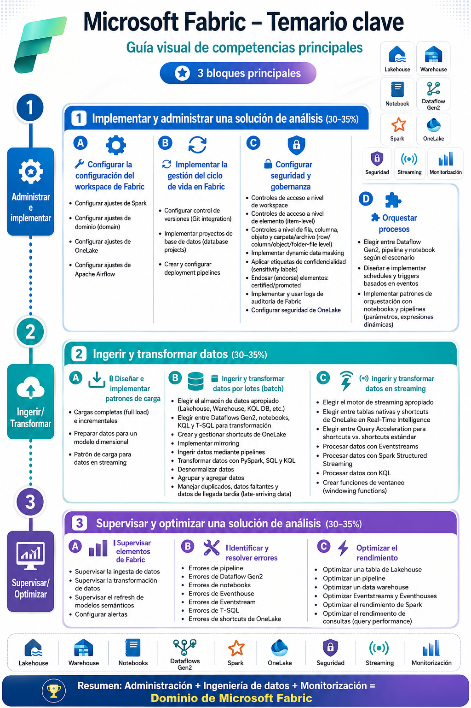

# 🧑🏽‍💻 Clase 27 - Arquitectura de Fabric

---




# 1. Contexto: arquitectura de Fabric, capacidades y licencias


## 1.1 ¿Por qué empezar por aquí?

> No se puede entender **qué se configura en un workspace** sin entender **dónde vive** un workspace dentro de la jerarquía de Fabric. Esta jerarquía es:
> 


## 1.2 Microsoft Fabric en una frase

> Fabric es una plataforma de analítica **SaaS** de extremo a extremo (ingesta, transformación, streaming, ciencia de datos, warehousing y BI) que unifica todos sus workloads sobre un único data lake lógico llamado **OneLake**.
> 

## 1.3 Capacidades y licencias


> ⚠️ **Trampa de examen:** un workspace con licencia **PPU** (Premium Per User) *no* habilita Apache Airflow Jobs. Airflow requiere que el workspace esté asignado a una **capacidad F** (o Trial). Esto también aplica, en general, a los ítems de Data Engineering más avanzados.
> 

📚 Referencia: [Entender las licencias de Microsoft Fabric](https://learn.microsoft.com/fabric/enterprise/licenses) · [Fabric features by SKU and capacity type](https://learn.microsoft.com/fabric/enterprise/fabric-features)

### 💬 Pregunta de repaso

<aside>

*"Un usuario con licencia Free intenta crear un Lakehouse en un workspace que está en la capacidad compartida (no asignada a ninguna capacidad F/Trial). ¿Lo puede hacer?"*
→ **No:** necesita que el workspace esté respaldado por una capacidad F o Trial para crear ítems que no sean de Power BI.

</aside>

---

# 2 — Workspaces: concepto, roles y panel de Workspace Settings

## 2.1 ¿Qué es un workspace?

> Un *workspace* es el lugar de colaboración donde se crean y organizan ítems (lakehouses, warehouses, notebooks, informes, eventstreams, etc.) y donde se definen *task flows*. Cada workspace vive dentro de una capacidad y se apoya en **OneLake** como almacenamiento lógico único.
> 

📚 Referencia: [Workspaces in Microsoft Fabric and Power BI](https://learn.microsoft.com/fabric/fundamentals/workspaces)

## 2.2 Los 4 roles de workspace


> 🔑 **Regla de oro :** *todos* los ajustes que veremos  (Spark, dominio, OneLake, Airflow) requieren rol **Admin** en el workspace. Si una pregunta de escenario dice que un usuario con rol Member/Contributor no puede cambiar un ajuste del workspace, la respuesta correcta normalmente es **"Sí, es el comportamiento esperado"**.
> 

📚 Referencia: [Roles in workspaces in Microsoft Fabric](https://learn.microsoft.com/fabric/fundamentals/roles-workspaces)

## 2.3 El panel de Workspace Settings


📚 Referencia: [Workspace settings](https://learn.microsoft.com/fabric/fundamentals/workspaces#workspace-settings)

---

# 3.  Ajustes de Spark en el workspace

## Contexto

> Cuando se crea un workspace, Fabric aprovisiona automáticamente un **starter pool** de Apache Spark asociado a ese workspace, sin que el usuario tenga que elegir tamaños de nodo o máquina.
> 

### Starter Pool vs. Custom Pool


> ⚠️ **Trampa de examen:** cambiar de Starter Pool a un Custom Pool **incrementa el tiempo de arranque de la sesión** (de segundos a minutos). Si un escenario pide "minimizar el tiempo de inicio de sesión de Spark para los analistas", la respuesta normalmente es *mantener el Starter Pool*, no crear un pool personalizado.
> 

### Cómo se configura


Mas detallas puedes encontrarlo en:

📚 Referencia: [Data Engineering workspace administration settings in Microsoft Fabric](https://learn.microsoft.com/fabric/data-engineering/workspace-admin-settings)

### Relación con Environments


<aside>

### 💬 Pregunta tipo examen

*"Un data engineer necesita que los notebooks del workspace usen siempre nodos de tamaño Large con autoescalado activado. ¿Qué ajuste debe modificar y quién debe hacerlo?"*

→ Debe crear/configurar un **Custom Pool** en **Workspace settings → Data Engineering/Science → Spark Compute**, y debe hacerlo un usuario con rol **Admin** en el workspace.

</aside>

---

# 4. Ajustes de dominio (domain)

## 4.1 ¿Qué es un dominio en Fabric?


📚 Referencia: [Fabric domains](https://learn.microsoft.com/fabric/governance/domains)

## 4.2 Conceptos clave


> ⚠️ **Trampa de examen:** la asignación de un workspace a un dominio **no afecta quién puede ver o acceder a los ítems** del workspace. Eso sigue dependiendo de los roles de workspace y los permisos de ítem. El dominio solo mejora la *descubribilidad* (por ejemplo, filtrar por dominio en el OneLake Catalog) y permite delegar ciertos ajustes de nivel tenant.
> 

## 4.3 Cómo se configura desde el workspace


Para mayores detalles ir a la documentación:

📚 Referencia: [Fabric domains — Assign workspaces to domains and subdomains](https://learn.microsoft.com/fabric/governance/domains#structure-your-data-in-the-domain) · [Create a workspace](https://learn.microsoft.com/fabric/fundamentals/create-workspaces)

## 4.4 Override de tenant settings a nivel dominio

> En Fabric, un **tenant override** significa que una configuración definida globalmente para todo el **Tenant** puede ser **sobrescrita (override)** en un nivel inferior, como un dominio o una capacidad, permitiendo una excepción a la regla general.
> 

Supongamos que el administrador del tenant establece:

```
Tenant Contoso
│
└── Configuración:
    Copilot = Deshabilitado
```

Sin overrides, nadie puede usar Copilot.

Con overrides:

```
Tenant Contoso
│
├── Dominio Ventas
│   └── Override:
│       Copilot = Habilitado
│
├── Dominio Finanzas
│   └── Hereda:
│       Copilot = Deshabilitado
│
└── Dominio RRHH
    └── Hereda:
        Copilot = Deshabilitado
```

> Un **tenant override** es una **excepción a una regla definida en el Tenant**, permitiendo que un dominio, capacidad o administrador autorizado utilice una configuración distinta de la establecida globalmente.
> 


> Una de las razones principales para usar dominios es poder **delegar** ciertos ajustes que normalmente se controlan a nivel tenant (por ejemplo, ciertas políticas de compartición o de exportación) para que cada dominio los configure según sus propias necesidades regulatorias, sin que el Fabric admin tenga que microgestionar cada área de negocio.
> 

📚 Referencia: [Governance overview and guidance — Tenant, domain and workspace settings](https://learn.microsoft.com/fabric/governance/governance-compliance-overview#manage-your-data-estate)

<aside>

### 💬 Pregunta tipo examen

*"La empresa Contoso quiere que el equipo de Finanzas administre sus propias políticas de gobernanza sin depender del equipo central de TI para cada cambio, pero sin perder la trazabilidad organizacional. ¿Qué característica de Fabric deben usar?"*
→ **Domains**, delegando el rol de **domain admin** al equipo de Finanzas y asignando sus workspaces a un dominio "Finanzas".

</aside>

---

## 5. Ajustes de OneLake en el workspace

## 5.1  ¿Qué es OneLake?

> OneLake es el data lake lógico único de todo el tenant, incluido automáticamente con cada tenant de Fabric, construido sobre Azure Data Lake Storage (ADLS) Gen2. Todos los workloads de Fabric leen y escriben en OneLake, lo que permite **una sola copia de los datos** reutilizable entre motores (Spark, T-SQL, KQL, Power BI Direct Lake).
> 

📚 Referencia: [¿Qué es OneLake?](https://learn.microsoft.com/fabric/onelake/onelake-overview)

## 5.2 La pestaña "OneLake" en Workspace Settings

> Dentro de **Workspace settings → OneLake** se configuran cuatro cosas concretas:
> 

#### 5.2.1. OneLake diagnostics


📚 Referencia: [OneLake diagnostics](https://learn.microsoft.com/fabric/onelake/onelake-diagnostics-overview)

#### 5.2.2. Shortcut caching

> Un Shortcut es un **acceso directo (puntero o enlace)** a datos que están en otra ubicación, sin necesidad de copiarlos.
Si vienes del mundo Linux, es muy parecido a un **enlace simbólico (symlink)**.
> 


📚 Referencia: [OneLake shortcuts — Caching](https://learn.microsoft.com/fabric/onelake/onelake-shortcuts#caching)

#### 5.2.3. Storage report


📚 Referencia: [Get the size of OneLake items](https://learn.microsoft.com/fabric/onelake/how-to-get-item-size)

#### 5.2.4. Default storage tier


📚 Referencia: [OneLake storage tiers (preview)](https://learn.microsoft.com/fabric/onelake/onelake-storage-tiers)

### Tabla resumen


<aside>

### 💬 Pregunta tipo examen

*"Una organización necesita conservar, sin posibilidad de alteración, los registros de acceso a OneLake durante 90 días por motivos regulatorios. ¿Qué configuración deben habilitar?"*

→ **OneLake diagnostics**, enviando los eventos a un lakehouse y activando **logs de diagnóstico inmutables** con un período de retención de 90 días.

</aside>

---

# 6. Ajustes de Apache Airflow en el workspace

## 6.2 Contexto

> **Apache Airflow Job** es el ítem de Fabric que permite orquestar flujos de trabajo (DAGs) usando Apache Airflow de forma nativa dentro del portal de Fabric, útil cuando se necesita una orquestación más compleja o basada en código que la que ofrecen los pipelines nativos.
> 

> ⚠️ **Prerrequisito importante:** el workspace debe estar respaldado por una **capacidad F** (no funciona en workspaces Free ni en PPU sin capacidad F/Trial).
> 

📚 Referencia: [Manage Apache Airflow Jobs in Microsoft Fabric — prerequisites](https://learn.microsoft.com/fabric/data-factory/apache-airflow-jobs-manage-vs-code)

## 6.3 Starter Pool vs. Custom Pool (mismo patrón que Spark)


> Se configura en **Workspace settings → Data Factory → Apache Airflow Runtime Settings**, cambiando el **Default Data Workflow Setting** de *Starter Pool* a *New Pool* (custom) y definiendo nombre, tamaño de nodo, autoescalado y nodos extra.
> 

📚 Referencia: [Apache Airflow Job workspace settings](https://learn.microsoft.com/fabric/data-factory/apache-airflow-jobs-workspace-settings)

## 6.4 Identidad del workspace (Workspace identity) para Airflow


📚 Referencia: [Use workspace identity to authenticate Apache Airflow Jobs to Fabric services](https://learn.microsoft.com/fabric/data-factory/apache-airflow-jobs-workspace-identity)

<aside>

### 💬 Pregunta tipo examen

*"Un equipo de producción necesita que su entorno de Airflow esté siempre disponible, sin latencia de arranque, y con nodos de tamaño configurable. ¿Qué deben usar?"*

→ Un **Custom Pool** en los ajustes de Apache Airflow del workspace (no el Starter Pool, que se apaga tras 20 min de inactividad).

</aside>

---

## 7.  Tabla resumen, trampas de examen

### Tabla maestra "¿Quién configura qué, y dónde?"


### ⚠️ Las 5 trampas de examen más frecuentes de este submódulo

1. **Rol insuficiente:** un Member o Contributor *no puede* cambiar ningún ajuste de Workspace Settings, aunque sí pueda crear y ejecutar ítems. Solo **Admin**.
2. **PPU no es capacidad F:** PPU da funcionalidades premium por usuario, pero **no** habilita ítems de Data Engineering avanzados como Airflow Jobs; para eso se necesita capacidad F o Trial.
3. **Dominio ≠ permisos:** asignar un workspace a un dominio **no cambia** quién puede ver o editar sus ítems.
4. **Starter vs. Custom Pool:** Custom Pool da más control pero **más latencia de arranque** — no siempre es "la mejor" respuesta en un escenario que pide velocidad.
5. **Diagnostics necesita un lakehouse:** no se pueden activar los diagnósticos de OneLake sin antes tener un lakehouse de destino en la misma capacidad.

# Mas detalles sobre Fabric Capacity


