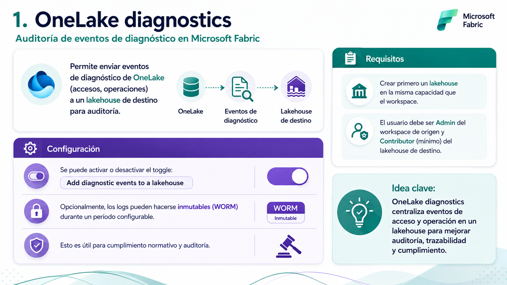

# 🧑🏽‍💻 Clase 28 - Arquitectura de Fabric Parte 2

---

# 5. Ajustes de OneLake en el workspace

## 5.1  ¿Qué es OneLake?

> OneLake es el data lake lógico único de todo el tenant, incluido automáticamente con cada tenant de Fabric, construido sobre Azure Data Lake Storage (ADLS) Gen2. Todos los workloads de Fabric leen y escriben en OneLake, lo que permite **una sola copia de los datos** reutilizable entre motores (Spark, T-SQL, KQL, Power BI Direct Lake).
> 

📚 Referencia: [¿Qué es OneLake?](https://learn.microsoft.com/fabric/onelake/onelake-overview)

## 5.2 La pestaña "OneLake" en Workspace Settings

> Dentro de **Workspace settings → OneLake** se configuran cuatro cosas concretas:
> 

#### 5.2.1. OneLake diagnostics

📚 Referencia: [OneLake diagnostics](https://learn.microsoft.com/fabric/onelake/onelake-diagnostics-overview)

#### 5.2.2. Shortcut caching

> Un Shortcut es un **acceso directo (puntero o enlace)** a datos que están en otra ubicación, sin necesidad de copiarlos.
Si vienes del mundo Linux, es muy parecido a un **enlace simbólico (symlink)**.
> 

📚 Referencia: [OneLake shortcuts — Caching](https://learn.microsoft.com/fabric/onelake/onelake-shortcuts#caching)

#### 5.2.3. Storage report

📚 Referencia: [Get the size of OneLake items](https://learn.microsoft.com/fabric/onelake/how-to-get-item-size)

#### 5.2.4. Default storage tier

📚 Referencia: [OneLake storage tiers (preview)](https://learn.microsoft.com/fabric/onelake/onelake-storage-tiers)

### Tabla resumen

<aside>

### 💬 Pregunta tipo examen

*"Una organización necesita conservar, sin posibilidad de alteración, los registros de acceso a OneLake durante 90 días por motivos regulatorios. ¿Qué configuración deben habilitar?"*

→ **OneLake diagnostics**, enviando los eventos a un lakehouse y activando **logs de diagnóstico inmutables** con un período de retención de 90 días.

</aside>

---

# 6. Ajustes de Apache Airflow en el workspace

## 6.2 Contexto

> **Apache Airflow Job** es el ítem de Fabric que permite orquestar flujos de trabajo (DAGs) usando Apache Airflow de forma nativa dentro del portal de Fabric, útil cuando se necesita una orquestación más compleja o basada en código que la que ofrecen los pipelines nativos.
> 

> ⚠️ **Prerrequisito importante:** el workspace debe estar respaldado por una **capacidad F** (no funciona en workspaces Free ni en PPU sin capacidad F/Trial).
> 

<aside>

### Qué es **Apache Airflow Job**

Es el sucesor natural del *Workflow Orchestration Manager* de Azure Data Factory, ahora integrado como ítem nativo dentro de **Fabric Data Factory**. En esencia, te da un runtime de **Apache Airflow completamente administrado (SaaS)** dentro del portal de Fabric, sin que tengas que aprovisionar servidores, instalar Airflow ni mantener infraestructura — Microsoft se encarga de todo eso por debajo.

Su función es ejecutar **DAGs escritos en Python** (Directed Acyclic Graphs) para orquestar flujos de trabajo de datos: mover datos entre sistemas, encadenar tareas condicionales, esperar a que termine un proceso externo, reintentar en caso de fallo, etc.

### Cuándo usarlo (vs. Pipelines)

Este es el punto clave que suele aparecer en preguntas de escenario del examen:

|  | **Pipelines nativos de Fabric** | **Apache Airflow Job** |
| --- | --- | --- |
| Estilo | No-code / low-code (interfaz visual) | Código Python (DAGs) |
| Mejor para | Orquestación simple y directa: copiar datos, encadenar actividades, triggers basados en eventos | Lógica compleja, condicional o dinámica; DAGs generados programáticamente; reutilizar librerías/plugins de Airflow existentes |
| Perfil del usuario | Ingenieros de datos que prefieren UI | Equipos que ya usan Airflow o prefieren escribir código |

En otras palabras: si la orquestación se puede resolver con actividades encadenadas en un lienzo visual, usa **pipelines**. Si necesitas ramificaciones complejas, generación dinámica de tareas, o ya tienes DAGs de Airflow que quieres migrar (por ejemplo desde Azure Workflow Orchestration Manager), usa **Apache Airflow Job**.

</aside>

📚 Referencia: [Manage Apache Airflow Jobs in Microsoft Fabric — prerequisites](https://learn.microsoft.com/fabric/data-factory/apache-airflow-jobs-manage-vs-code)

## 6.3 Starter Pool vs. Custom Pool (mismo patrón que Spark)

> Se configura en **Workspace settings → Data Factory → Apache Airflow Runtime Settings**, cambiando el **Default Data Workflow Setting** de *Starter Pool* a *New Pool* (custom) y definiendo nombre, tamaño de nodo, autoescalado y nodos extra.
> 

📚 Referencia: [Apache Airflow Job workspace settings](https://learn.microsoft.com/fabric/data-factory/apache-airflow-jobs-workspace-settings)

## 6.4 Identidad del workspace (Workspace identity) para Airflow

📚 Referencia: [Use workspace identity to authenticate Apache Airflow Jobs to Fabric services](https://learn.microsoft.com/fabric/data-factory/apache-airflow-jobs-workspace-identity)

<aside>

### 💬 Pregunta tipo examen

*"Un equipo de producción necesita que su entorno de Airflow esté siempre disponible, sin latencia de arranque, y con nodos de tamaño configurable. ¿Qué deben usar?"*

→ Un **Custom Pool** en los ajustes de Apache Airflow del workspace (no el Starter Pool, que se apaga tras 20 min de inactividad).

</aside>

---

## 7.  Tabla resumen, trampas de examen

### Tabla maestra "¿Quién configura qué, y dónde?"

### ⚠️ Las 5 trampas de examen más frecuentes de este submódulo

1. **Rol insuficiente:** un Member o Contributor *no puede* cambiar ningún ajuste de Workspace Settings, aunque sí pueda crear y ejecutar ítems. Solo **Admin**.
2. **PPU no es capacidad F:** PPU da funcionalidades premium por usuario, pero **no** habilita ítems de Data Engineering avanzados como Airflow Jobs; para eso se necesita capacidad F o Trial.
3. **Dominio ≠ permisos:** asignar un workspace a un dominio **no cambia** quién puede ver o editar sus ítems.
4. **Starter vs. Custom Pool:** Custom Pool da más control pero **más latencia de arranque** — no siempre es "la mejor" respuesta en un escenario que pide velocidad.
5. **Diagnostics necesita un lakehouse:** no se pueden activar los diagnósticos de OneLake sin antes tener un lakehouse de destino en la misma capacidad.

# Mas detalles sobre Fabric Capacity

> ⚠️ **Nota de vigencia:** Microsoft está consolidando las opciones de compra y retirando los SKU P de Power BI Premium; los clientes nuevos y existentes deben adquirir SKU F de Fabric. Esta clase refleja la documentación oficial vigente en el momento de su elaboración (julio 2026); revisa el enlace de la [FAQ de Power BI Premium](https://learn.microsoft.com/fabric/enterprise/powerbi/service-premium-faq) por si hay actualizaciones antes de tu examen.
> 

#### Repaso de Conceptos fundamentales

### Jerarquía Tenant → Capacidad → Workspace

- **Tenant**: es la organización en Microsoft Entra ID. Se crea automáticamente al adquirir una licencia de servicio online de Microsoft, o se puede crear manualmente. Un tenant puede tener uno o varios dominios DNS y **una o varias capacidades de Fabric**.
- **Capacidad (capacity)**: es un pool de recursos de cómputo dedicado dentro del tenant. Su tamaño (SKU) determina la potencia de cómputo disponible. Una organización puede tener tantas capacidades como necesite.
- **Workspace**: contenedor de ítems de Fabric que reside dentro de una capacidad. Cada usuario tiene un *My workspace* personal. Por defecto, los workspaces se crean en la **capacidad compartida del tenant** (la que aloja también todos los *My workspaces* y los workspaces de tipo Pro/PPU); se pueden reasignar a cualquier otra capacidad del tenant.

<aside>

### Dos categorías de ítems

Esta distinción es la base de casi todas las reglas de licenciamiento que veremos hoy:

**Ítems de Power BI:**

- Reports, semantic models (modelos semánticos), dashboards, paginated reports, scorecards, metric sets, dataflows, datamarts, org apps, explorations.

**Ítems de Fabric que NO son de Power BI:**

- Lakehouses, warehouses, notebooks, pipelines, eventhouses, KQL databases y el resto de ítems de los demás workloads de Fabric.

> 💡 **Por qué importa:** las licencias por usuario (Free/Pro/PPU) tratan de forma distinta a estas dos categorías. Un usuario puede tener permiso para crear un lakehouse pero no un report, o viceversa, dependiendo de su licencia y del tipo de capacidad.
> 

### Chequeo rápido

> Un usuario acaba de iniciar sesión por primera vez en Fabric y el tenant tiene Fabric habilitado. ¿Qué licencia recibe automáticamente y qué puede hacer con ella?
> 

📚 Referencia: [Understand Microsoft Fabric licenses – Core building blocks](https://learn.microsoft.com/fabric/enterprise/licenses#core-building-blocks)

</aside>

<aside>

#### Licencias individuales Free, Pro, PPU

### Free

- Se asigna **automáticamente** la primera vez que el usuario inicia sesión en el portal de Fabric (si el tenant tiene Fabric habilitado).
- Permite crear y compartir ítems de Fabric **que no son de Power BI**, siempre que el workspace esté respaldado por una capacidad **F** o **Trial**.
- No elimina el requisito de licencia para *ver* contenido de Power BI cuando la capacidad F es menor que F64 .
- Para crear ítems de Power BI fuera de *My workspace* y compartirlos, siempre se necesita Pro, PPU o una prueba individual de Power BI.

### Pro

- Permite **compartir** contenido de Power BI con otros usuarios.
- Toda organización que use Power BI dentro de Fabric necesita **al menos un usuario** con licencia Pro o PPU.
- En SKUs F **menores** a F64, cada usuario que quiera *ver* contenido de Power BI necesita Pro, PPU o una prueba individual.
- En F64 o superior, un usuario con licencia Free y rol de *viewer* en el workspace **sí puede ver** contenido de Power BI sin necesitar Pro.

### Premium Per User (PPU)

- Da acceso a la mayoría de las funciones de Power BI Premium **por usuario**, en lugar de comprar una capacidad Premium completa.
- Es más rentable que una capacidad cuando se necesitan funciones Premium para **menos de 250 usuarios**.
- Usa un **pool de capacidad compartida** de la organización para el cómputo.
- Incluye: dataflows y datamarts completos, hasta **48 actualizaciones de datos al día**, soporte para modelos semánticos de más de 1 GB, y el **XMLA endpoint**.
</aside>

> ⚠️ **Trampa de examen — la más importante de esta clase:** **PPU NO aprovisiona una capacidad de Fabric.** Aunque da acceso a casi todas las funciones Premium de Power BI, **no permite crear ni ejecutar ítems de Fabric que no sean de Power BI** (lakehouses, warehouses, notebooks, etc.). Para usar workloads de Fabric más allá de Power BI, siempre se necesita una capacidad F (o una capacidad Trial), incluso si todos los usuarios tienen PPU.
> 

### Matriz de capacidades por licencia individual

### Escenarios comunes de licenciamiento

> Con la licencia **Free**; puede crear y compartir ítems que no son de Power BI en workspaces sobre capacidad F o Trial, pero no puede crear/compartir ítems de Power BI fuera de *My workspace* sin Pro o PPU.
> 

📚 Referencia: [Per-user or individual licenses](https://learn.microsoft.com/fabric/enterprise/licenses#per-user-or-individual-licenses)

## Capacidades y SKUs

> ℹ️ Esta tabla se usa solo como referencia comparativa de cómputo; **no implica equivalencia funcional ni de licenciamiento** entre SKUs F y P.
> 

### Los tres "tipos" de SKU y qué soportan

> 
> 
> 
> **Power BI Embedded** es una oferta de **Azure** que te permite insertar (embeber) contenido de Power BI —reportes, dashboards, tiles— dentro de tus propias aplicaciones web o sitios, en lugar de que los usuarios accedan a través del portal de Power BI. Se compra como una capacidad con **SKU tipo A** (A1, A2, A3... equivalentes en CU a EM1, EM2, EM3, etc.).
> 
> En términos simples: es la forma de decir *"quiero que mi aplicación tenga gráficos y reportes de Power BI integrados, con mi propia marca, sin que el usuario final sepa (ni necesite saber) que por debajo hay Power BI"*.
> 

> ⚠️ **Trampa de examen:** si una pregunta describe una capacidad **A** o **EM**, recuerda que **solo soporta ítems de Power BI**, nunca lakehouses, warehouses ni otros ítems de Fabric.
> 

> ⚠️ **Trampa de examen:** una capacidad **P (Power BI Premium)** por defecto **no tiene habilitados los ítems de Fabric** — hay que habilitar Fabric explícitamente sobre esa capacidad (el "Fabric switch") para poder crear lakehouses, notebooks, etc.
> 

### Diferencias clave entre F64+ y P1

| Capacidad | P1 o superior | F64 o superior |
| --- | --- | --- |
| Compromiso de compra | Mensual o anual | Mensual, anual **o pago por uso** |
| Precio | Global | Regional |
| Power BI Report Server | Incluido | Incluido solo con licencia reservada |
| Power BI Embedded | Incluido al comprar SKU EM | Incluido |
| Funciones específicas de Azure (Trusted workspace access, Managed Private Endpoint) | No incluidas | Incluidas |

### Capacidad Trial

- Da **acceso gratuito por 60 días**, equivalente a una **F64** (8 v-cores de Power BI), a casi todas las experiencias de Fabric.
- Se puede iniciar de tres formas: desde el *Account manager*, al intentar usar una función de Fabric sin capacidad disponible, o uniéndose a un trial existente de un compañero.
- El administrador de capacidad puede aumentarla de 4 a 64 CU (o reducirla) sin que eso cambie los días restantes del trial.

📚 Referencia: [Capacity and SKUs](https://learn.microsoft.com/fabric/enterprise/licenses#capacity) · [Try Microsoft Fabric for free](https://learn.microsoft.com/fabric/fundamentals/fabric-trial) · [Power BI Premium FAQ](https://learn.microsoft.com/fabric/enterprise/powerbi/service-premium-faq)

### 💰 Costos aproximados (referencia — no forma parte del examen DP-700)

> ⚠️ **Importante:** el examen DP-700 **no pregunta precios exactos**; esta tabla es solo para que dimensiones el impacto económico de las decisiones de licenciamiento que sí entran en el examen (ej. "¿conviene escalar a F64 o pagar licencias Pro?"). Los precios de Microsoft varían por región, tipo de acuerdo (EA, CSP, pay-as-you-go) y cambian con el tiempo — usa siempre la [calculadora de precios de Azure](https://azure.microsoft.com/pricing/calculator/) y la [página oficial de precios de Power BI](https://www.microsoft.com/power-platform/products/power-bi/pricing) para cifras reales antes de presupuestar. Cifras de referencia en **USD**, región EE. UU., precios de lista:
> 

#### **Licencias por usuario (Power BI / Fabric)**

| Licencia | Costo aproximado |
| --- | --- |
| Free (Fabric) | $0 — se otorga automáticamente |
| Power BI Pro | ≈ $14 / usuario / mes (facturación anual) |
| Power BI Premium Per User (PPU) | ≈ $24 / usuario / mes (facturación anual) |

#### **Capacidades Fabric (SKU F) — pago por uso, aproximado**

| SKU | CUs | Pago por uso (≈ USD/mes, always-on) | Reservado 1 año (≈ USD/mes, ahorro ~40%) |
| --- | --- | --- | --- |
| F2 | 2 | ≈ $260–310 | ≈ $155–185 |
| F8 | 8 | ≈ $1,050–1,250 | ≈ $625–750 |
| F32 | 32 | ≈ $4,200–5,000 | ≈ $2,500–3,000 |
| **F64** | **64** | ≈ $8,400–8,500 | ≈ $4,980–5,260 |
| F128 | 128 | ≈ $16,800–17,000 | ≈ $9,960–10,500 |
| F256 | 256 | ≈ $33,600–34,000 | ≈ $19,900–21,000 |

#### **Capacidades Power BI Premium (SKU P) — en retiro, solo renovación (valores históricos de referencia)**

| SKU | v-cores | Costo aproximado |
| --- | --- | --- |
| P1 | 8 | ≈ $4,995 / mes |
| P2 | 16 | ≈ $9,995 / mes |
| P3 | 32 | ≈ $19,995 / mes |

#### **Otros costos relacionados**

- Almacenamiento OneLake: ≈ $0.023 / GB / mes (~$23/TB/mes), separado del cómputo.
- Power BI Embedded (SKU A1): desde ≈ $1/hora (~$735/mes en uso continuo) — solo ítems de Power BI.

> 💡C**lave para el examen:** por debajo de F64, cada *viewer* de Power BI necesita una licencia Pro/PPU, así que el costo total crece linealmente con el número de usuarios. A partir de F64, los *viewers* con licencia Free ya no pagan por usuario — por eso, en organizaciones con muchos consumidores de reportes, escalar a F64 (o una capacidad P equivalente) suele ser el punto de inflexión de costos, independientemente de los dólares exactos.
> 

