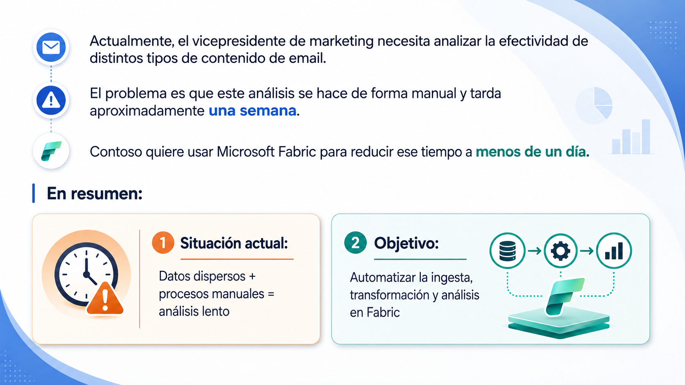

# 🧑🏽‍💻 Clase 30 - Caso de Estudio: Contoso LTD

---

<aside>
💡

**Contoso, Ltd.**,  es una empresa de venta online que quiere modernizar su plataforma de analítica usando **Microsoft Fabric**. El objetivo inicial es mejorar el análisis de marketing, especialmente el análisis de campañas de email y comportamiento web.

</aside>

# **1. Qué problema tiene Contoso**

# **2. Qué equipos trabajan con los datos**

<aside>

Define y explica que son los modelos semánticos

</aside>

# **3. Qué tiene Contoso actualmente en Fabric**

<aside>

Investiga las diferencias sutiles entre la capacidad F64 y la Trial (no confundir con free) de 60 días de Fabric.

</aside>

# **4. Qué sistemas fuente existen**

<aside>

- Define que es “Data Gateway” y como se configura en Fabric
- Define que es Managed private endopint y como se configura en Fabric
- Define que es una API REST e investiga porque Contoso tiene configurado 7 endpoints para la misma API REST de marketing. Incluye ejemplos para entender mejor porque se usan varios endopints
</aside>

# **5. Qué arquitectura quiere construir Contoso**

<aside>

¿Qué es un modelo dimensional en este contexto?
Define que es un Lakehouse y que ventajas tiene frente a un Datawarehouse o un Data Lake.

</aside>

# **6. Arquitectura medallion**

<aside>

Define que son tablas de dimensiones (dim Table) y tablas de hechos (Fact table)

</aside>

# **7. Flujo general esperado**

# 8.  **Reglas de ejecución**

# 9. **Control de versiones**

<aside>

En que consiste el servicio de Azure llamado Azure Reports, añade ejemplos básicos aplicados con Fabric.

</aside>

# **10. Separación entre WorkspaceA y WorkspaceB**

<aside>

Define y explica con ejemplos que es “Dataflows”

</aside>

# 11. Seguridad de datos

# 12. **Datos de producto**

# **13. Mantenimiento Delta**

<aside>

Investiga que ventajas tiene hacer un Vacuum en Fabric, añade ejemplos.

</aside>

# 14. Preguntas a responder

1. **Qué herramienta usar para ingerir datos desde REST APIs.**
2. **Cómo configurar reintentos ante errores transitorios.**
3. **Cómo ejecutar cargas en paralelo.**
4. **Cómo se configura una politica de Retry en un pipeline de ingesta de la fase donde se quieren extraer los datos de una API** 
5. **Cómo organizar los datos en Bronze, Silver y Gold.**
6. **Cómo usar Delta format en el lakehouse.**
7. **Cómo evitar copiar datos raw desde Amazon S3.**
8. **Cómo minimizar costes de egress cross-cloud.**
9. **Cómo separar ingeniería y analítica en distintos workspaces.**
10. **Qué permisos asignar a DataEngineers y DataAnalysts.**
11. **Cómo aplicar control de versiones con Azure Repos.**
12. **Cómo construir la dimensión de productos en la capa Gold.**
13. **Cómo limpiar archivos obsoletos de Delta con VACUUM.**

