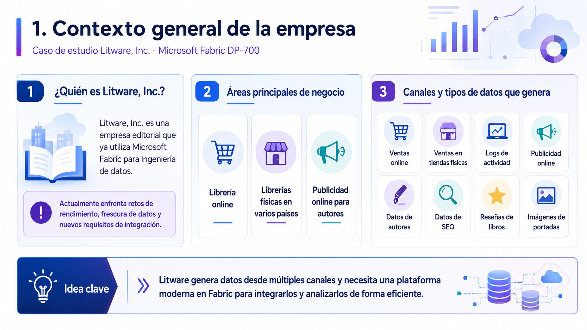

# 🧑🏽‍💻 Clase 31 - Caso de Estudio: Litware Inc.

---

# **1. Contexto general de la empresa**

# **2. Entorno actual en Microsoft Fabric**

# **3. Cómo llegan actualmente los datos de ventas**

# **4. Arquitectura medallion existente**

# **5. Imágenes de portadas de libros**

# **6. Datos de ventas y frecuencia de actualización**

# 7. **Dataflow Gen2 actual**

# **8. Tabla AuthorSales y seguridad por autor**

# **9. Grupos de seguridad existentes**

# **10. Problemas de rendimiento en el warehouse**

# **11. Aumento de actividad cuando hay nuevos lanzamientos**

# **12. Problema de frescura de datos por la mañana**

# **13. Nuevo requisito: reseñas de libros desde Amazon S3**

## **14. Nuevo requisito: SEO en near-real-time**

---

## **15. Nuevo requisito: procesar imágenes al llegar**

---

## **16. Requisito de control de versiones**

---

## **17. Requisito de gobernanza y costes**

---

## **18. Resumen del flujo actual**

---

## **19. Resumen del flujo futuro**

---

## **20. Qué está evaluando este caso**

---

## **21. Idea central del caso**

