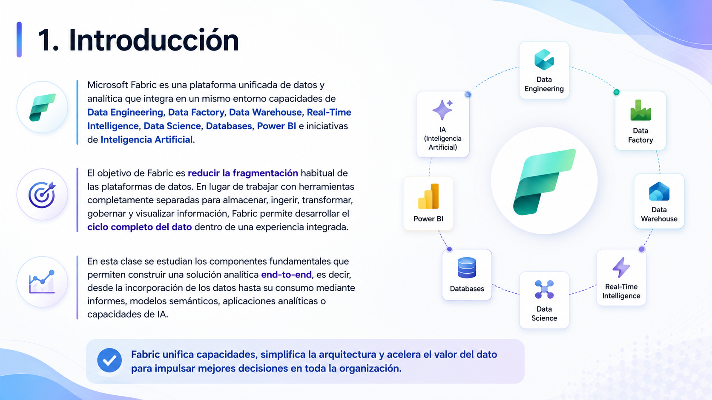

# 🧑🏽‍💻 Clase 35 - Analítica end-to-end con Microsoft Fabric

---

# **Explore end-to-end analytics with Microsoft Fabric**

## **1. Introducción**

---

---

# **Parte I. Visión general de una solución end-to-end**

## **2. ¿Qué significa analítica end-to-end?**

### **Ejemplo**

 ****

---

# **Parte II. OneLake**

## **3. ¿Qué es OneLake?**

---

## **4. OneLake y Azure Data Lake Storage Gen2**

---

## **5. Formatos soportados**

## **6. Un mismo dato para varios motores**

---

## **7. Diferencia entre OneLake, Lakehouse y Warehouse**

---

# **Parte III. Shortcuts**

## **8. ¿Qué son los Shortcuts?**

---

## **9. Acceso lógico frente a copia física**

## **10. Cuándo usar un Shortcut**

---

## **11. Ejemplo aplicado**

---

# **Parte IV. Workspaces**

## **15. Permisos y colaboración**

---

---

## **16. Workspaces y capacidad de cómputo**

# **Parte V. Administración y gobierno**

## **18. Gobierno centralizado**

---

## **19. Admin portal**

---

## **21. APIs y SDKs administrativos**

---

# **Parte VI. OneLake catalog**

## **22. ¿Qué es el OneLake catalog?**

---

## **24. Metadatos y estado de gobierno**

# **Parte VII. Workloads y elementos de Fabric**

## **27. ¿Qué es un workload?**

---

## **28. Data Engineering**

---

## **29. Data Factory**

---

## **30. Data Warehouse**

---

## **31. Real-Time Intelligence**

---

## **32. Industry Solutions**

---

## **33. Data Science**

### **34. Databases**

---

---

## **35. IQ (preview)**

---

## **36. Power BI**

# **Parte VIII. Fabric como plataforma unificada**

## **37. Integración de tecnologías Microsoft**

Fabric reúne capacidades procedentes o relacionadas con tecnologías como Power BI; Azure Data Factory; Azure Synapse Analytics; Spark; SQL; KQL; y servicios de datos de Azure.

El objetivo no es que todos los workloads sean idénticos, sino que puedan colaborar dentro de una misma plataforma, compartiendo: OneLake; identidad; gobierno; workspaces; administración; experiencias de usuario; y capacidades de IA.

---

---

# **Parte IX. Capacidades de IA en Microsoft Fabric**

## **41. Fabric IQ**

---

---

## **42. Fabric IQ, Foundry IQ y Work IQ**

---

## **43. Fabric data agents**

---

## **44. Importancia de los permisos**

# **Parte X. Copilot en los workloads**

---

---

# **Parte XIV. Actividades**

## **49. Actividad 1. Shortcut o copia**

- Solución

---

# **50. Glosario**

