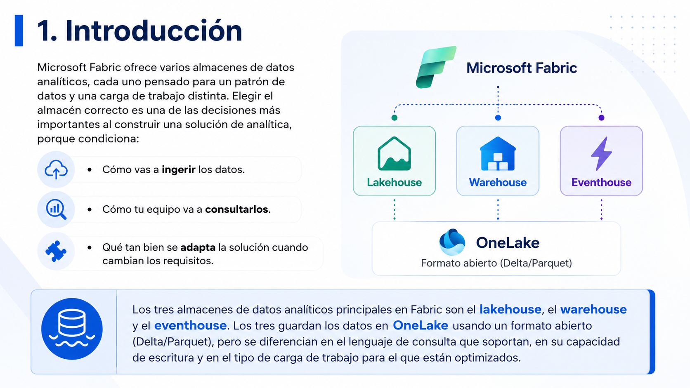
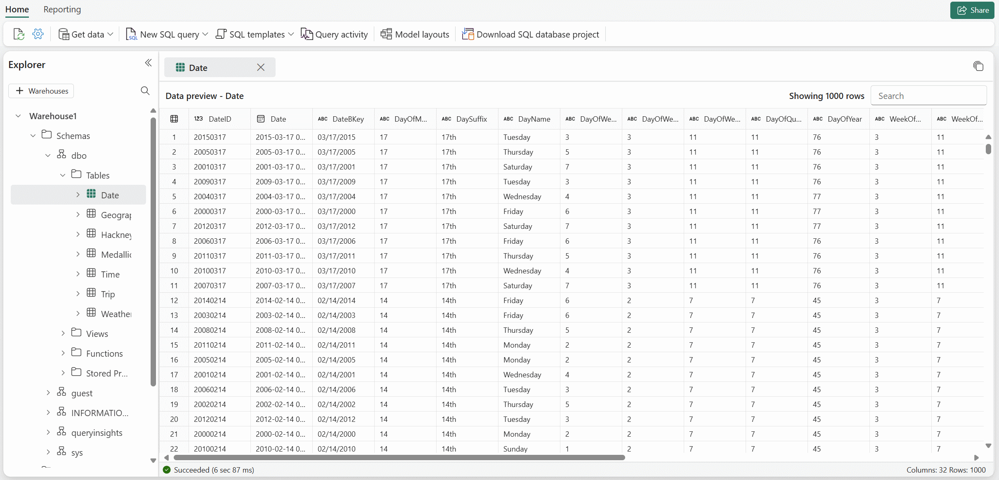
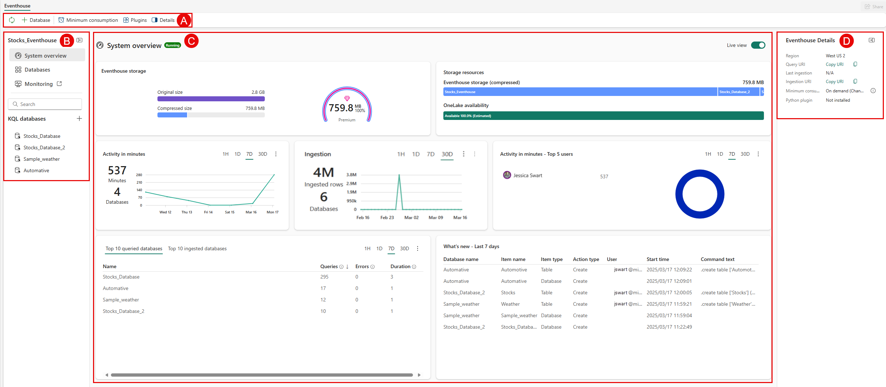

# 🧑🏽‍💻 Clase 39 - Criterios para elegir el almacenamiento de datos analítico correcto en Microsoft Fabric

## **1. Introducción**

### **Caso de estudio de Microsoft Learn**

### **2. Panorama general: los tres almacenes analíticos**

---

### **Cómo se conectan los almacenes a través de OneLake**

### **Diagrama de decisión**

> Este árbol de decisión resume la lógica que verás con más detalle en la siguiente sección: parte de la pregunta "¿qué tipo de dato y qué carga de trabajo tengo?" y termina apuntando al almacén (o servicio) más adecuado, todos apoyados sobre **OneLake** como base de almacenamiento unificada.
> 

### **Factores clave de decisión**

### **Consideraciones para el uso de IA**

---

## **3. Lakehouse: capacidades y evaluación**

### **¿Cuándo elegir un lakehouse?**

### Como encaja el Lakehouse en una solución  completa de Microsoft Fabric

---

## **4. Warehouse: capacidades y evaluación**

### Como encaja el Warehouse en una solución  completa de Microsoft Fabric

---

## **5. Eventhouse: capacidades y evaluación**

### Como encaja el E**venthouse** en una solución  completa de Microsoft Fabric

---