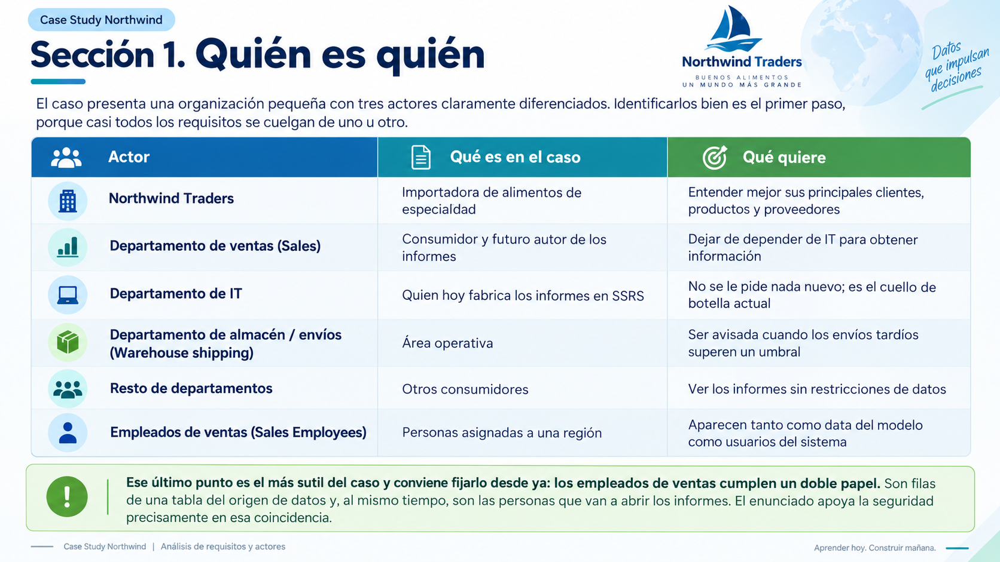

# 📋Clase 41 Caso de Estudio Northwind

# Case Study Northwind — PL-300 (Contexto y comprensión)

---

# PARTE 1 — Planteamiento caso de estudio

## Instrucciones de la sección

This is a case study. Case studies are not timed separately. You can use as much exam time as you would like to complete each case. However, there may be additional case studies and sections on this exam. You must manage your time to ensure that you are able to complete all questions included on this exam in the time provided.

To answer the questions included in a case study, you will need to reference information that is provided in the case study. Case studies might contain exhibits and other resources that provide more information about the scenario that is described in the case study. Each question is independent of the other questions in this case study.

At the end of this case study, a review screen will appear. This screen allows you to review your answers and to make changes before you move to the next section of the exam. After you begin a new section, you cannot return to this section.

**To start the case study**

To display the first question in this case study, click the **Next** button. Use the buttons in the left pane to explore the content of the case study before you answer the questions. Clicking these buttons displays information such as business requirements, existing environment and problem statements. If the case study has an **All Information** tab, note that the information displayed is identical to the information displayed on the subsequent tabs. When you are ready to answer a question, click the **Question** button to return to the question.

---

## General Overview

Northwind Traders is a specialty food import company.

The company recently implemented Power BI to better understand its top customers, products, and suppliers.

---

## Business Issues

The sales department relies on the IT department to generate reports in Microsoft SQL Server Reporting Services (SSRS). The IT department takes too long to generate the reports and often misunderstands the report requirements.

---

## Existing Environment. Data Sources

Northwind Traders uses the data sources shown in the following table.

| Name | Type | Data size |
| --- | --- | --- |
| Source1 | Azure SQL database | 2 GB |
| Source2 | Microsoft Excel spreadsheet | 5 MB |

Source2 is exported daily from a third-party system and stored in Microsoft SharePoint Online.

---

## Existing Environment. Customer Worksheet

Source2 contains a single worksheet named **Customer Details**. The first 11 rows of the worksheet are shown in the following table.

| CustomerID | CustomerCRMID | CompanyName | Address | City | Region | PostalCode | Country | Phone |
| --- | --- | --- | --- | --- | --- | --- | --- | --- |
| 1 | ALFKI | Alfreds Futterkiste | Obere Str. 57 | Berlin | DE | 12209 | Germany | 030-0074321 |
| 2 | ANATR | Ana Trujillo Emparedados y helados | Avda. de la Constitución 2222 | México D.F. | MX | 5021 | Mexico | (5) 555-4729 |
| 3 | ANTON | Antonio Moreno Taquería | Mataderos 2312 | México D.F. | MX | 5023 | Mexico | (5) 555-3932 |
| 4 | AROUT | Around the Horn | 120 Hanover Sq. | London | UK | WA1 1DP | UK | (171) 555-7788 |
| 5 | BERGS | Berglunds snabbköp | Berguvsvägen 8 | Luleå | SWE | S-958 22 | Sweden | 0921-12 34 65 |
| 6 | BLAUS | Blauer See Delikatessen | Forsterstr. 57 | Mannheim | DE | 68306 | Germany | 0621-08460 |
| 7 | BLONP | Blondesddsl père et fils | 24, place Kléber | Strasbourg | FRA | 67000 | France | 88.60.15.31 |
| 8 | BOLID | Bólido Comidas preparadas | C/ Araquil, 67 | Madrid | SPN | 28023 | Spain | (91) 555 22 82 |
| 9 | BONAP | Bon app’ | 12, rue des Bouchers | Marseille | FRA | 13008 | France | 91.24.45.40 |
| 10 | BOTTM | Bottom-Dollar Markets | 23 Tsawassen Blvd. | Tsawassen | BC | T2F 8M4 | Canada | (604) 555-4729 |

All the fields in Source2 are mandatory.

The **Address** column in Customer Details is the **billing address**, which can differ from the shipping address.

---

## Existing Environment. Azure SQL Database

Source1 contains the following tables:

- Orders
- Products
- Suppliers
- Categories
- Order Details
- Sales Employees

### The Orders table contains the following columns

| Name | Is nullable | Data type | Example value | Key |
| --- | --- | --- | --- | --- |
| OrderID | No | Int | 10248 | Primary key |
| CustomerID | Yes | NCHAR | VINET | Not applicable |
| OrderDate | Yes | Date | 2021-01-04 | Not applicable |
| RequiredDate | Yes | Date | 2021-02-01 | Not applicable |
| ShippedDate | Yes | Date | 2021-01-16 | Not applicable |
| Freight | Yes | Decimal | 32.38 | Not applicable |
| ShipName | Yes | NVARCHAR | Vins et alcools Chevalier | Not applicable |
| ShipAddress | Yes | NVARCHAR | 59 rue de l’Abbaye | Not applicable |
| ShipCity | Yes | NVARCHAR | Reims | Not applicable |
| ShipRegion | Yes | NVARCHAR | FRA | Not applicable |
| ShipPostalCode | Yes | NVARCHAR | 51100 | Not applicable |
| ShipCountry | Yes | NVARCHAR | France | Not applicable |

### The Order Details table contains the following columns

> ⚠️ **Aviso de fidelidad:** el PDF que has subido enuncia esta frase pero **no incluye la imagen de la tabla**. En el caso de estudio original de Microsoft, la tabla Order Details contiene las columnas que se listan abajo. Trátalas como referencia contextual, no como parte literal del documento que has proporcionado.
> 

| Name | Is nullable | Data type | Example value | Key |
| --- | --- | --- | --- | --- |
| OrderID | No | Int | 10248 | Foreign key to Orders |
| ProductID | No | Int | 11 | Foreign key to Products |
| UnitPrice | No | Decimal | 14.00 | Not applicable |
| Quantity | No | Int | 12 | Not applicable |
| Discount | No | Decimal | 0 | Not applicable |

### The Products table contains the following columns

| Name | Is nullable | Data type | Example value | Key |
| --- | --- | --- | --- | --- |
| ProductID | No | Int | 11 | Primary key |
| ProductName | No | NVARCHAR | Queso Cabrales | Not applicable |
| SupplierID | Yes | Int | 5 | Foreign key to Suppliers |
| CategoryID | Yes | Int | 4 | Foreign key to Categories |
| QuantityPerUnit | Yes | NVARCHAR | 1 kg pkg. | Not applicable |
| Discontinued | No | Bit | 0 | Not applicable |

### The Categories table contains the following columns

| Name | Is nullable | Data type | Example value | Key |
| --- | --- | --- | --- | --- |
| CategoryID | No | int | 4 | Primary key |
| CategoryName | No | nvarchar | Dairy Products | Not applicable |
| Description | Yes | nvarchar | Cheeses | Not applicable |

### The Suppliers table contains the following columns

| Name | Is nullable | Data type | Example value | Key |
| --- | --- | --- | --- | --- |
| SupplierID | No | Int | 5 | Primary key |
| CompanyName | No | NVARCHAR | Cooperativa de Quesos ‘Las Cabras’ | Not applicable |
| Address | Yes | NVARCHAR | Calle del Rosal 4 | Not applicable |
| City | Yes | NVARCHAR | Oviedo | Not applicable |
| Region | Yes | NVARCHAR | Asturias | Not applicable |
| PostalCode | Yes | NVARCHAR | 33007 | Not applicable |
| Country | Yes | NVARCHAR | Spain | Not applicable |
| Phone | Yes | NVARCHAR | (98) 598 76 54 | Not applicable |

### The Sales Employees table contains the following columns

| Name | Is nullable | Data type | Example value | Key |
| --- | --- | --- | --- | --- |
| EmployeeID | No | Int | 1 | Primary key |
| LastName | No | NVARCHAR | Davolio | Not applicable |
| FirstName | No | NVARCHAR | Nancy | Not applicable |
| Title | Yes | NVARCHAR | Sales Representative | Not applicable |
| HireDate | Yes | Date | 2015-02-01 | Not applicable |
| Region | Yes | NVARCHAR | WA | Not applicable |
| Country | Yes | NVARCHAR | USA | Not applicable |
| EmailAddress | No | NVARCHAR | [ndavolio@northwindtraders.com](mailto:ndavolio@northwindtraders.com) | Not applicable |

Each employee in the Sales Employees table is assigned to **one** sales region. **Multiple** employees can be assigned to each region.

---

## Requirements. Report Requirements

Northwind Traders requires the following reports:

- Top Products
- Top Customers
- On-Time Shipping

The **Top Customers** report will show the top 20 customers based on the highest sales amounts in a selected order month or quarter, product category, and sales region.

The **Top Products** report will show the top 20 products based on the highest sales amounts sold in a selected order month or quarter, sales region, and product category. The report must also show which suppliers provide the top products.

The **On-Time Shipping** report will show the following metrics for a selected shipping month or quarter:

- The percentage of orders that were shipped late by country and shipping region
- Customers that had multiple late shipments during the last quarter

Northwind Traders defines late orders as those shipped after the required shipping date.

The warehouse shipping department must be notified if the percentage of late orders within the current month exceeds 5%.

The reports must show historical data for the current calendar year and the last three calendar years.

---

## Requirements. Technical Requirements

Northwind Traders identifies the following technical requirements:

- A single dataset must support all three reports.
- The reports must be stored in a single Power BI workspace.
- Report data must be current as of 7 AM Pacific Time each day.
- The reports must provide fast response times when users interact with a visualization.
- The data model must minimize the size of the dataset as much as possible, while meeting the report requirements and the technical requirements.

---

## Requirements. Security Requirements

Access to the reports must be granted to Azure Active Directory (Azure AD) security groups only. An Azure AD security group exists for each department.

The sales department must be able to perform the following tasks in Power BI:

- Create, edit, and delete content in the reports.
- Manage permissions for workspaces, datasets, and reports.
- Publish, unpublish, update, and change the permissions for an app.
- Assign Azure AD groups role-based access to the reports workspace.

Users in the sales department must be able to access only the data of the sales region to which they are assigned in the Sales Employees table.

Power BI has the following row-level security (RLS) Table filter DAX expression for the Sales Employees table.

```
[EmailAddress] = USERNAME()
```

RLS will be applied only to the sales department users. Users in all other departments must be able to view all the data.

# PARTE 2 — Explicación del caso

> Esta parte no resuelve el caso. Su único objetivo es que entiendas **qué te están contando**: quién es quién, qué problema existe, qué pide cada informe, qué condiciona cada requisito y qué deja el enunciado sin decir. Las decisiones técnicas se abordan después, al trabajar las preguntas.
> 

---

## Sección 1. Quién es quién

El caso presenta una organización pequeña con tres actores claramente diferenciados. Identificarlos bien es el primer paso, porque casi todos los requisitos se cuelgan de uno u otro.



---

## Sección 2. Por qué existe este proyecto

El caso abre con una situación de partida que no es técnica, sino organizativ


---

## Sección 3. El paisaje de datos

Northwind trabaja con dos orígenes de naturaleza muy distinta. El contraste entre ambos es deliberado.


---

## Sección 4. Qué pide cada informe

Northwind quiere tres informes. Conviene leerlos como lo que son: **especificaciones funcionales**, con sujeto, métrica y dimensiones de análisis.

### 


---

## Sección 5. Los requisitos técnicos, uno a uno

El caso enumera cinco. Cada uno es una restricción sobre el diseño, y cada uno está redactado con precisión.


---

## Sección 6. Los requisitos de seguridad

Son los más densos del caso, así que conviene separarlos en tres bloques que responden a preguntas distintas.


---

## Sección 7. Lo que el enunciado no dice

Los casos de estudio del PL-300 son deliberadamente incompletos. Reconocer los huecos es parte de entenderlos.


---

## Sección 8. Mapa mental del caso

Una forma de fijar todo lo anterior es plegar el caso en una sola tabla de lectura: qué se pide, de dónde sale la información y con qué se cruza.


---