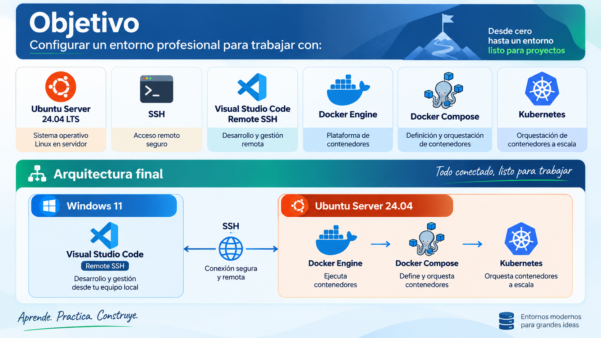

# 🧑🏽‍💻 Clase 43 - Instalaciones básicas para Docker y Kubernetes

> **Para poder instalar Docker y Kubernetes debes tener instalada tu maquina virtual de Ubuntu Server 24.04.4. La ISO se descargó a principios del curso.**
> 



---

# Pasos:

# 1. Obtener la IP de Ubuntu

Iniciar sesión en Ubuntu Server y ejecutar en la terminal:

```bash
hostname -I
```

O bien:

```bash

ip a
```

Ejemplo de salida:

```

192.168.86.130
```

---

# 2. Verificar que SSH está instalado

Comprobar si el servicio SSH está funcionando:

```bash

sudo systemctl status ssh
```

Si aparece:

```

Active: active (running)
```

SSH está correctamente instalado.

Para salir de la pantalla:

```

q
```

---

# 3. Instalar SSH (si fuera necesario)

Actualizar repositorios:

```bash

sudo apt update
```

Instalar OpenSSH Server:

```bash

sudo apt install -y openssh-server
```

Habilitar el servicio:

```bash

sudo systemctl enable ssh
```

Iniciar el servicio:

```bash

sudo systemctl start ssh
```

Comprobar nuevamente:

```bash

sudo systemctl status ssh
```


---

# 4. Conectar desde Windows Terminal

Abrir Windows Terminal y ejecutar:

```powershell
ssh curso@192.168.86.130
```

Donde:

- `curso` es el usuario de Ubuntu.
- `192.168.86.130` es la IP del servidor.

La primera vez aparecerá:

```

Are you sure you want to continue connecting (yes/no)?
```

Responder:

```

yes
```


Introducir la contraseña del usuario Ubuntu.


Si todo está correcto aparecerá:

```bash

curso@dataeng:~$
```


---

# 5. Verificar que estamos trabajando en Ubuntu

Ejecutar:

```bash

uname -a
```

Resultado esperado:

```

Linux dataeng 6.8.0-139-generic #139-Ubuntu SMP PREEMPT_DYNAMIC Sat Aug  1 03:52:05 UTC 2026 x86_64 x86_64 x86_64 GNU/Linux
```

Probar también:

```bash

pwd
```

```bash

ls
```

```bash

whoami
```


---

# 6. Instalar Visual Studio Code

Descargar desde:

[https://code.visualstudio.com](https://code.visualstudio.com/)

Instalar normalmente en Windows.

---

# 7. Instalar la extensión Remote SSH

Abrir VS Code.

Ir a:

```

Extensiones
```

Buscar:

```

Remote - SSH
```


Instalar la extensión oficial de Microsoft:

```

ms-vscode-remote.remote-ssh
```


---

# 8. Configurar la conexión SSH en VS Code

Abrir la paleta de comandos:

```

Ctrl + Shift + P
```


Escribir:

```

Remote-SSH: Connect Current Window to Host...
```


Seleccionar:

```

Add New SSH Host
```


Introducir:

```

ssh curso@192.168.86.130
```


Guardar en:

```

C:\Users\juanjo\.ssh\config
```


---

# 9. Conectarse a Ubuntu desde VS Code

Abrir nuevamente:

```

Ctrl + Shift + P
```

Ejecutar:

```

Remote-SSH: Connect Current Window to Host...
```


Seleccionar:

```

curso@192.168.86.130
```


Seleccionar Linux


Introduce password:


eberias ver: 


VS Code instalará automáticamente los componentes necesarios.

Cuando la conexión esté activa se verá:

```

SSH: 192.168.86.130
```

en la esquina inferior izquierda.


Ve a la terminal de VScode:


---

# 10. Actualizar Ubuntu

Antes de instalar Docker, escribe en la terminal:

```bash

sudo apt update
```

```bash

sudo apt upgrade -y
```


---

# 11. Instalar dependencias necesarias para Docker

```bash

sudo apt install -y ca-certificates curl gnupg lsb-release
```


---

# 12. Crear directorio para claves GPG

```bash

sudo install -m 0755 -d /etc/apt/keyrings
```


---

# 13. Descargar la clave oficial de Docker

```bash
curl -fsSL https://download.docker.com/linux/ubuntu/gpg | sudo gpg --dearmor -o /etc/apt/keyrings/docker.gpg
```

Si te sale sobreescribir:


escribe `y` y luego Enter:


Asignar permisos:

```bash

sudo chmod a+r /etc/apt/keyrings/docker.gpg
```


---

# 14. Agregar el repositorio oficial de Docker

```bash
echo "deb [arch=$(dpkg --print-architecture) signed-by=/etc/apt/keyrings/docker.gpg] https://download.docker.com/linux/ubuntu $(. /etc/os-release && echo "$VERSION_CODENAME") stable" | sudo tee /etc/apt/sources.list.d/docker.list > /dev/null
```


---

# 15. Actualizar repositorios

```bash

sudo apt update
```


---

# 16. Instalar Docker Engine y Docker Compose

```bash

sudo apt install -y docker-ce docker-ce-cli containerd.io docker-buildx-plugin docker-compose-plugin
```

Deberías obtener en la salida esto (no pegar): 

```bash
curso@dataeng:~$ 
sudo apt install -y docker-ce docker-ce-cli containerd.io docker-buildx-plugin docker-compose-plugin
Leyendo lista de paquetes... Hecho
Creando árbol de dependencias... Hecho
Leyendo la información de estado... Hecho
Los paquetes indicados a continuación se instalaron de forma automática y ya no son necesarios.
  libfwupd2 libgusb2
Utilice «sudo apt autoremove» para eliminarlos.
Se instalarán los siguientes paquetes adicionales:
  docker-ce-rootless-extras pigz
Paquetes sugeridos:
  cgroupfs-mount | cgroup-lite docker-model-plugin
Se instalarán los siguientes paquetes NUEVOS:
  containerd.io docker-buildx-plugin docker-ce docker-ce-cli docker-ce-rootless-extras docker-compose-plugin pigz
0 actualizados, 7 nuevos se instalarán, 0 para eliminar y 4 no actualizados.
Se necesita descargar 99,8 MB de archivos.
Se utilizarán 382 MB de espacio de disco adicional después de esta operación.
Des:1 http://es.archive.ubuntu.com/ubuntu noble/universe amd64 pigz amd64 2.8-1 [65,6 kB]
Des:2 https://download.docker.com/linux/ubuntu noble/stable amd64 containerd.io amd64 2.3.5-1~ubuntu.24.04~noble [22,4 MB]
Des:3 https://download.docker.com/linux/ubuntu noble/stable amd64 docker-ce-cli amd64 5:29.8.0-1~ubuntu.24.04~noble [17,6 MB]
Des:4 https://download.docker.com/linux/ubuntu noble/stable amd64 docker-ce amd64 5:29.8.0-1~ubuntu.24.04~noble [24,3 MB]
Des:5 https://download.docker.com/linux/ubuntu noble/stable amd64 docker-buildx-plugin amd64 0.37.0-1~ubuntu.24.04~noble [17,3 MB]
Des:6 https://download.docker.com/linux/ubuntu noble/stable amd64 docker-ce-rootless-extras amd64 5:29.8.0-1~ubuntu.24.04~noble [10,2 MB]
Des:7 https://download.docker.com/linux/ubuntu noble/stable amd64 docker-compose-plugin amd64 5.5.1-1~ubuntu.24.04~noble [8.012 kB]
Descargados 99,8 MB en 2s (61,2 MB/s)        
Seleccionando el paquete containerd.io previamente no seleccionado.
(Leyendo la base de datos ... 88443 ficheros o directorios instalados actualmente.)
Preparando para desempaquetar .../0-containerd.io_2.3.5-1~ubuntu.24.04~noble_amd64.deb ...
Desempaquetando containerd.io (2.3.5-1~ubuntu.24.04~noble) ...
Seleccionando el paquete docker-ce-cli previamente no seleccionado.
Preparando para desempaquetar .../1-docker-ce-cli_5%3a29.8.0-1~ubuntu.24.04~noble_amd64.deb ...
Desempaquetando docker-ce-cli (5:29.8.0-1~ubuntu.24.04~noble) ...
Seleccionando el paquete docker-ce previamente no seleccionado.
Preparando para desempaquetar .../2-docker-ce_5%3a29.8.0-1~ubuntu.24.04~noble_amd64.deb ...
Desempaquetando docker-ce (5:29.8.0-1~ubuntu.24.04~noble) ...
Seleccionando el paquete pigz previamente no seleccionado.
Preparando para desempaquetar .../3-pigz_2.8-1_amd64.deb ...
Desempaquetando pigz (2.8-1) ...
Seleccionando el paquete docker-buildx-plugin previamente no seleccionado.
Preparando para desempaquetar .../4-docker-buildx-plugin_0.37.0-1~ubuntu.24.04~noble_amd64.deb ...
Desempaquetando docker-buildx-plugin (0.37.0-1~ubuntu.24.04~noble) ...
Seleccionando el paquete docker-ce-rootless-extras previamente no seleccionado.
Preparando para desempaquetar .../5-docker-ce-rootless-extras_5%3a29.8.0-1~ubuntu.24.04~noble_amd64.deb ...
Desempaquetando docker-ce-rootless-extras (5:29.8.0-1~ubuntu.24.04~noble) ...
Seleccionando el paquete docker-compose-plugin previamente no seleccionado.
Preparando para desempaquetar .../6-docker-compose-plugin_5.5.1-1~ubuntu.24.04~noble_amd64.deb ...
Desempaquetando docker-compose-plugin (5.5.1-1~ubuntu.24.04~noble) ...
Configurando docker-buildx-plugin (0.37.0-1~ubuntu.24.04~noble) ...
Configurando containerd.io (2.3.5-1~ubuntu.24.04~noble) ...
Created symlink /etc/systemd/system/multi-user.target.wants/containerd.service → /usr/lib/systemd/system/containerd.service.
Configurando docker-compose-plugin (5.5.1-1~ubuntu.24.04~noble) ...
Configurando docker-ce-cli (5:29.8.0-1~ubuntu.24.04~noble) ...
Configurando pigz (2.8-1) ...
Configurando docker-ce-rootless-extras (5:29.8.0-1~ubuntu.24.04~noble) ...
Configurando docker-ce (5:29.8.0-1~ubuntu.24.04~noble) ...
Created symlink /etc/systemd/system/multi-user.target.wants/docker.service → /usr/lib/systemd/system/docker.service.
Created symlink /etc/systemd/system/sockets.target.wants/docker.socket → /usr/lib/systemd/system/docker.socket.
Procesando disparadores para man-db (2.12.0-4build2) ...
Scanning processes...                                                                                                                                                                                                                                                
Scanning linux images...                                                                                                                                                                                                                                             

Running kernel seems to be up-to-date.

No services need to be restarted.

No containers need to be restarted.

No user sessions are running outdated binaries.

No VM guests are running outdated hypervisor (qemu) binaries on this host.
curso@dataeng:~$ 
```

---

# 17. Verificar la instalación

Versión de Docker:

```bash

docker --version
```


Versión de Docker Compose:

```bash

docker compose version
```


Estado del servicio:

```bash

sudo systemctl status docker
```

Debe aparecer:

```

Active: active (running)
```


pulsar q para salir del END:


---

# 18. Permitir usar Docker sin sudo

Agregar el usuario al grupo docker:

```bash

sudo usermod -aG docker curso
```


Cerrar sesión:

```bash

exit
```

Volver a conectarse:

```powershell

ssh curso@192.168.86.130
```

---

# 19. Probar Docker

Ejecutar:

```bash

docker run hello-world
```

Si todo funciona correctamente aparecerá:

```

Hello from Docker!
```

Si te sale este error:


esto es que el usuario aún no pertenece al grupo `docker` en la sesión actual.

Ejecuta:

```bash
groups
```


Si no aparece `docker` en la lista, es normal. Ahora ejecuta:

```bash
sudo usermod -aG docker curso
```


Después verifica:

```bash
grep docker /etc/group
```

Deberías ver algo parecido a:


## Muy importante

Los cambios de grupo **no se aplican a la sesión actual**.

Debes salir completamente de la sesión SSH:

```bash
exit
```

Vuelve a conectarte desde VS Code:

Pulsa: `Ctrl + Shift + P`

Ejecuta:

```bash
Remote-SSH: Connect Current Window to Host...
```

Selecciona la ip e introduces el password. 

Ejecuta:

```bash
newgrp docker
```

Después comprueba:

```bash
groups
```

Ahora debería aparecer:


Ejecuta ahora:

```bash
docker run hello-world
```

La primera vez Docker descargará la imagen desde Docker Hub y deberías ver algo parecido a:


### Comprobaciones finales:

Ejecuta estos comandos:

```bash
docker --version
```


```bash
docker compose version
```


```bash
docker ps -a
```

Deberías obtener algo similar a:


### Prueba adicional:

Descarga y ejecuta Nginx:

```bash
docker run -d --name nginx-prueba -p 80:80 nginx
```

Comprueba que está funcionando:

```bash
docker ps
```

Verás algo parecido a:


Abre en tu navegador de Windows:

```bash
http://192.168.86.130
```

(donde `192.168.86.130` es la IP que vimos antes). Si aparece la página de bienvenida de Nginx, tendrás confirmación de que:

✅ Ubuntu Server funciona

✅ VMware funciona

✅ Red configurada correctamente

✅ Docker Engine funciona

✅ Descarga de imágenes desde Docker Hub funciona

✅ Publicación de puertos funciona


---

# 20. Instalacion de Kubernetes

Vamos a verificar que nuestro ububntu server trae microk8s. 

## **1. Verificar que MicroK8s está funcionando**

Ejecuta:

```bash
microk8s status
```

## **2. Verificar el estado del nodo**

```bash
microk8s kubectl get nodes
```

Resultado esperado:

```
NAME      STATUS   ROLES    AGE   VERSION
dataeng   Ready    <none>   25h   v1.35.6
```

Puntos importantes:

- STATUS = Ready
- Debe aparecer el nodo `dataeng`

## 3. Ver información del clúster

```bash
microk8s kubectl cluster-info
```

Resultado esperado:

```
Kubernetes control plane is running at https://127.0.0.1:16443
```

---

## 4. Ver todos los pods de Kubernetes

```bash
microk8s kubectl get pods -A
```

Resultado esperado:

```
NAMESPACE     NAME                                  STATUS
kube-system   calico-kube-controllers-xxxxx         Running
kube-system   calico-node-xxxxx                     Running
kube-system   coredns-xxxxx                         Running
kube-system   hostpath-provisioner-xxxxx            Running
kube-system   metrics-server-xxxxx                  Running
```

Todos deben aparecer en:

```
STATUS = Running
```

---

## 5. Ver todos los recursos del clúster

```bash
microk8s kubectl get all -A
```

Permite ver:

- Pods
- Services
- Deployments
- ReplicaSets
- DaemonSets

---

## 6. Verificar DNS

```bash
microk8s status
```

Debe aparecer:

```
dns
```

como addon habilitado.

También:

```bash
microk8s kubectl get pods -n kube-system
```

Debe aparecer:

```
coredns
```

en estado:

```
Running
```

---

## 7. Verificar almacenamiento persistente

Ver addon:

```bash
microk8s status
```

Debe aparecer:

```
hostpath-storage
```

habilitado.

Ver StorageClass:

```bash
microk8s kubectl get storageclass
```

Resultado esperado:

```
microk8s-hostpath (default)
```

---

## 8. Verificar Metrics Server

Ver addon:

```bash
microk8s status
```

Debe aparecer:

```
metrics-server
```

habilitado.

Comprobar consumo de recursos:

```bash
microk8s kubectl top nodes
```

Ejemplo:

```
NAME      CPU(cores)   CPU(%)   MEMORY(bytes)   MEMORY(%)
dataeng   423m         21%      2185Mi          57%
```

---

## 9. Verificar Helm

```bash
microk8s status
```

Debe aparecer:

```
helm
helm3
```

habilitados.

Comprobar versión:

```bash
microk8s helm3 version
```

---

## 10. Verificar puertos de Kubernetes

```bash
sudo ss -tulpn | grep 16443
```

Resultado esperado:

```
*:16443
```

Corresponde al API Server de Kubernetes.

## **21. Configuración recomendada para las clases**

- Añadir alias permanentes:

```bash
echo "alias kubectl='microk8s kubectl'" >> ~/.bashrc
```

```bash
echo "alias k='microk8s kubectl'" >> ~/.bashrc
```

- Aplicar cambios:

```bash
source ~/*bashrc
```

- Verificar:
    
    ```bash
    kubectl get nodes
    ```
    
    o
    
    ```bash
    k get nodes
    ```
    
    Resultado esperado:
    
    ```bash
    NAME      STATUS   ROLES    AGE   VERSION
    dataeng   Ready    <none>   ...
    ```
    
- Verificar que Metrics Server funciona
    
    ```bash
    kubectl top nodes
    ```
    
    Resultado esperado:
    
    ```bash
    NAME      CPU(cores)   CPU%   MEMORY(bytes)   MEMORY%
    dataeng   ...
    ```
    
- Verificar el almacenamiento persistente
    
    ```bash
    kubectl get storageclass
    ```
    
    Resultado esperado:
    
    ```bash
    microk8s-hostpath (default)
    ```
    
- Verificar todos los pods del sistema
    
    ```bash
    kubectl get pods -A
    ```
    
    Todos los pods deben aparecer como:
    
    ```bash
    Running
    ```
    

Verificación final del laboratorio

```bash
kubectl get nodes
```

```bash
kubectl get pods -A
```

```bash
kubectl get storageclass
```

```bash
kubectl get storageclass
```

```bash
kubectl top nodes
```

```bash
kubectl cluster-info
```