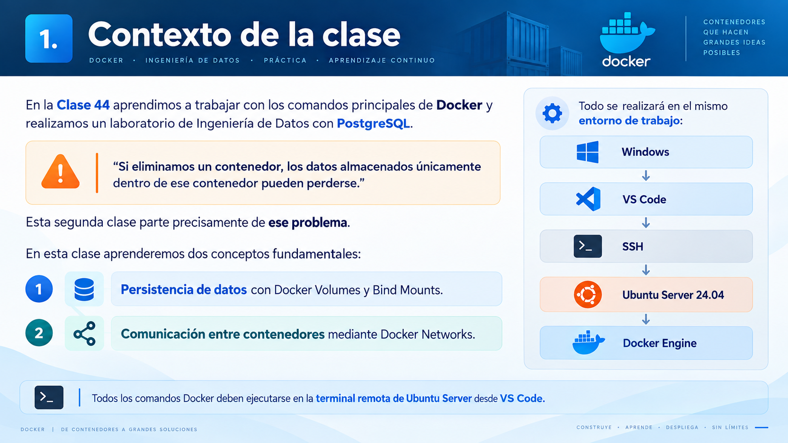

# 🧑🏽‍💻 Clase 45 - Docker: persistencia con volúmenes y comunicación entre contenedores

## 1. Contexto de la clase



---

---

# 3. El problema de los datos dentro de un contenedor


---

# 4. Separar aplicación y datos


# 5. ¿Qué es un Docker Volume?


---

# 6. Ver los volúmenes existentes


---

# 7. Crear un volumen e inspeccionar un volumen


---

# 9. Montar un volumen en PostgreSQL


---

# 10. Entender `v`


---

# 11. Comprobar el contenedor


---

# 12. Crear datos de prueba


---

# 13. Demostración de persistencia


# 14. Crear un nuevo contenedor usando el mismo volumen


---

# 15. Comandos principales de Docker Volume


---

# 16. ¿Qué es un Bind Mount?


---

# 17. Diferencia entre Volume y Bind Mount


---

# 18. Ejemplo de Bind Mount con archivos .txt


---

# 19. ¿Por qué es útil un Bind Mount para Ingeniería de Datos?


---

# 20. Introducción a Docker Networks


---

# 21. Ver redes existentes


---

# 23. Inspeccionar una red


---

# 24. Crear PostgreSQL dentro de la red


---

# 25. Comprobar la red


---

# 26. Crear un segundo contenedor


---

# 27. Probar comunicación por nombre


---

# 28. Idea fundamental


---

# 29. ¿Por qué no conviene depender de IP internas?


---

# 31. Conectar y desconectar contenedores de una red


---

# 32. Eliminar una red


---

# 34. Ejercicio - PostgreSQL persistente en red Docker

<aside>
💡

## Objetivo

Crear un PostgreSQL que:

- esté conectado a una red Docker;
- utilice un volumen persistente;
- pueda eliminarse y recrearse sin perder los datos.
</aside>

---

## Paso 1. Crear la red

```bash
docker network create data-network
```

## Paso 2. Crear el volumen

```bash
docker volume create postgres-data-volume
```

## Paso 3. Crear PostgreSQL

```bash
docker run -d \
  --name postgres-data \
  --network data-network \
  -e POSTGRES_PASSWORD=curso123 \
  -e POSTGRES_DB=empresa \
  -p 5432:5432 \
  -v postgres-data-volume:/var/lib/postgresql/data \
  postgres:16
```

## Paso 4. Comprobar

```bash
docker ps
docker volume ls
docker network ls
```

## Paso 5. Crear una tabla

```bash
docker exec -it postgres-data psql -U postgres -d empresa
```

Dentro de PostgreSQL:

```sql
CREATE TABLE productos (
    id INTEGER PRIMARY KEY,
    nombre VARCHAR(100),
    categoria VARCHAR(100),
    precio NUMERIC(10,2)
);
```

Insertamos:

```sql
INSERT INTO productos VALUES
(1, 'Portatil', 'Informatica', 1200.00),
(2, 'Monitor', 'Informatica', 350.00),
(3, 'Teclado', 'Accesorios', 75.00),
(4, 'Raton', 'Accesorios', 35.00);
```

Consulta:

```sql
SELECT * FROM productos;
```

Salir:

```
\q
```

## Paso 6. Eliminar PostgreSQL

```bash
docker stop postgres-data
docker rm postgres-data
```

## Paso 7. Verificar que el volumen permanece

```bash
docker volume ls
```

Debe seguir apareciendo:

```
postgres-data-volume
```

## Paso 8. Recrear PostgreSQL

```bash
docker run -d \
  --name postgres-data \
  --network data-network \
  -e POSTGRES_PASSWORD=curso123 \
  -e POSTGRES_DB=empresa \
  -p 5432:5432 \
  -v postgres-data-volume:/var/lib/postgresql/data \
  postgres:16
```

## Paso 9. Verificar datos

```bash
docker exec -it postgres-data psql -U postgres -d empresa
```

Ejecuta:

```sql
SELECT * FROM productos;
```

Los registros deben continuar disponibles.

---

# 35. Ejercicios prácticos

## Ejercicio 1 — Crear un volumen

Crea un volumen llamado:

```
datos-clase2
```

Después:

1. comprueba que existe;
2. inspecciónalo;
3. localiza el campo `Mountpoint`.

---

## Ejercicio 2 — Volumen con PostgreSQL

Crea un contenedor:

```
postgres-ejercicio
```

con:

```
Base de datos: laboratorio
Password: curso123
Volumen: datos-clase2
```

El volumen debe montarse en:

```
/var/lib/postgresql/data
```

---

## Ejercicio 3 — Persistencia

Dentro de `postgres-ejercicio` crea:

```sql
CREATE TABLE sensores (
    id INTEGER,
    temperatura NUMERIC(5,2)
);
```

Inserta:

```sql
INSERT INTO sensores VALUES
(1, 4.5),
(2, 5.2),
(3, 3.8);
```

Después:

1. elimina el contenedor;
2. vuelve a crearlo utilizando el mismo volumen;
3. comprueba si los datos permanecen.

---

## Ejercicio 4 — Bind Mount

Crea:

```
~/docker-clase2/entrada
```

Dentro crea:

```
clientes.csv
```

con al menos 5 registros.

Después utiliza un contenedor Alpine para leer ese archivo mediante un Bind Mount.

---

## Ejercicio 5 — Modificar desde Ubuntu

Con el mismo Bind Mount:

1. modifica `clientes.csv` desde VS Code;
2. vuelve a ejecutar el contenedor;
3. comprueba que el contenedor ve los cambios.

Explica por qué.

---

## Ejercicio 6 — Crear una red

Crea:

```
lab-network
```

Comprueba:

```bash
docker network ls
```

Después:

```bash
docker network inspect lab-network
```

---

## Ejercicio 7 — Dos contenedores en una red

Crea:

```
servidor-a
servidor-b
```

utilizando Alpine.

Los dos deben estar conectados a:

```
lab-network
```

Desde uno de ellos intenta:

```
ping servidor-b
```

---

## Ejercicio 8 — Investigar resolución de nombres

Responde:

1. ¿Qué nombre utilizas para localizar el otro contenedor?
2. ¿Necesitas conocer su IP?
3. ¿Por qué utilizar nombres es más conveniente?

---

## Ejercicio 9 — Inspeccionar una red

Con varios contenedores conectados:

```bash
docker network inspect lab-network
```

Busca la sección:

```
Containers
```

Identifica:

- nombre;
- IP;
- identificador.

---

## Ejercicio 10 — Red + PostgreSQL

Crea:

```
postgres-red
```

conectado a:

```
lab-network
```

Utiliza:

```
postgres:16
```

y un volumen llamado:

```
postgres-red-data
```

---

# 36. Laboratorio  Mini plataforma de datos persistente


---

## Parte A — Crear infraestructura

Se debe

1. crear la red;
2. crear el volumen;
3. crear PostgreSQL;
4. comprobar los tres recursos.

---

## Parte B — Crear datos

Entrar en PostgreSQL y crear:

```sql
CREATE TABLE temperaturas (
    id INTEGER,
    camara VARCHAR(50),
    temperatura NUMERIC(5,2),
    fecha TIMESTAMP
);
```

Insertar al menos cinco registros.

Ejemplo:

```sql
INSERT INTO temperaturas VALUES
(1, 'Camara A', 3.8, CURRENT_TIMESTAMP),
(2, 'Camara B', 4.2, CURRENT_TIMESTAMP),
(3, 'Camara A', 4.0, CURRENT_TIMESTAMP),
(4, 'Camara C', 2.9, CURRENT_TIMESTAMP),
(5, 'Camara B', 4.6, CURRENT_TIMESTAMP);
```

---

## Parte C — Analizar

Ejecutar:

```sql
SELECT * FROM temperaturas;
```

Después:

```sql
SELECT
    camara,
    AVG(temperatura) AS temperatura_media
FROM temperaturas
GROUP BY camara;
```

---

## Parte D — Probar persistencia

1. detener PostgreSQL;
2. eliminar el contenedor;
3. comprobar que el volumen permanece;
4. recrear el contenedor;
5. comprobar que los datos siguen allí.

---

## Parte E — Investigar la red

Ejecuta:

```bash
docker network inspect data-lab-network
```

Identifica el contenedor PostgreSQL.

---

## Parte F — Limpieza

Al terminar:

1. eliminar el contenedor;
2. decidir si se quiere conservar o eliminar el volumen;
3. eliminar la red si ya no se necesita.

> No elimines un volumen sin comprobar antes si contiene información que quieras conservar.
> 

---

# 37. Resumen de nuevos comandos


---

# 38. Diferencias fundamentales


---

# 39. Esquema conceptual


---

# 40. Ideas clave para recordar

<aside>
💡

1. Los contenedores deben considerarse reemplazables.
2. Los datos importantes no deberían depender exclusivamente del sistema de archivos interno del contenedor.
3. Los Docker Volumes permiten persistencia.
4. Un volumen puede sobrevivir a la eliminación de un contenedor.
5. Los Bind Mounts conectan carpetas reales del host.
6. Los Bind Mounts son muy útiles durante desarrollo y procesamiento de archivos.
7. Las redes Docker permiten comunicación entre contenedores.
8. Dentro de una red creada por el usuario, los contenedores pueden localizarse por nombre.
9. No conviene depender de IP internas de contenedores.
10. En Ingeniería de Datos, combinar **containers + volumes + networks** es la base para construir arquitecturas con varios servicios.
</aside>

---