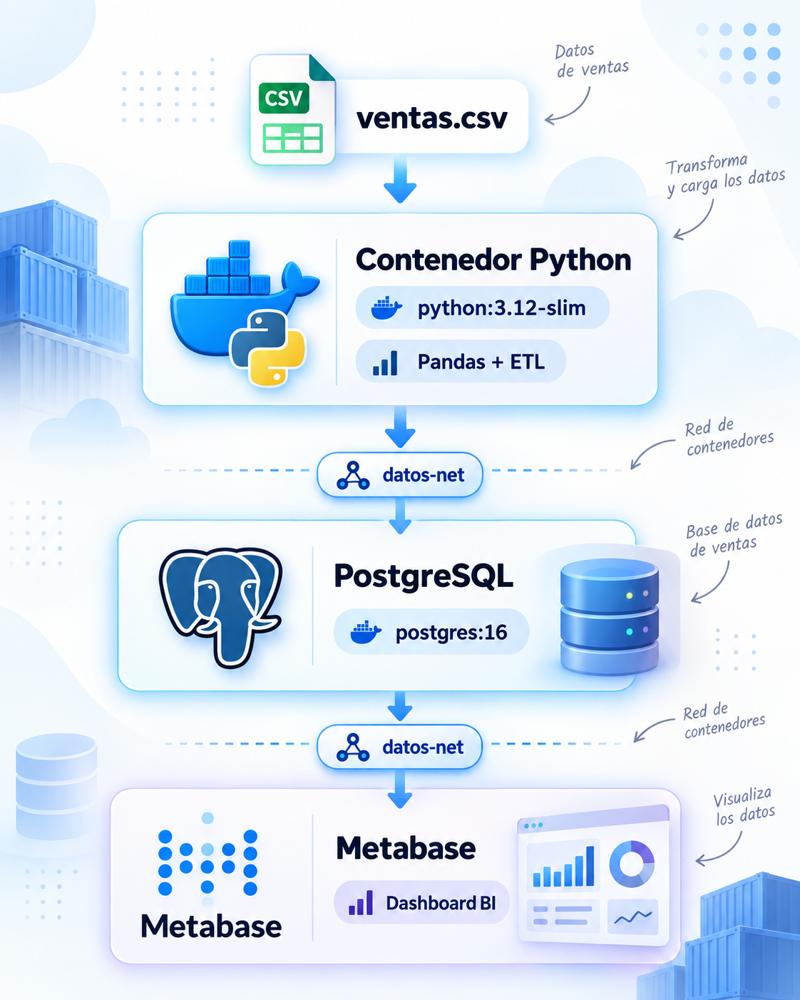

# 🏭Pipeline de datos con Docker, PostgreSQL y Metabase

## 1. Objetivo de la práctica

Construir una pequeña arquitectura de Ingeniería de Datos utilizando **contenedores Docker ya disponibles en Docker Hub**, sin crear imágenes propias y sin utilizar Docker Compose.

La práctica implementará el siguiente flujo:




---

# 3. Arquitectura

La arquitectura tendrá tres contenedores:


Los tres contenedores se conectarán, mientras estén en ejecución, a: `datos-net`

---

# 4. Estructura del proyecto


---

# 5. Crear el fichero de ventas

Crear:

```
data/ventas.csv
```

Contenido:

```
id_venta,fecha,producto,categoria,cantidad,precio
1,2026-09-01,Portatil,Electronica,1,1200
2,2026-09-01,Raton,Accesorios,3,25
3,2026-09-02,Monitor,Electronica,2,300
4,2026-09-02,Teclado,Accesorios,2,50
5,2026-09-03,Portatil,Electronica,1,1350
6,2026-09-03,Raton,Accesorios,4,25
7,2026-09-04,Monitor,Electronica,1,320
8,2026-09-04,Webcam,Accesorios,2,80
```

---

# 6. Crear una red Docker

Crear:

```bash
docker network create datos-net
```

Comprobar:

```bash
docker network ls
```

Salida aproximada:

```
NETWORK ID     NAME        DRIVER    SCOPE
xxxxxxxxxxxx   bridge      bridge    local
xxxxxxxxxxxx   datos-net   bridge    local
xxxxxxxxxxxx   host        host      local
xxxxxxxxxxxx   none        null      local
```

En este laboratorio utilizaremos:

```
datos-net
```

como red común para todos los contenedores.

---

# 7. Crear un volumen para PostgreSQL

Crear:

```bash
docker volume create postgres_data
```

Comprobar:

```bash
docker volume ls
```

El volumen permitirá que los datos sobrevivan aunque eliminemos el contenedor PostgreSQL.

---

# 8. Descargar las imágenes que utilizaremos

Podemos descargar previamente las imágenes:

```bash
docker pull postgres:16
```

```bash
docker pull python:3.12-slim
```

```bash
docker pull metabase/metabase:latest
```

Comprobar:

```bash
docker image ls
```

En este caso estamos utilizando imágenes existentes.

No hemos usado:

```bash
docker build
```

ni hemos creado ningún:

```
Dockerfile
```

---

# 9. Ejecutar PostgreSQL

Crear el contenedor:

```bash
docker run -d \
  --name postgres \
  --network datos-net \
  -e POSTGRES_USER=datauser \
  -e POSTGRES_PASSWORD=datapass \
  -e POSTGRES_DB=ventas \
  -v postgres_data:/var/lib/postgresql/data \
  postgres:16
```

Comprobar:

```bash
docker ps
```

Consultar los logs:

```bash
docker logs postgres
```

Antes de ejecutar el ETL, comprobar que PostgreSQL ya acepta conexiones:

```bash
docker exec postgres pg_isready -U datauser -d ventas
```

Cuando esté listo veremos un mensaje similar a:

```
/var/run/postgresql:5432 - accepting connections
```

Si todavía aparece como no disponible, esperar unos segundos y repetir el comando. Esto evita que el ETL intente conectarse mientras PostgreSQL todavía se está inicializando.

## ¿Qué estamos haciendo?

### Nombre del contenedor

```
--name postgres
```

El contenedor se llama:

```
postgres
```

Este nombre será importante porque otros contenedores de `datos-net` podrán utilizarlo para localizar la base de datos.

### Red

```
--network datos-net
```

Conectamos PostgreSQL a nuestra red.

### Variables de entorno

```
POSTGRES_USER=datauser
POSTGRES_PASSWORD=datapass
POSTGRES_DB=ventas
```

Configuran la base de datos durante su **primera inicialización**. Si reutilizamos un volumen `postgres_data` que ya contiene una base de datos, la imagen de PostgreSQL no volverá a crear usuarios o bases de datos a partir de estas variables.

### Volumen

```
-v postgres_data:/var/lib/postgresql/data
```

Los datos de PostgreSQL quedarán almacenados en el volumen `postgres_data`.

> Para esta práctica no necesitamos publicar el puerto `5432` en el host, ya que los otros contenedores accederán a PostgreSQL a través de `datos-net`.
> 

---

# 10. Crear el programa ETL

Crear:

```
scripts/etl.py
```

Contenido:

```python
import pandas as pd
from sqlalchemy import create_engine

print("====================================")
print("       PIPELINE DE VENTAS")
print("====================================")

print("\n1. Extracción")

df = pd.read_csv("/data/ventas.csv")

print(f"Registros leídos:{len(df)}")

print("\n2. Transformación")

df["fecha"] = pd.to_datetime(df["fecha"])

df["importe"] = (
    df["cantidad"] * df["precio"]
)

df = df.drop_duplicates()

print(df)

print("\n3. Carga en PostgreSQL")

engine = create_engine(
    "postgresql+psycopg2://"
    "datauser:datapass@postgres:5432/ventas"
)

df.to_sql(
    "ventas",
    engine,
    if_exists="replace",
    index=False
)

print("\nPipeline completado correctamente.")
```

---

# 11. Ejecutar el ETL sin crear una imagen

En lugar de crear nuestra propia imagen Docker utilizaremos:

```
python:3.12-slim
```

y montaremos dentro del contenedor:

```
scripts/
data/
```

## Linux

Desde el directorio raíz del proyecto:

```bash
docker run --rm \
  --name python-etl \
  --network datos-net \
  -v "$(pwd)/scripts:/app" \
  -v "$(pwd)/data:/data:ro" \
  -w /app \
  python:3.12-slim \
  sh -c "pip install --quiet pandas sqlalchemy psycopg2-binary && python etl.py"
```

## PowerShell

```powershell
docker run --rm `
  --name python-etl `
  --network datos-net `
  -v "${PWD}/scripts:/app" `
  -v "${PWD}/data:/data:ro" `
  -w /app `
  python:3.12-slim `
  sh -c "pip install --quiet pandas sqlalchemy psycopg2-binary && python etl.py"
```

---

# 12. Analizar el comando del ETL

Este comando contiene varios conceptos importantes.

```
--rm
```

Docker eliminará automáticamente el contenedor cuando termine el proceso. Por tanto, `python-etl` será un contenedor temporal.

---

## `-network`

```
--network datos-net
```

Permite que Python pueda comunicarse con PostgreSQL.

---

## Bind mount del código

```
-v "$(pwd)/scripts:/app"
```

Nuestro script local:

```
scripts/etl.py
```

aparece dentro del contenedor como:

```
/app/etl.py
```

---

## Bind mount de los datos

```
-v "$(pwd)/data:/data:ro"
```

El CSV estará disponible dentro del contenedor en:

```
/data/ventas.csv
```

`:ro` significa:

```
read only
```

El contenedor puede leer los datos, pero no modificarlos.

---

## Directorio de trabajo

```
-w /app
```

Establece:

```
/app
```

como directorio de trabajo.

---

## Imagen

```
python:3.12-slim
```

Utilizamos directamente una imagen oficial existente.

---

## Comando

```bash
sh -c "pip install --quiet pandas sqlalchemy psycopg2-binary && python etl.py"
```

Cuando arranca el contenedor:

1. instala las librerías necesarias;
2. ejecuta `etl.py`;
3. termina;
4. Docker elimina el contenedor debido a `-rm`.

> Esta forma no sería la más eficiente para un entorno de producción porque instala las dependencias cada vez que ejecutamos el contenedor. Aquí se utiliza intencionadamente porque todavía no hemos estudiado la creación de imágenes Docker.
> 

---

# 13. El punto clave: DNS de Docker

Observar la conexión:

```python
engine = create_engine(
    "postgresql+psycopg2://"
    "datauser:datapass@postgres:5432/ventas"
)
```

El servidor es:

```
postgres
```

No usamos:

```
localhost
```

y tampoco utilizamos directamente una dirección IP.

La comunicación es:


---

# 14. Comprobar que los datos se han cargado

Entrar en PostgreSQL:

```bash
docker exec -it postgres psql -U datauser -d ventas
```

Listar tablas:

```sql
\dt
```

Consultar:

```sql
SELECT * FROM ventas;
```

Deberíamos encontrar una columna nueva:

```
importe
```

creada por el proceso ETL.

Salir:

```
\q
```

---

# 15. Realizar algunas consultas analíticas

## Facturación total

```sql
SELECT
    SUM(importe) AS facturacion_total
FROM ventas;
```

## Facturación por categoría

```sql
SELECT
    categoria,
    SUM(importe) AS facturacion
FROM ventas
GROUP BY categoria
ORDER BY facturacion DESC;
```

## Facturación por producto

```sql
SELECT
    producto,
    SUM(cantidad) AS unidades,
    SUM(importe) AS facturacion
FROM ventas
GROUP BY producto
ORDER BY facturacion DESC;
```

## Evolución temporal

```sql
SELECT
    fecha,
    SUM(importe) AS facturacion
FROM ventas
GROUP BY fecha
ORDER BY fecha;
```

Con el CSV original, algunos resultados de control son:

```
Facturación total: 3905

Por categoría:
Electronica: 3470
Accesorios:   435
```

Estos valores permiten comprobar rápidamente que la transformación y la carga se han realizado correctamente.

---

# 16. Añadir el contenedor de Business Intelligence

Ahora completaremos el pipeline con:

```
Metabase
```

La arquitectura será:


---

# 17. Ejecutar Metabase

Crear el contenedor:

```bash
docker run -d \
  --name metabase \
  --network datos-net \
  -p 3000:3000 \
  metabase/metabase:latest
```

> **Nota sobre persistencia:** en esta práctica no persistimos la base de datos interna de Metabase. Parar y volver a arrancar el mismo contenedor conserva su configuración, pero si ejecutamos `docker rm metabase`, se perderán los dashboards y la configuración guardados dentro de ese contenedor. Para este laboratorio introductorio es suficiente.
> 

Comprobar:

```bash
docker ps
```

Consultar logs:

```bash
docker logs metabase
```

También podemos seguirlos en tiempo real:

```bash
docker logs -f metabase
```

Para dejar de seguir los logs, pulsar `Ctrl+C`. Esto no detiene el contenedor; solo finaliza el seguimiento de la salida.

---

# 18. Acceder a Metabase

Abrir:

```
http://localhost:3000
```

¿Por qué podemos acceder desde el navegador?

Porque hemos utilizado:

```
-p 3000:3000
```

Representa:

```
HOST                CONTENEDOR

localhost:3000 ---> metabase:3000
```

---

# 19. Conectar Metabase con PostgreSQL

Durante la configuración de Metabase seleccionar PostgreSQL.

Usar:

```
Host: postgres

Port: 5432

Database name: ventas

Username: datauser

Password: datapass
```

Lo más importante vuelve a ser:

```
Host = postgres
```

Metabase no necesita conocer la IP de PostgreSQL.

Los dos contenedores pertenecen a:

```
datos-net
```

Por tanto:

```
metabase
    |
    | postgres:5432
    v
postgres
```

---

# 20. Crear el dashboard

Crear un dashboard denominado:

```
Dashboard de Ventas
```

Añadir al menos cuatro visualizaciones.

## KPI 1 — Facturación total

```sql
SELECT
    SUM(importe) AS facturacion_total
FROM ventas;
```

Visualización:

```
Número
```

---

## Gráfico 2 — Facturación por categoría

```sql
SELECT
    categoria,
    SUM(importe) AS facturacion
FROM ventas
GROUP BY categoria
ORDER BY facturacion DESC;
```

Visualización:

```
Barras
```

---

## Gráfico 3 — Ventas por producto

```sql
SELECT
    producto,
    SUM(cantidad) AS unidades
FROM ventas
GROUP BY producto
ORDER BY unidades DESC;
```

Visualización:

```
Barras
```

---

## Gráfico 4 — Evolución de la facturación

```sql
SELECT
    fecha,
    SUM(importe) AS facturacion
FROM ventas
GROUP BY fecha
ORDER BY fecha;
```

Visualización:

```
Línea
```

---

# 21. Resultado end-to-end


---

# 22. Inspeccionar la red

Ejecutar:

```bash
docker network inspect datos-net
```

En la sección:

```
Containers
```

deberían aparecer los contenedores que siguen activos:

```
postgres
metabase
```

El contenedor:

```
python-etl
```

ya no aparecerá porque terminó su ejecución y usamos:

```
--rm
```

---

# 23. Comprobar el DNS con un contenedor temporal

Podemos utilizar otra imagen existente:

```
alpine
```

Ejecutar:

```bash
docker run --rm \
  --network datos-net \
  alpine \
  ping -c 3 postgres
```

Docker debería resolver:

```
postgres
```

a una IP de la red `datos-net`.

También:

```bash
docker run --rm \
  --network datos-net \
  alpine \
  ping -c 3 metabase
```

---

# 24. Experimento: aislamiento de red

Ejecutar un contenedor que **no** pertenezca a `datos-net`:

```bash
docker run --rm alpine ping -c 3 postgres
```

Comparar el resultado con:

```bash
docker run --rm \
  --network datos-net \
  alpine \
  ping -c 3 postgres
```

## Pregunta

¿Por qué uno puede localizar `postgres` y el otro no?

---

# 25. Experimento: persistencia de PostgreSQL

Eliminar el contenedor:

```bash
docker stop postgres
```

```bash
docker rm postgres
```

Comprobar:

```bash
docker ps -a
```

El contenedor ha desaparecido.

Pero:

```bash
docker volume ls
```

debería seguir mostrando:

```
postgres_data
```

---

# 26. Volver a crear PostgreSQL

```bash
docker run -d \
  --name postgres \
  --network datos-net \
  -e POSTGRES_USER=datauser \
  -e POSTGRES_PASSWORD=datapass \
  -e POSTGRES_DB=ventas \
  -v postgres_data:/var/lib/postgresql/data \
  postgres:16
```

Como `postgres_data` ya está inicializado, PostgreSQL reutilizará los datos y usuarios existentes. Por eso mantenemos las mismas credenciales del primer arranque.

Entrar:

```bash
docker exec -it postgres psql -U datauser -d ventas
```

Ejecutar:

```sql
SELECT * FROM ventas;
```

Los datos deberían continuar disponibles.

Esto demuestra que:

```
contenedor != datos
```

Los datos permanecen en:

```
postgres_data
```

---

# 27. Reto: añadir nuevos datos

Añadir nuevas filas a:

```
data/ventas.csv
```

Por ejemplo:

```
9,2026-09-05,Monitor,Electronica,3,310
10,2026-09-05,Raton,Accesorios,10,25
```

Volver a ejecutar:

```bash
docker run --rm \
  --name python-etl \
  --network datos-net \
  -v "$(pwd)/scripts:/app" \
  -v "$(pwd)/data:/data:ro" \
  -w /app \
  python:3.12-slim \
  sh -c "pip install --quiet pandas sqlalchemy psycopg2-binary && python etl.py"
```

Después:

1. consultar PostgreSQL;
2. actualizar Metabase;
3. comprobar los cambios en el dashboard.

---

# 29. Limpieza del laboratorio

Eliminar Metabase:

```bash
docker stop metabase
docker rm metabase
```

> Al eliminar este contenedor también se elimina la configuración interna de Metabase utilizada en el laboratorio, ya que no le hemos asociado un volumen.
> 

Eliminar PostgreSQL:

```bash
docker stop postgres
docker rm postgres
```

Eliminar la red:

```bash
docker network rm datos-net
```

Finalmente, si no queremos conservar los datos:

```bash
docker volume rm postgres_data
```

---

---