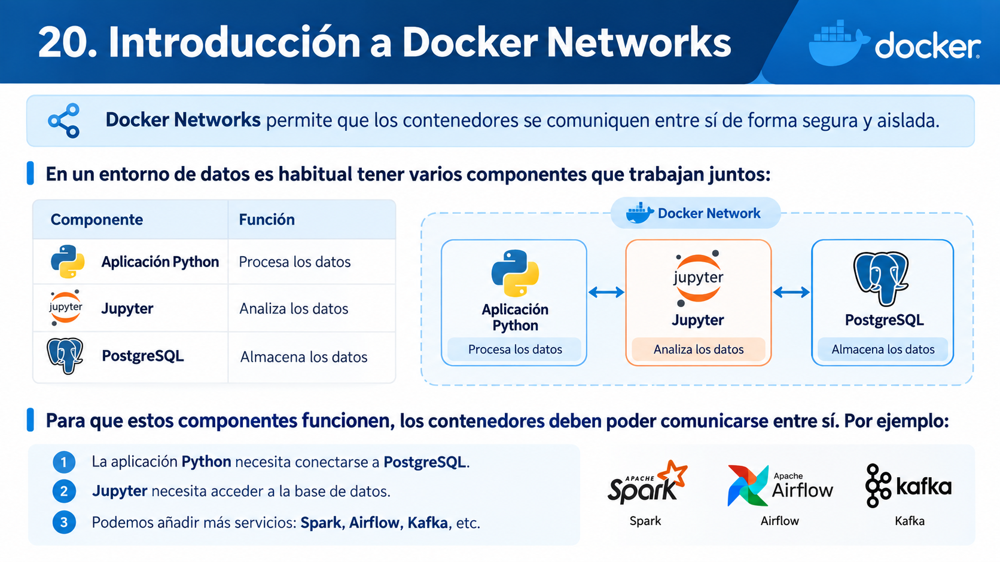

# 🧑🏽‍💻 Clase 46 - Docker: Redes

# 20. Introducción a Docker Networks



Para permitir esa comunicación creamos una red y conectamos los contenedores a ella:

```bash
docker network create datos-net
```


---

# 21. Ver redes existentes

Para ver todas las redes disponibles ejecutamos:

```bash
docker network ls
```

Salida esperada (los identificadores serán distintos en cada equipo):

```
NETWORK ID     NAME      DRIVER    SCOPE
3f1c9a2b7d4e   bridge    bridge    local
8a2e5d1c6b90   host      host      local
c47b0e93f215   none      null      local
```


---

# 22. Crear una red Docker

Podemos crear nuestras propias redes para conectar los contenedores de una aplicación:

```bash
docker network create data-network
```

Salida esperada (Docker devuelve el identificador completo de la red):

```
cbad523d2c489a92d93bd8b41305c175ebb5adb0c9af42b5833853cdc5b3d5b4
```

Si no indicamos nada, la red se crea con el driver `bridge`. Volvemos a listar las redes para verificar que se ha creado:

```bash
docker network ls
```

Salida esperada:

```
NETWORK ID     NAME           DRIVER    SCOPE
3f1c9a2b7d4e   bridge         bridge    local
cbad523d2c48   data-network   bridge    local
8a2e5d1c6b90   host           host      local
c47b0e93f215   none           null      local
```

✅
**¡Red creada!** Ya tenemos una red llamada `data-network` que podemos utilizar para conectar nuestros contenedores.

---

# 23. Inspeccionar una red

Para ver la configuración detallada de una red:

```bash
docker network inspect data-network
```


---

# 24. Crear PostgreSQL dentro de la red

Vamos a crear un contenedor de PostgreSQL conectado a nuestra red personalizada.

Primero eliminamos el contenedor `postgres-data` de las secciones anteriores, si existe:

```bash
docker stop postgres-data
docker rm postgres-data
```

⚠️
**Es normal que aparezca un error:** si el contenedor no existe, Docker mostrará `Error response from daemon: No such container: postgres-data`. Podemos ignorarlo. Los datos no se pierden, porque están en el volumen `postgres-data-volume`.

Ahora creamos PostgreSQL dentro de la red `data-network`:

```bash
docker run -d \
  --name postgres-data \
  --network data-network \
  -e POSTGRES_PASSWORD=curso123 \
  -e POSTGRES_DB=empresa \
  -p 5432:5432 \
  -v postgres-data-volume:/var/lib/postgresql/data \
  postgres:16
```

Salida esperada (identificador del contenedor):

```
8ffc7f65841af0be4ff7e097ad32925f0102b930974ef08e643d9876997a4239
```

La opción nueva en el comando es:

```bash
--network data-network
```

<aside>
💡

💡
**Importante:** esta opción conecta el contenedor a la red Docker que creamos, lo que permite la comunicación con otros contenedores de esa misma red. Si no la indicamos, el contenedor se conecta a la red `bridge` por defecto.

</aside>

---

# 25. Comprobar la red

Inspeccionamos la red para verificar que el contenedor está conectado:

```bash
docker network inspect data-network
```


Si solo queremos ver el nombre y la IP de cada contenedor conectado, podemos filtrar la salida con `--format`:

```bash
docker network inspect data-network \
  --format '{{range .Containers}}{{.Name}} {{.IPv4Address}}{{println}}{{end}}'
```

Salida esperada:

```
postgres-data 172.18.0.2/16
```

---

# 26. Crear un segundo contenedor

Ahora vamos a crear una aplicación Python conectada a la misma red:

```bash
docker run -it \
  --name app-python \
  --network data-network \
  python:3.11 \
  bash
```

Esto nos abre una terminal **dentro** del contenedor. El prompt cambia a algo similar a:

```
root@bb6870f73db6:/#
```

Para ver los contenedores en ejecución, abrimos **otra terminal en el host** (dentro de `app-python` no existe el comando `docker`) y ejecutamos:

```bash
docker ps
```

Salida esperada:

```
CONTAINER ID   IMAGE         COMMAND                  CREATED          STATUS          PORTS                                         NAMES
bb6870f73db6   python:3.11   "bash"                   30 seconds ago   Up 29 seconds                                                 app-python
8ffc7f65841a   postgres:16   "docker-entrypoint.s…"   5 minutes ago    Up 5 minutes    0.0.0.0:5432->5432/tcp, [::]:5432->5432/tcp   postgres-data
```


Desde la terminal de `app-python` comprobamos que el nombre `postgres-data` se resuelve a su IP interna. La imagen `python:3.11` no incluye `ping`, así que usamos `getent`:

```bash
getent hosts postgres-data
```

Salida esperada:

```
172.18.0.2      postgres-data
```

O directamente con Python:

```bash
python -c "import socket; print(socket.gethostbyname('postgres-data'))"
```

Salida esperada:

```
172.18.0.2
```


---

# 27. Probar comunicación por nombre

Para comprobar la comunicación con `ping` creamos un contenedor ligero de Alpine, llamado `cliente-prueba`, en la misma red:

```bash
docker run -it \
  --name cliente-prueba \
  --network data-network \
  alpine \
  sh
```

El prompt cambia a:

```
/ #
```

**Dentro del contenedor Alpine ejecutamos**:

```bash
ping -c 4 postgres-data
```

Salida esperada:

```
PING postgres-data (172.18.0.2): 56 data bytes
64 bytes from 172.18.0.2: seq=0 ttl=64 time=0.086 ms
64 bytes from 172.18.0.2: seq=1 ttl=64 time=0.062 ms
64 bytes from 172.18.0.2: seq=2 ttl=64 time=0.073 ms
64 bytes from 172.18.0.2: seq=3 ttl=64 time=0.058 ms

--- postgres-data ping statistics ---
4 packets transmitted, 4 packets received, 0% packet loss
round-trip min/avg/max = 0.058/0.069/0.086 ms
```

Podemos ver también quién resuelve el nombre:

```bash
nslookup postgres-data
```

Salida esperada (similar a):

```
Server:         127.0.0.11
Address:        127.0.0.11:53

Non-authoritative answer:
Name:   postgres-data
Address: 172.18.0.2
```

La dirección `127.0.0.11` es el **DNS interno de Docker**, disponible en todas las redes definidas por el usuario.


**Comprobación extra: la red `bridge` por defecto no resuelve nombres.** Desde **otra terminal del host**, lanzamos un Alpine temporal sin indicar red:

```bash
docker run --rm alpine ping -c 1 postgres-data
```

Salida esperada:

```
ping: bad address 'postgres-data'
```

El contenedor temporal está en la red `bridge` por defecto, que no tiene DNS interno y además no comparte red con `postgres-data`.

---

# 28. Idea fundamental


---

# 29. ¿Por qué no conviene depender de IP internas?


---

# 30. Salir del contenedor Alpine

Una vez terminadas las pruebas, salimos del contenedor. Dentro de Alpine ejecutamos:

```bash
exit
```

Esto nos devuelve a la terminal de nuestro equipo. Al salir, el contenedor se **detiene**, pero no se elimina. Lo comprobamos:

```bash
docker ps -a --filter name=cliente-prueba
```

Salida esperada:

```
CONTAINER ID   IMAGE     COMMAND     CREATED         STATUS                     PORTS     NAMES
91f6855a5782   alpine    "/bin/sh"   3 minutes ago   Exited (0) 5 seconds ago             cliente-prueba
```

Cuando ya no lo necesitemos, eliminamos el contenedor de prueba:

```bash
docker rm cliente-prueba
```

Salida esperada:

```
cliente-prueba
```

---

# 31. Conectar y desconectar contenedores de una red

Podemos conectar o desconectar contenedores de una red Docker en cualquier momento, sin recrearlos.

Sintaxis general para conectar:

```bash
docker network connect RED CONTENEDOR
```

Sintaxis general para desconectar:

```bash
docker network disconnect RED CONTENEDOR
```

**Ejemplo práctico.** Creamos un contenedor Alpine sin indicar red, de modo que queda en la red `bridge` por defecto. Usamos `sleep infinity` para que se mantenga en ejecución:

```bash
docker run -d --name otro-contenedor alpine sleep infinity
```

Consultamos a qué redes está conectado:

```bash
docker inspect otro-contenedor \
  --format '{{range $red, $cfg := .NetworkSettings.Networks}}{{$red}} {{end}}'
```

Salida esperada:

```
bridge
```

Lo conectamos a `data-network`:

```bash
docker network connect data-network otro-contenedor
```

El comando no muestra salida si todo va bien. Volvemos a consultar:

```bash
docker inspect otro-contenedor \
  --format '{{range $red, $cfg := .NetworkSettings.Networks}}{{$red}} {{end}}'
```

Salida esperada:

```
bridge data-network
```

Ahora `otro-contenedor` ya puede localizar a PostgreSQL por nombre:

```bash
docker exec otro-contenedor ping -c 2 postgres-data
```

Salida esperada:

```
PING postgres-data (172.18.0.2): 56 data bytes
64 bytes from 172.18.0.2: seq=0 ttl=64 time=0.091 ms
64 bytes from 172.18.0.2: seq=1 ttl=64 time=0.067 ms

--- postgres-data ping statistics ---
2 packets transmitted, 2 packets received, 0% packet loss
round-trip min/avg/max = 0.067/0.079/0.091 ms
```

Cuando ya no lo necesitemos en la red, lo desconectamos:

```bash
docker network disconnect data-network otro-contenedor
```

Y eliminamos el contenedor de prueba:

```bash
docker rm -f otro-contenedor
```


---

# 32. Eliminar una red

Para eliminar una red Docker usamos:

```bash
docker network rm data-network
```

Si algún contenedor **en ejecución** sigue conectado a la red, Docker no permite eliminarla y muestra un mensaje similar a:

```
Error response from daemon: error while removing network: network data-network has active endpoints
```

En nuestro ejemplo, `postgres-data` sigue en ejecución y `app-python` sigue existiendo, aunque esté detenido. Si se borrara la red, un contenedor detenido que la tuviera configurada no podría volver a arrancar (error `network not found`). Por eso eliminamos primero los contenedores que usan la red:

```bash
docker rm -f postgres-data app-python
```

Salida esperada:

```
postgres-data
app-python
```

Ahora sí eliminamos la red:

```bash
docker network rm data-network
```

Salida esperada:

```
data-network
```

Comprobamos que ya no aparece:

```bash
docker network ls
```

Salida esperada:

```
NETWORK ID     NAME      DRIVER    SCOPE
3f1c9a2b7d4e   bridge    bridge    local
8a2e5d1c6b90   host      host      local
c47b0e93f215   none      null      local
```

<aside>
💡

💡  **Importante:** eliminar los contenedores y la red **no** elimina el volumen `postgres-data-volume`. Los datos de PostgreSQL siguen a salvo.

</aside>

---

# 33. Comandos principales de Docker Network


---

# 34. Ejercicio - PostgreSQL persistente en red Docker

<aside>
💡

En este ejercicio crearás un PostgreSQL que:

- Esté conectado a una red Docker;
- utilice un volumen persistente;
- pueda eliminarse y recrearse sin perder los datos.
</aside>

## Paso 0. Limpiar el entorno

Nos aseguramos de que no quede un contenedor con el mismo nombre:

```bash
docker rm -f postgres-data
```

Si no existe, Docker mostrará un error que podemos ignorar.

## Paso 1. Crear la red

```bash
docker network create data-network
```

## Paso 2. Crear el volumen

```bash
docker volume create postgres-data-volume
```

Salida esperada:

```
postgres-data-volume
```

<aside>
💡

💡 **Nota:** este volumen ya existe desde la sección 9. `docker volume create` no da error si el volumen ya existe: simplemente lo reutiliza. Por eso el volumen conservará también la tabla `clientes` que creamos en la sección 12.

</aside>

## Paso 3. Crear PostgreSQL

```bash
docker run -d \
  --name postgres-data \
  --network data-network \
  -e POSTGRES_PASSWORD=curso123 \
  -e POSTGRES_DB=empresa \
  -p 5432:5432 \
  -v postgres-data-volume:/var/lib/postgresql/data \
  postgres:16
```

## Paso 4. Comprobar

```bash
docker ps
docker volume ls
docker network ls
```

Salida esperada (fragmentos relevantes):

```
CONTAINER ID   IMAGE         COMMAND                  CREATED         STATUS         PORTS                                         NAMES
8ffc7f65841a   postgres:16   "docker-entrypoint.s…"   10 seconds ago  Up 9 seconds   0.0.0.0:5432->5432/tcp, [::]:5432->5432/tcp   postgres-data

DRIVER    VOLUME NAME
local     postgres-data-volume

NETWORK ID     NAME           DRIVER    SCOPE
3f1c9a2b7d4e   bridge         bridge    local
cbad523d2c48   data-network   bridge    local
8a2e5d1c6b90   host           host      local
c47b0e93f215   none           null      local
```

## Paso 5. Crear una tabla

```bash
docker exec -it postgres-data psql -U postgres -d empresa
```

Dentro de PostgreSQL:

```sql
CREATE TABLE productos (
    id INTEGER PRIMARY KEY,
    nombre VARCHAR(100),
    categoria VARCHAR(100),
    precio NUMERIC(10,2)
);
```

Salida esperada:

```
CREATE TABLE
```

Insertamos:

```sql
INSERT INTO productos VALUES
(1, 'Portatil', 'Informatica', 1200.00),
(2, 'Monitor', 'Informatica', 350.00),
(3, 'Teclado', 'Accesorios', 75.00),
(4, 'Raton', 'Accesorios', 35.00);
```

Salida esperada:

```
INSERT 0 4
```

Consulta:

```sql
SELECT * FROM productos;
```

Salida esperada:

```
 id |  nombre  |  categoria  | precio
----+----------+-------------+---------
  1 | Portatil | Informatica | 1200.00
  2 | Monitor  | Informatica |  350.00
  3 | Teclado  | Accesorios  |   75.00
  4 | Raton    | Accesorios  |   35.00
(4 rows)
```

Salir:

```
\q
```

## Paso 6. Eliminar PostgreSQL

```bash
docker stop postgres-data
docker rm postgres-data
```

## Paso 7. Verificar que el volumen permanece

```bash
docker volume ls
```

Salida esperada (debe seguir apareciendo el volumen):

```
DRIVER    VOLUME NAME
local     postgres-data-volume
```

## Paso 8. Recrear PostgreSQL

```bash
docker run -d \
  --name postgres-data \
  --network data-network \
  -e POSTGRES_PASSWORD=curso123 \
  -e POSTGRES_DB=empresa \
  -p 5432:5432 \
  -v postgres-data-volume:/var/lib/postgresql/data \
  postgres:16
```

## Paso 9. Verificar datos

```bash
docker exec -it postgres-data psql -U postgres -d empresa
```

Ejecuta:

```sql
SELECT * FROM productos;
```

Salida esperada, con los registros todavía disponibles:

```
 id |  nombre  |  categoria  | precio
----+----------+-------------+---------
  1 | Portatil | Informatica | 1200.00
  2 | Monitor  | Informatica |  350.00
  3 | Teclado  | Accesorios  |   75.00
  4 | Raton    | Accesorios  |   35.00
(4 rows)
```

También puedes listar las tablas para comprobar que se conserva la tabla `clientes` de la sección 12:

```
\dt
```

Salida esperada:

```
           List of relations
 Schema |   Name    | Type  |  Owner
--------+-----------+-------+----------
 public | clientes  | table | postgres
 public | productos | table | postgres
(2 rows)
```

---

# 35. Ejercicios prácticos

## Ejercicio 1 — Crear un volumen

Crea un volumen llamado:

```
datos-clase2
```

Después:

1. comprueba que existe;
2. inspecciónalo;
3. localiza el campo `Mountpoint`.

Salida esperada del campo `Mountpoint` en la inspección:

```
"Mountpoint": "/var/lib/docker/volumes/datos-clase2/_data",
```

---

## Ejercicio 2 — Volumen con PostgreSQL

Crea un contenedor llamado:

```
postgres-ejercicio
```

con estos datos:

```
Imagen: postgres:16
Base de datos: laboratorio
Password: curso123
Volumen: datos-clase2
```

El volumen debe montarse en:

```
/var/lib/postgresql/data
```

⚠️
No necesitas publicar ningún puerto. Si decides hacerlo, no uses el `5432` del host si `postgres-data` sigue en ejecución, porque obtendrás el error `port is already allocated`. Usa, por ejemplo, `-p 5433:5432`.

---

## Ejercicio 3 — Persistencia

Conéctate a `postgres-ejercicio` (base de datos `laboratorio`) y crea:

```sql
CREATE TABLE sensores (
    id INTEGER,
    temperatura NUMERIC(5,2)
);
```

Inserta:

```sql
INSERT INTO sensores VALUES
(1, 4.5),
(2, 5.2),
(3, 3.8);
```

Después:

1. elimina el contenedor;
2. vuelve a crearlo utilizando el mismo volumen;
3. comprueba si los datos permanecen.

Salida esperada de `SELECT * FROM sensores;` tras recrear el contenedor:

```
 id | temperatura
----+-------------
  1 |        4.50
  2 |        5.20
  3 |        3.80
(3 rows)
```

---

## Ejercicio 4 — Bind Mount

Crea la carpeta:

```
~/docker-clase2/entrada
```

Dentro crea el archivo:

```
clientes.csv
```

con al menos 5 registros.

Después utiliza un contenedor Alpine para leer ese archivo mediante un Bind Mount. La salida del contenedor debe mostrar el contenido del CSV, por ejemplo:

```
id,nombre,ciudad
1,Ana,Madrid
2,Luis,Barcelona
3,Marta,Valencia
4,Pedro,Sevilla
5,Lucia,Bilbao
```

---

## Ejercicio 5 — Modificar desde Ubuntu

Con el mismo Bind Mount:

1. modifica `clientes.csv` desde VS Code;
2. vuelve a ejecutar el contenedor;
3. comprueba que el contenedor ve los cambios.

Explica por qué.

---

## Ejercicio 6 — Crear una red

Crea la red:

```
lab-network
```

Comprueba que existe:

```bash
docker network ls
```

Después inspecciónala:

```bash
docker network inspect lab-network
```

---

## Ejercicio 7 — Dos contenedores en una red

Crea dos contenedores con Alpine:

```
servidor-a
servidor-b
```

Los dos deben estar conectados a:

```
lab-network
```

💡
**Pista:** un contenedor Alpine sin proceso en primer plano se detiene en cuanto arranca. Para que se mantenga en ejecución en segundo plano, añade `sleep infinity` al final del `docker run -d`. Después entra con `docker exec`.

Desde uno de ellos intenta:

```bash
ping -c 4 servidor-b
```

Salida esperada (la IP puede variar):

```
PING servidor-b (172.19.0.3): 56 data bytes
64 bytes from 172.19.0.3: seq=0 ttl=64 time=0.081 ms
64 bytes from 172.19.0.3: seq=1 ttl=64 time=0.065 ms
64 bytes from 172.19.0.3: seq=2 ttl=64 time=0.070 ms
64 bytes from 172.19.0.3: seq=3 ttl=64 time=0.059 ms

--- servidor-b ping statistics ---
4 packets transmitted, 4 packets received, 0% packet loss
round-trip min/avg/max = 0.059/0.068/0.081 ms
```

---

## Ejercicio 8 — Investigar resolución de nombres

Responde:

1. ¿Qué nombre utilizas para localizar el otro contenedor?
2. ¿Necesitas conocer su IP?
3. ¿Por qué utilizar nombres es más conveniente?

---

## Ejercicio 9 — Inspeccionar una red

Con varios contenedores conectados, ejecuta:

```bash
docker network inspect lab-network
```

Busca la sección:

```
Containers
```

Identifica de cada contenedor:

- el nombre;
- la IP;
- el identificador.

---

## Ejercicio 10 — Red + PostgreSQL

Crea un contenedor llamado:

```
postgres-red
```

conectado a:

```
lab-network
```

con estos datos:

```
Imagen: postgres:16
Password: curso123
Volumen: postgres-red-data
Puerto host: 5434
Puerto contenedor: 5432
```

⚠️
Sin la variable `POSTGRES_PASSWORD` el contenedor se detiene nada más arrancar. Usamos el puerto `5434` del host para no chocar con `postgres-data` (5432) ni con `postgres-ejercicio` (5433, si lo publicaste).

Comprueba que `postgres-red` aparece en la sección `Containers` de `docker network inspect lab-network`.

---

# 36. Laboratorio: Mini plataforma de datos persistente

Una empresa recibe datos de sensores de cámaras frigoríficas. Se desea utilizar PostgreSQL como zona de almacenamiento intermedio (*staging*) de esas lecturas. La solución debe ejecutarse completamente en Docker.

Requisitos:

| Recurso | Configuración |
| --- | --- |
| Red | `data-lab-network` |
| Volumen | `sensores-data` |
| Contenedor PostgreSQL | `postgres-sensores` |
| Imagen | `postgres:16` |
| Base de datos | `iot` |
| Password | `curso123` |
| Puerto host | `5433` |
| Puerto contenedor | `5432` |

💡
Usamos el puerto `5433` del host para evitar conflictos con otras instancias de PostgreSQL que ya publiquen el `5432`. Si `postgres-ejercicio` usa el `5433`, detenlo antes de empezar.

---

## Parte A — Crear infraestructura

Se debe:

1. crear la red;
2. crear el volumen;
3. crear PostgreSQL;
4. comprobar los tres recursos.

---

## Parte B — Crear datos

Entrar en PostgreSQL y crear:

```sql
CREATE TABLE temperaturas (
    id INTEGER,
    camara VARCHAR(50),
    temperatura NUMERIC(5,2),
    fecha TIMESTAMP
);
```

Insertar al menos cinco registros. Ejemplo:

```sql
INSERT INTO temperaturas VALUES
(1, 'Camara A', 3.8, CURRENT_TIMESTAMP),
(2, 'Camara B', 4.2, CURRENT_TIMESTAMP),
(3, 'Camara A', 4.0, CURRENT_TIMESTAMP),
(4, 'Camara C', 2.9, CURRENT_TIMESTAMP),
(5, 'Camara B', 4.6, CURRENT_TIMESTAMP);
```

---

## Parte C — Analizar

Ejecutar:

```sql
SELECT * FROM temperaturas;
```

Después calcular la temperatura media por cámara:

```sql
SELECT
    camara,
    ROUND(AVG(temperatura), 2) AS temperatura_media
FROM temperaturas
GROUP BY camara
ORDER BY camara;
```

---

## Parte D — Probar persistencia

1. detener PostgreSQL;
2. eliminar el contenedor;
3. comprobar que el volumen permanece;
4. recrear el contenedor;
5. comprobar que los datos siguen allí.

---

## Parte E — Investigar la red

Ejecuta:

```bash
docker network inspect data-lab-network
```

Identifica el contenedor PostgreSQL en la sección `Containers`.

---

## Parte F — Limpieza

Al terminar:

1. eliminar el contenedor;
2. decidir si se quiere conservar o eliminar el volumen;
3. eliminar la red si ya no se necesita.

⚠️
No elimines un volumen sin comprobar antes si contiene información que quieras conservar.

---


---

# 39. Esquema conceptual

